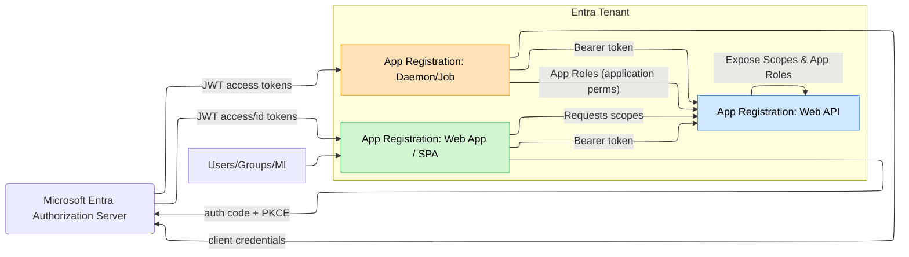

# 🧭 **Where You Are vs Where You’re Going**

## Today (IdentityServer4)

- You run **IS4** (now EOL; successor is **Duende IdentityServer**, commercial) as your central OpenID Connect/OAuth2 server, backed by your user DB. ([IdentityServer][1], [Duende Software Docs][2])

## Target (Managed in Cloud)

- Replace IS4 with **Microsoft Entra ID** (managed identity provider) for **workforce/partners**; or **Entra External ID (customer/CIAM)** if your users are customers.
- Entra provides the same open standards (**OIDC/OAuth2**), scopes/permissions, and flows (Auth Code + PKCE, Client Credentials, Device Code, On-Behalf-Of, limited ROPC) with first-class SDKs (**MSAL**). ([Microsoft Learn][3])
- **Entra External ID** is _not just a rename of Azure AD B2C_—it’s the next-gen CIAM; choose it for customer identities. ([Microsoft Learn][4])

---

## 🔁 **Concept Mapping (IS4 → Entra)**

| IdentityServer4                            | Entra ID (Microsoft identity platform)                                                                                                                |
| ------------------------------------------ | ----------------------------------------------------------------------------------------------------------------------------------------------------- |
| **Identity Resources** / **API Resources** | **App registration** (one for API, one per client). “Expose an API” = define **scopes** + **app roles**. ([Microsoft Learn][5])                       |
| **Clients** (confidential/public)          | **App registrations** (web, SPA, native, daemon) with redirect URIs & secrets/certs                                                                   |
| **Scopes**                                 | **Delegated permissions (scopes)** via “Expose an API”                                                                                                |
| **API Roles/Claims**                       | **App roles**, **groups**, **optional claims** (token configuration) ([Microsoft Learn][6])                                                           |
| **Grant Types**                            | Auth code + **PKCE** (SPA/native), **client credentials** (daemon), **device code**, **OBO**; **ROPC** exists but discouraged. ([Microsoft Learn][7]) |
| **Token Service you host**                 | **Managed** token service (no server to run/patch), plus **Conditional Access, MFA, PIM** baked in.                                                   |

---

## 🏗️ **Target Architecture (High Level)**



---

## 🛣️ **Migration Plan (Pragmatic & Low-Risk)**

### 0) Decide Your Track

- **Internal users / partners** → **Entra ID** (workforce).
- **Customer identities** → **Entra External ID** (CIAM). ([Microsoft Learn][4])

### 1) Inventory & Map

- List **APIs**, **clients**, **flows** used (auth code, CC, OBO, ROPC).
- Map each IS4 resource/scope → an **App Registration** (API) with **scopes**/**app roles** in Entra. ([Microsoft Learn][5])

### 2) Tenant & Policies

- Use existing Entra tenant (or create). Turn on **MFA/Conditional Access** as needed (you get this for free now).

### 3) Users & Data

- **Workforce**: users live in Entra; sync from on-prem AD if needed.
- **Customers**: create an **External ID** (CIAM) tenant and user flows/custom policies as needed. (B2C tenants continue to work; new guidance pushes to External ID.) ([Microsoft Learn][4])
- Password migration is typically **not** direct; use **gradual migration** (federate old IDP → new IDP) to avoid forcing resets. ([Stack Overflow][8])

### 4) Register the **API** (per backend)

- **App registration** → **Expose an API** → set **Application ID URI** → add **scopes** (delegated) & **app roles** (application). ([Microsoft Learn][5])

### 5) Register **Clients**

- Web app / SPA: configure redirect URIs, **PKCE**, allowed account types.
- Daemons/jobs: add a **client secret** or **certificate**.

### 6) Wire Up **Permissions**

- In client registrations: **API permissions** → add the API’s **scopes** (delegated) or **app roles** (application). **Grant admin consent** as required. ([Microsoft Learn][5])

### 7) Update Code to **MSAL / Microsoft.Identity.Web**

- Replace IS4/OIDC middleware with **Microsoft.Identity.Web** (ASP.NET Core) or **MSAL.js** (Angular), **MSAL.NET** (daemons).

### 8) Rollout Safely

- **Federation bridge**: temporarily keep IS4 as an upstream OIDC provider or vice-versa to phase clients over without a “big bang.” ([Stack Overflow][8])

### 9) Decommission IS4

- When traffic is 100% on Entra and audits are clean, remove IS4.

---

## 🔐 **Implementation – API (ASP.NET Core)**

**Goal**: Protect your API with Entra scopes; demand `access_as_user` (delegated).

1. **Register API**, “Expose an API” → add scope `api://{api-app-id}/access_as_user`. ([Microsoft Learn][5])

2. **ASP.NET Core** program:

```csharp
// Program.cs
using Microsoft.Identity.Web;
using Microsoft.AspNetCore.Authorization;

var builder = WebApplication.CreateBuilder(args);

builder.Services
  .AddAuthentication("Bearer")
  .AddMicrosoftIdentityWebApi(builder.Configuration.GetSection("AzureAd"));

builder.Services.AddAuthorization(options =>
{
    options.AddPolicy("ApiScope", policy =>
        policy.RequireClaim("scp", "access_as_user")); // or roles claim for app roles
});

var app = builder.Build();
app.UseAuthentication();
app.UseAuthorization();

app.MapGet("/weather", [Authorize(Policy="ApiScope")] () => new { ok = true });

app.Run();
```

```json
// appsettings.json
{
  "AzureAd": {
    "Instance": "https://login.microsoftonline.com/",
    "TenantId": "<your-tenant-id>",
    "ClientId": "<api-app-registration-client-id>", // API app's ID
    "Audience": "api://<api-app-registration-client-id>"
  }
}
```

---

## 🧑‍💻 **Implementation – Web App / SPA (Auth Code + PKCE)**

### ASP.NET Core Web App (server-rendered)

```csharp
// Program.cs
using Microsoft.Identity.Web;

var builder = WebApplication.CreateBuilder(args);
builder.Services.AddAuthentication(OpenIdConnectDefaults.AuthenticationScheme)
    .AddMicrosoftIdentityWebApp(builder.Configuration.GetSection("AzureAd"))
    .EnableTokenAcquisitionToCallDownstreamApi()
    .AddDownstreamWebApi("MyApi", builder.Configuration.GetSection("MyApi"))
    .AddInMemoryTokenCaches();

var app = builder.Build();
app.UseAuthentication();
app.UseAuthorization();

app.MapGet("/", async (HttpContext ctx, IDownstreamWebApi api) =>
{
    var resp = await api.CallWebApiForUserAsync("MyApi", options => options.RelativePath = "/weather");
    return Results.Content(await resp.Content.ReadAsStringAsync(), "application/json");
}).RequireAuthorization();

app.Run();
```

```json
// appsettings.json
{
  "AzureAd": {
    "Instance": "https://login.microsoftonline.com/",
    "TenantId": "<tenant-id>",
    "ClientId": "<webapp-client-id>",
    "ClientSecret": "<secret or use key vault>",
    "CallbackPath": "/signin-oidc"
  },
  "MyApi": {
    "BaseUrl": "https://api.yourdomain.com",
    "Scopes": "api://<api-app-id>/access_as_user"
  }
}
```

### Angular (MSAL.js, SPA)

- App registration type: **SPA**, enable redirect URI (SPA), require **PKCE** (default with MSAL). ([Microsoft Learn][9])

```ts
// msal-config.ts
import { PublicClientApplication, LogLevel } from "@azure/msal-browser";

export const msalInstance = new PublicClientApplication({
  auth: {
    clientId: "<spa-client-id>",
    authority: "https://login.microsoftonline.com/<tenant-id>",
    redirectUri: "https://localhost:4200",
  },
  cache: { cacheLocation: "localStorage" },
  system: { loggerOptions: { logLevel: LogLevel.Info } },
});

// acquireToken request
export const apiRequest = {
  scopes: ["api://<api-app-id>/access_as_user"],
};
```

---

## 🤝 **Implementation – Machine-to-Machine (Client Credentials)**

1. In **API app** add **App Roles (Application)** like `Api.Read.All`. ([Microsoft Learn][5])
2. In **Daemon app**, add **Application Permission** to that role and **grant admin consent**.

### Token acquisition (C# daemon)

```csharp
using Microsoft.Identity.Client;
var app = ConfidentialClientApplicationBuilder.Create("<daemon-client-id>")
    .WithClientSecret("<secret>") // or cert
    .WithAuthority(new Uri("https://login.microsoftonline.com/<tenant-id>"))
    .Build();

var result = await app.AcquireTokenForClient(new[] { "api://<api-app-id>/.default" }).ExecuteAsync();
var token = result.AccessToken; // call API with Bearer token
```

- `.default` means “all application permissions granted for this API.” ([Microsoft Learn][10])

---

## 🔄 **Chained APIs (On-Behalf-Of)**

If **API A** needs to call **API B** with the user’s identity, use **OBO** in API A to exchange the incoming token for a new token to API B. ([Microsoft Learn][11], [Stack Overflow][12])

---

## ⚠️ About ROPC (Password Grant)

Entra **supports ROPC** with constraints (not for federated users; no MFA), but it’s **not recommended**. Prefer **Auth Code + PKCE**/**Device Code** for passwordless, MFA-friendly flows. ([Microsoft Learn][13])

---

## 🛡️ **Security & Governance You Gain**

- **Conditional Access, MFA, CAE**, **PIM** (just-in-time admin), **Identity Protection**, **Access Reviews**—all managed by Entra (no custom code). ([Microsoft Learn][3])

---

## 🧪 **Rollout Strategy (Zero-Downtime)**

1. Stand up Entra registrations (API + clients) in **test**.
2. Add a **federation bridge** (IS4 trusts Entra or vice-versa) → move clients gradually. ([Stack Overflow][8])
3. Cut over per-app; monitor Entra **sign-in logs**; decommission IS4 at the end.

---

## ✅ Quick Checklist

- [ ] Pick **Entra ID** (workforce) or **External ID** (customers). ([Microsoft Learn][4])
- [ ] For each API: App registration → **Expose scopes & app roles**. ([Microsoft Learn][5])
- [ ] For each client: App registration → redirect URIs, secrets/certs, **Auth Code + PKCE** (SPA/native) or **Client Credentials** (daemon). ([Microsoft Learn][7])
- [ ] Update code to **Microsoft.Identity.Web / MSAL**. ([Microsoft Learn][9])
- [ ] Use **admin consent** for application permissions.
- [ ] Turn on **MFA/Conditional Access**.
- [ ] Plan **federated migration** (no password resets). ([Stack Overflow][8])

---

If you share **one API** and **one client** you want to migrate first, I’ll tailor the exact **App Registration settings** + **code diffs** for that pair (scopes, roles, redirect URIs, MSAL config) so you can move in a single PR.

[1]: https://www.identityserver.com/articles/identityserver4-eol?utm_source=chatgpt.com "IdentityServer4 End-of-life (EOL) - What Next?"
[2]: https://docs.duendesoftware.com/identityserver/upgrades/identityserver4-to-duende-identityserver-v7/?utm_source=chatgpt.com "IdentityServer4 to Duende IdentityServer v7.3"
[3]: https://learn.microsoft.com/en-us/entra/fundamentals/new-name?utm_source=chatgpt.com "New name for Azure Active Directory - Microsoft Entra"
[4]: https://learn.microsoft.com/en-us/entra/external-id/customers/faq-customers?utm_source=chatgpt.com "Microsoft Entra External ID frequently asked questions"
[5]: https://learn.microsoft.com/en-us/entra/identity-platform/quickstart-configure-app-expose-web-apis?utm_source=chatgpt.com "How to configure an application to expose a web API"
[6]: https://learn.microsoft.com/en-us/entra/identity-platform/howto-add-app-roles-in-apps?utm_source=chatgpt.com "Add app roles and get them from a token"
[7]: https://learn.microsoft.com/en-us/entra/identity-platform/v2-oauth2-auth-code-flow?utm_source=chatgpt.com "Microsoft identity platform and OAuth 2.0 authorization ..."
[8]: https://stackoverflow.com/questions/70668872/migration-from-identityserver4-to-azureb2c?utm_source=chatgpt.com "Migration from IdentityServer4 to AzureB2C"
[9]: https://learn.microsoft.com/en-us/entra/identity-platform/msal-authentication-flows?utm_source=chatgpt.com "Authentication flow support in MSAL"
[10]: https://learn.microsoft.com/en-us/entra/identity-platform/v2-oauth2-client-creds-grant-flow?utm_source=chatgpt.com "OAuth 2.0 client credentials flow on the Microsoft identity ..."
[11]: https://learn.microsoft.com/en-us/entra/identity-platform/v2-oauth2-on-behalf-of-flow?utm_source=chatgpt.com "Microsoft identity platform and OAuth 2.0 On-Behalf-Of flow"
[12]: https://stackoverflow.com/questions/70986209/microsoft-identity-platfrom-on-behalf-of-user-vs-code-flow?utm_source=chatgpt.com "Microsoft Identity Platfrom on behalf of user vs Code flow"
[13]: https://learn.microsoft.com/en-us/entra/identity-platform/v2-oauth-ropc?utm_source=chatgpt.com "Microsoft identity platform and OAuth 2.0 Resource Owner ..."
