# ☁️ **Identity as a Service (IDaaS)**

## 📌 **1. What is it?**

**Identity as a Service (IDaaS)** is a **cloud-based service** that provides **identity and access management (IAM)** capabilities without you having to build and maintain your own identity infrastructure.

👉 Instead of running your own **Active Directory, LDAP servers, MFA servers, federation services**, etc., you “rent” identity services from a cloud provider.

💡 **Analogy:**
It’s like **Netflix for Identity** 🎬 — you don’t build a cinema at home, you just subscribe to a service that handles authentication, SSO, MFA, and security for all your apps and users.

---

## 📌 **2. Core Capabilities of IDaaS**

| Capability 🚀                            | What it means                              | Example                                   |
| ---------------------------------------- | ------------------------------------------ | ----------------------------------------- |
| **Authentication**                       | Verifying who the user/app is              | Login with password, OTP, biometrics      |
| **Authorization**                        | Controlling what resources they can access | Alice can read DB, Bob can’t              |
| **Single Sign-On (SSO)**                 | Log in once, access multiple apps          | One login → Teams, Salesforce, GitHub     |
| **Multi-Factor Authentication (MFA)**    | Extra step beyond password                 | SMS, Authenticator app                    |
| **Federation**                           | Trust between identity providers           | Login to Azure using Google account       |
| **Provisioning & Lifecycle**             | Create/disable accounts automatically      | New hire → auto-account created           |
| **Identity Governance**                  | Rules, access reviews, compliance          | Ensure only managers can approve expenses |
| **Privileged Identity Management (PIM)** | Secure elevated roles                      | Just-in-time admin access                 |
| **Reporting & Analytics**                | Logs, risky sign-ins, compliance reports   | Detect “impossible travel” logins         |

---

## 📌 **3. Components of IDaaS**

1. **Cloud Identity Directory** 🗂️

   - Cloud “database” of users, groups, devices, apps
   - Example: Microsoft Entra ID, Okta Universal Directory

2. **Authentication Services** 🔑

   - MFA, Passwordless, OAuth2, OIDC, SAML

3. **Access Management** 🚪

   - RBAC (role-based access), ABAC (attribute-based access), Conditional Access

4. **Integrations (Apps & APIs)** 🔌

   - SaaS apps (Salesforce, Google Workspace, ServiceNow)
   - Custom apps (your APIs via OAuth/OpenID Connect)

5. **Governance Layer** 🕵️

   - Access reviews, approvals, identity lifecycle

---

## 📌 **4. Benefits**

✅ No servers to manage (fully cloud-managed)
✅ Faster onboarding/offboarding of users
✅ Strong security: MFA, conditional access, risk-based login
✅ Works across cloud + on-prem + SaaS apps
✅ Compliance-ready (ISO, SOC2, GDPR, etc.)

---

## 📌 **5. Examples of IDaaS Providers**

- **Microsoft Entra ID (formerly Azure AD)** → integrates deeply with Azure/M365 + SaaS apps
- **Okta Identity Cloud** → strong third-party app ecosystem
- **Auth0 (by Okta)** → developer-friendly IDaaS for custom apps
- **Ping Identity** → enterprise-grade federation + IAM
- **Google Identity / Workspace** → GCP + Google SaaS apps

---

## 📌 **6. Example Flow (SSO with SaaS app)**

```mermaid
sequenceDiagram
  participant U as User
  participant ID as IDaaS (e.g., Entra ID / Okta)
  participant App as SaaS App (Salesforce)

  U->>App: Open Salesforce
  App->>ID: Redirect for login
  U->>ID: Enter credentials (with MFA)
  ID->>App: Return SAML/OIDC token
  App->>U: Access granted ✅
```

👉 The app (Salesforce) never stores the password. It trusts the **IDaaS provider** for identity verification.

---

## 📌 **7. IDaaS vs Traditional IAM**

| Feature    | Traditional IAM (On-prem AD) | IDaaS (Cloud)                       |
| ---------- | ---------------------------- | ----------------------------------- |
| Location   | Data center, your servers    | Cloud service                       |
| Management | You patch, configure, scale  | Provider handles infra              |
| Reach      | Mostly corporate network     | Internet-wide (SaaS, Cloud, Hybrid) |
| Updates    | Manual, risky                | Auto, seamless                      |
| Cost       | Hardware + licenses          | Subscription (OPEX)                 |

---

## 📌 **8. Real-Life Example**

- You’re a company using:

  - Azure for cloud
  - Salesforce for CRM
  - Slack for messaging
  - GitHub for dev

Without IDaaS:

- Separate logins for each (users reuse weak passwords).
- You manually create/delete accounts.

With IDaaS (e.g., Entra ID):

- **One login** for all apps (SSO).
- **MFA + Conditional Access** protect logins.
- **Lifecycle automation**: when a user leaves, disabling their Entra ID account removes them everywhere.

---

## 🏁 **TL;DR**

- **IDaaS** = Identity as a Service → IAM delivered from the cloud.
- Provides **Authentication, Authorization, SSO, MFA, Federation, Governance**.
- Removes the burden of managing on-prem identity infra.
- Examples: **Entra ID, Okta, Auth0, Ping Identity**.
- Critical in a **multi-cloud + SaaS-heavy world** 🌍.

---

👉 Do you want me to make a **mapping table of IDaaS features → Entra ID specific implementations** (like how Entra does SSO, MFA, Conditional Access), so you see theory vs practice?
