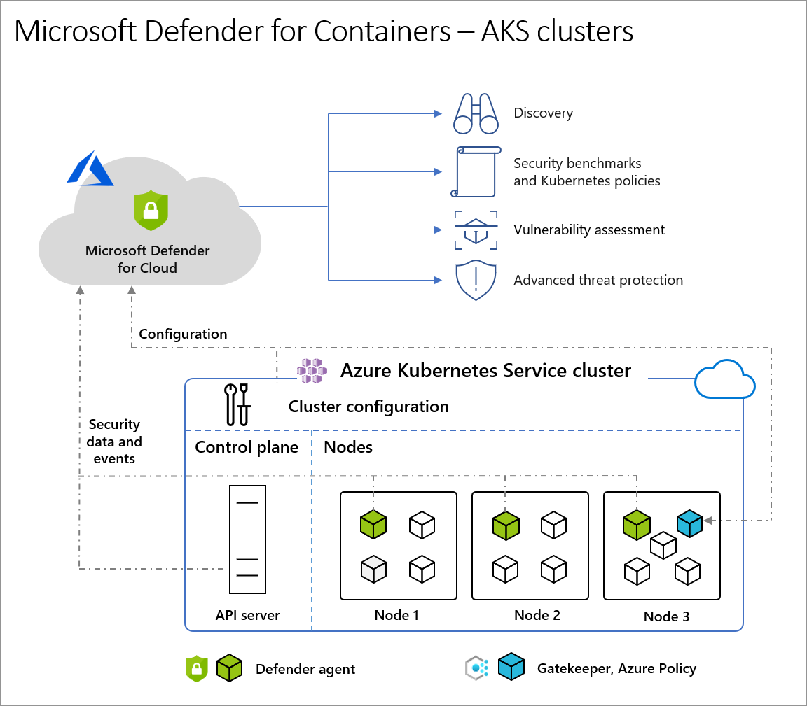
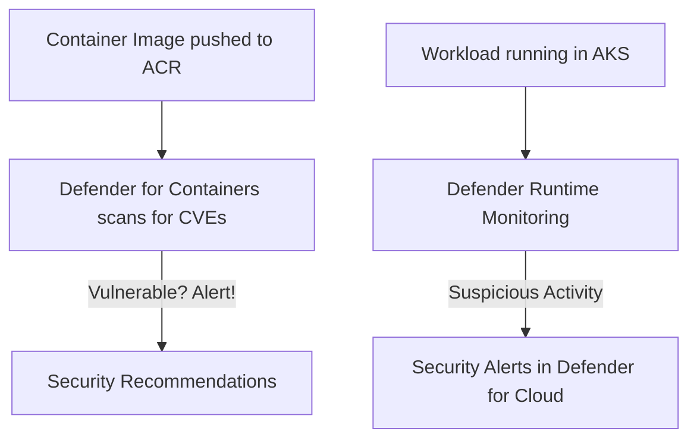

# 🛡️ Microsoft Defender for Containers

## 📌 1. What is it?

👉 **Microsoft Defender for Containers** is a **cloud-native security service** in **Azure Security Center / Microsoft Defender for Cloud** that protects your **containerized workloads** across:

- **Azure Kubernetes Service (AKS)**
- **On-premises or hybrid Kubernetes clusters** (via Azure Arc)
- **Amazon EKS / Google GKE** (multi-cloud, with Arc)

Think of it as **“security guard for containers”** 🧑‍✈️ that scans, monitors, and alerts on:

- **Vulnerabilities** in container images (CVEs, bad libraries).
- **Misconfigurations** in Kubernetes clusters.
- **Runtime threats** (suspicious processes inside pods).
- **Network anomalies** (e.g., pod trying to talk to bitcoin miner).

---

  

---

## 📌 2. Why Do You Need It?

Containers bring speed 🚀 but also new risks:

- A developer might push a Docker image with a **critical CVE**.
- A misconfigured Kubernetes role could let attackers get **cluster admin**.
- A compromised pod might start **lateral movement** inside the cluster.

👉 Defender for Containers helps detect, block, and alert on these issues **before they hit production**.

---

## 📌 3. Key Features

| Feature                           | What it Does                                                                       | Example                            |
| --------------------------------- | ---------------------------------------------------------------------------------- | ---------------------------------- |
| **Image Scanning**                | Scans container images for vulnerabilities (integrates with ACR, Docker Hub, etc.) | Finds outdated `log4j` in an image |
| **K8s Threat Detection**          | Detects suspicious runtime behavior                                                | Pod spawning reverse shell         |
| **K8s Hardening Recommendations** | Security best practices                                                            | Warns if RBAC roles are too broad  |
| **Network Protection**            | Monitors unusual traffic patterns                                                  | Pod calling suspicious external IP |
| **Compliance Reports**            | Maps cluster security posture to standards (CIS, PCI-DSS)                          | Helps pass audits                  |
| **Multi-Cloud Support**           | Works on AKS, EKS, GKE (via Arc)                                                   | Hybrid protection                  |

---

## 📌 4. Hands-On: How to Enable

### 🔹 Step 1: Enable Defender Plan

1. Go to **Microsoft Defender for Cloud → Environment Settings**.
2. Select your subscription.
3. Under **Defender Plans** → turn on **Defender for Containers**.

---

### 🔹 Step 2: Connect Cluster

- For **AKS**: Integration is automatic after enabling.
- For **Arc-enabled Kubernetes**: Install the Defender extension via Azure Arc.

---

### 🔹 Step 3: Image Scanning

- Push images to **Azure Container Registry (ACR)**.
- Defender automatically scans images for vulnerabilities.
- Issues show up in **Defender for Cloud → Recommendations**.

---

### 🔹 Step 4: Monitor Threats

- Deploy workloads to AKS.
- Defender starts monitoring:

  - Suspicious execs inside containers.
  - Crypto-mining detection.
  - Privilege escalation attempts.

👉 Alerts show in **Security Alerts** with severity (High, Medium, Low).

---

## 📊 Visual Flow

---

## 📌 5. Integration with DevOps

- **Azure DevOps / GitHub Actions** → run Defender’s **image scan** as part of CI/CD.
- Example: pipeline fails if a critical vulnerability is found.
- **Policies** → block deployments if cluster doesn’t meet security baseline.

---

## 📌 6. Exam Tips (AZ-400, SC-200, AZ-500)

- **“Protect container workloads in Azure”** → Answer = **Defender for Containers**.
- If the question says:

  - “Scan images in registry for vulnerabilities” → ACR + Defender.
  - “Detect suspicious activity in AKS runtime” → Defender for Containers.
  - “Apply compliance to Kubernetes clusters across clouds” → Arc + Defender.

- ⚠️ Don’t confuse with **Defender for Servers** (VMs) or **Defender for App Service** (PaaS apps).

---

## ✅ TL;DR

- **Microsoft Defender for Containers** = security for **containers & Kubernetes**.
- Protects across **image scanning, runtime detection, network, compliance**.
- Works with **AKS, Arc-enabled K8s, EKS, GKE**.
- Integrates with **DevOps pipelines + ACR**.
- Exam keyword = _“container workload security in Azure & hybrid”_.

---

⚡ Do you want me to also create a **sample Azure DevOps YAML pipeline** where Defender scans images **before pushing to AKS** (classic real-world + exam case)?
