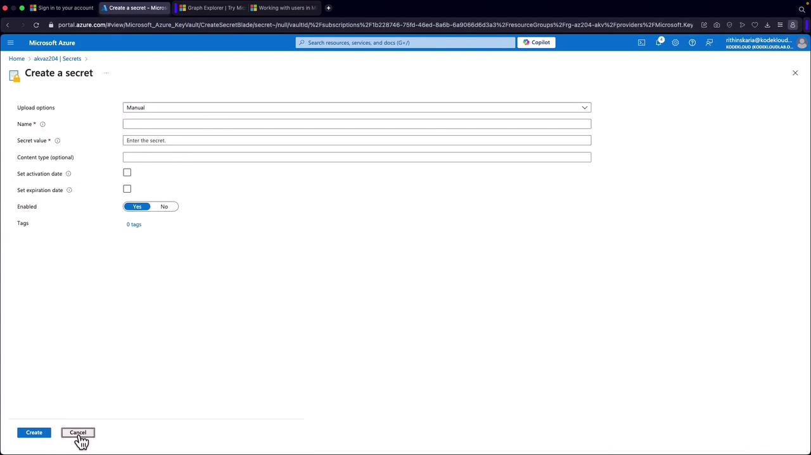
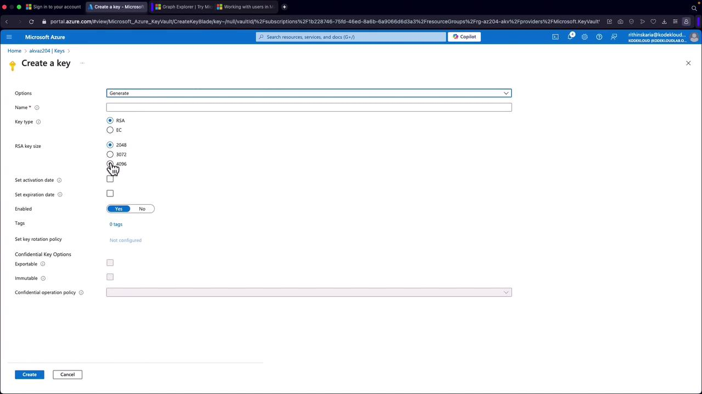

# **Hands-on** for **all three Azure Key Vault data types** (Secrets, Keys, Certificates)

## 🧰 Prereqs (once)

- **Key Vault** created (Standard or Premium).
- **Access model**: use **Azure RBAC** (recommended) not legacy Access Policies.
- **Your identity** (you, a service principal, or a managed identity) needs:

  - Secrets: **Key Vault Secrets User** (read) / **Secrets Officer** (write)
  - Keys (crypto ops): **Key Vault Crypto User** (encrypt/decrypt/sign) / **Crypto Officer** (create)
  - Certificates: **Key Vault Certificates Officer** (manage) + **Secrets User** (to read PFX/PEM secret)

- **.NET SDK packages** (install as needed):

  ```bash
  dotnet add package Azure.Identity
  dotnet add package Azure.Security.KeyVault.Secrets
  dotnet add package Azure.Security.KeyVault.Keys
  dotnet add package Azure.Security.KeyVault.Certificates
  ```

- **Auth in code**: `DefaultAzureCredential` (uses Managed Identity in Azure; locally uses your VS/Az CLI login).
- Set `KEYVAULT_URI` env var (e.g., `https://akv-az204-demo.vault.azure.net/`).

---

## 1) 🔒 SECRETS

### A) Portal — Create a Secret

1. Portal → **Key Vault** → your vault → **Secrets** → **Generate/Import**.
2. Name: `SqlConnectionString`.
3. Value: `Server=tcp:db...;Database=appdb;User Id=app;Password=P@ssw0rd;`
4. (Optional) Set activation/expiration → **Create**.
5. Note the **Secret Identifier (URI)**.

<div align="center">
  
</div>

---

### B) .NET — Use Secrets (set/get/list/update)

```csharp
using Azure.Identity;
using Azure.Security.KeyVault.Secrets;

var kvUri = new Uri(Environment.GetEnvironmentVariable("KEYVAULT_URI")!);
var secrets = new SecretClient(kvUri, new DefaultAzureCredential());

// Create/update a secret (creates a new version)
await secrets.SetSecretAsync(new KeyVaultSecret("SqlConnectionString",
    "Server=tcp:db;Database=appdb;User Id=app;Password=S3cr3t!"));

// Read latest version
KeyVaultSecret secret = await secrets.GetSecretAsync("SqlConnectionString");
Console.WriteLine($"ConnStr: {secret.Value}");

// Update properties (e.g., expire it)
var props = secret.Properties;
props.ExpiresOn = DateTimeOffset.UtcNow.AddDays(30);
await secrets.UpdateSecretPropertiesAsync(props);

// List all secrets (names only)
await foreach (var s in secrets.GetPropertiesOfSecretsAsync())
    Console.WriteLine($"Secret: {s.Name}");

// List all versions of one secret
await foreach (var v in secrets.GetPropertiesOfSecretVersionsAsync("SqlConnectionString"))
    Console.WriteLine($"Version: {v.Version} Enabled={v.Enabled}");
```

**Gotchas!**

- If you can see the vault but **403 on GetSecret** → assign **Key Vault Secrets User** (data plane).
- Secrets are **versioned**; creating a new one with same name creates a **new version**.

---

## 2) 🔑 KEYS

### A) Portal — Create a Key

1. Vault → **Keys** → **Generate**.
2. Name: `app-signing-key`.
3. Key type: **RSA** (2048) (or **EC**), operations: **Encrypt/Decrypt/Sign/Verify** as needed.
4. (Optional) Set rotation policy → **Create**.

<div align="center">
  
</div>

---

### B) .NET — Create & Use Keys (Encrypt/Decrypt, Sign/Verify)

```csharp
using System.Text;
using Azure.Identity;
using Azure.Security.KeyVault.Keys;
using Azure.Security.KeyVault.Keys.Cryptography;

var kvUri = new Uri(Environment.GetEnvironmentVariable("KEYVAULT_URI")!);
var keyClient = new KeyClient(kvUri, new DefaultAzureCredential());

// Create RSA key (skip if created in portal)
var create = await keyClient.CreateRsaKeyAsync(new CreateRsaKeyOptions("app-signing-key")
{
    KeySize = 2048
});
var key = create.Value;

// Get a crypto client bound to this key
var crypto = new CryptographyClient(key.Id, new DefaultAzureCredential());

// Encrypt/Decrypt (RSA-OAEP)
var plaintext = Encoding.UTF8.GetBytes("Top Secret Payload");
var enc = await crypto.EncryptAsync(EncryptionAlgorithm.RsaOaep, plaintext);
var dec = await crypto.DecryptAsync(EncryptionAlgorithm.RsaOaep, enc.Ciphertext);
Console.WriteLine($"Decrypted: {Encoding.UTF8.GetString(dec.Plaintext)}");

// Sign/Verify (RS256)
var data = Encoding.UTF8.GetBytes("data to sign");
using var sha256 = System.Security.Cryptography.SHA256.Create();
var digest = sha256.ComputeHash(data);

var sig = await crypto.SignAsync(SignatureAlgorithm.RS256, digest);
var ok  = await crypto.VerifyAsync(SignatureAlgorithm.RS256, digest, sig.Signature);
Console.WriteLine($"Signature valid: {ok.IsValid}");

// Get public JWK (e.g., to distribute to verifiers)
var pub = await keyClient.GetKeyAsync("app-signing-key");
Console.WriteLine($"KTY={pub.Value.KeyType}, N (len)={pub.Value.Key.N?.Length}");
```

**Gotchas!**

- To **do crypto** you need **Key Vault Crypto User** or higher.
- **Premium** tier puts keys in HSMs (compliance).
- You don’t download private key for Keys—use **CryptographyClient** so the key **never leaves the vault**.

---

## 3) 🪪 CERTIFICATES

Certificates in Key Vault have **three artifacts**:

- **Certificate** (lifecycle & metadata)
- **Key** (the private key managed by KV; non-exportable unless policy allows)
- **Secret** (PFX/PEM blob; requires **Secrets** permissions to download)

### A) Portal — Create a Certificate (self-signed)

1. Vault → **Certificates** → **Generate/Import** → **Generate**.
2. Name: `tls-api-cert`.
3. Type: **Self-signed** (for testing) or select an issuer (DigiCert) for prod.
4. Subject: `CN=api.contoso.local`
5. Advanced: mark **exportable** (if you’ll need the PFX), set key type/size, lifetime, auto-renew → **Create**.
6. Wait until status = **Completed**.

### B) .NET — Create & Retrieve Certificate + Load X509

```csharp
using Azure.Identity;
using Azure.Security.KeyVault.Certificates;
using Azure.Security.KeyVault.Secrets;
using System.Security.Cryptography.X509Certificates;

var kvUri = new Uri(Environment.GetEnvironmentVariable("KEYVAULT_URI")!);
var certClient = new CertificateClient(kvUri, new DefaultAzureCredential());
var secretClient = new SecretClient(kvUri, new DefaultAzureCredential());

// Create a self-signed cert (async long-running op)
var op = await certClient.StartCreateCertificateAsync("tls-api-cert",
    new CertificatePolicy("Self", "CN=api.contoso.local")
    {
        KeyType = CertificateKeyType.Rsa,
        KeySize = 2048,
        Exportable = true,
        ContentType = CertificateContentType.Pkcs12
    });
var certWithPolicy = await op.WaitForCompletionAsync();

// Download the PFX (backing secret) — requires Secrets permission
KeyVaultSecret pfxSecret = await secretClient.GetSecretAsync("tls-api-cert");

// If no password was set in policy, pass empty string
var pfxBytes = Convert.FromBase64String(pfxSecret.Value);
var x509 = new X509Certificate2(pfxBytes, (string?)null,
    X509KeyStorageFlags.MachineKeySet | X509KeyStorageFlags.Exportable);

Console.WriteLine($"Loaded cert: {x509.Subject}; HasPrivateKey={x509.HasPrivateKey}");
```

**Common uses!**

- Bind to **App Service/AKS/Reverse proxy** for TLS.
- Use for **client cert auth** or **JWT signing** in your own STS.
- Use cert with MSAL for **confidential client** auth:

  ```csharp
  // Microsoft.Identity.Client
  var app = ConfidentialClientApplicationBuilder.Create("<clientId>")
      .WithTenantId("<tenantId>")
      .WithCertificate(x509)   // ← from Key Vault
      .Build();
  ```

**Gotchas!**

- To download PFX/PEM you need **Secrets permissions**, not just Certificate role.
- If policy is **non-exportable**, you **won’t** get a PFX secret.
- Auto-renew requires a supported **issuer** and correct policy.

---

## 🧪 Quick end-to-end test (one file)

Create `Program.cs` and set `KEYVAULT_URI` env var; then paste the snippets for Secrets, Keys, and Certificates in order. Run:

```bash
dotnet run
```

If you hit `403`, verify **RBAC roles** on the **vault** for your identity.

---

## 🧩 Troubleshooting & Best Practices

- **403 / Forbidden** → You’re missing **data-plane** role(s) (Secrets/Keys/Certificates).
- **RBAC vs Access Policies** → Prefer **RBAC**; avoid mixing both.
- **Soft delete & purge protection** → Keep on (safety).
- **Rotation** → Create new **versions**, don’t mutate values; pair with config reload/Event Grid for apps.
- **Managed Identity** → Use it for apps (no secrets in code).
- **Premium** tier for **HSM** keys and compliance.
- **Logs** → Enable diagnostic settings to Log Analytics for audits.

---

## 🗺️ What to memorize for AZ-204

- **Secrets vs Keys vs Certificates** and typical SDK clients:

  - `SecretClient`, `KeyClient` + `CryptographyClient`, `CertificateClient`

- **RBAC roles** needed per operation (Secrets User, Crypto User, Certificates Officer).
- **Keys** are used via **CryptographyClient** (key stays in vault).
- **Certificates** often retrieved as **secret (PFX/PEM)** if **exportable**.
- Use **DefaultAzureCredential** + **Managed Identity** for apps.
