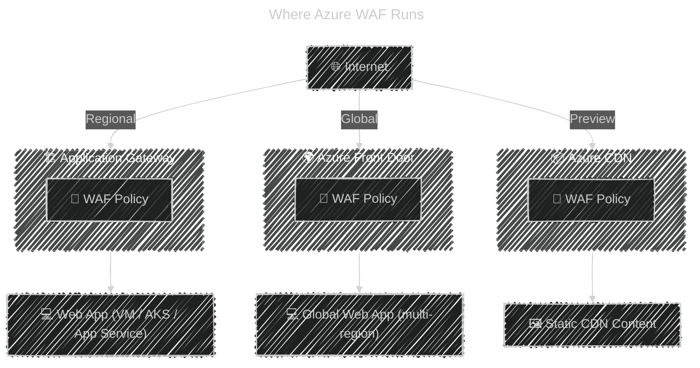

# 🧱 **Azure Web Application Firewall (WAF)**

> Protects your web apps from attacks like SQL Injection, XSS, and OWASP Top 10 —
> but here’s the key: **WAF is not a standalone service** — it’s a **feature** built into other Azure services.

---

## 🧩 What Exactly Is Azure WAF?

**Azure WAF (Web Application Firewall)** is a **layer-7 (HTTP/HTTPS) protection** service that inspects and filters inbound traffic to your web applications.

> 💡 It is **not a separate service** you deploy independently.  
> Instead, it’s a **security feature integrated into specific Azure services** that handle web traffic.

---

## ⚙️ Where Azure WAF Lives

Azure WAF can run in **two main places** (and optionally a third newer one):

| Deployment Type                   | Built Into                                 | Typical Use Case                                                 |
| --------------------------------- | ------------------------------------------ | ---------------------------------------------------------------- |
| 🧱 **WAF on Application Gateway** | **Application Gateway** (L7 Load Balancer) | Protect **web apps hosted inside Azure** (VMs, App Service, AKS) |
| 🌍 **WAF on Azure Front Door**    | **Front Door (Global CDN + LB)**           | Protect **globally distributed web apps**                        |
| ☁️ **WAF on Azure CDN (Preview)** | **Azure CDN (Standard from Microsoft)**    | Protect **content delivery endpoints**                           |

So:  
✅ Azure WAF = feature inside **Application Gateway**, **Front Door**, or **CDN**  
❌ Not a standalone SKU in Azure.

---

## 🧠 Visual Summary

---

## 1️⃣ Azure WAF on **Application Gateway**

> 💡 **Regional deployment** — inside your virtual network.

### 🏗️ How It Works

- Traffic comes through **Application Gateway**
- The **WAF tier** (v2) inspects HTTP(S) requests
- Applies rules (based on **OWASP Core Rule Set**)
- Blocks, allows, or logs malicious requests

### 📦 Key Features

| Feature            | Description                                  |
| ------------------ | -------------------------------------------- |
| 📍 Deployment      | Inside your VNet (regional)                  |
| 🔐 TLS Termination | Yes (L7)                                     |
| 🧱 WAF Policy      | Associated with Gateway or specific listener |
| ⚙️ Modes           | Detection or Prevention                      |
| 📜 Rules           | OWASP 3.x + custom rules                     |
| 🧭 Integration     | Azure Monitor, Log Analytics, Sentinel       |
| 🚀 Autoscaling     | Supported (v2 SKU)                           |

### ⚙️ Modes

| Mode           | Behavior                                   |
| -------------- | ------------------------------------------ |
| **Detection**  | Logs malicious requests but allows traffic |
| **Prevention** | Blocks attacks inline                      |

---

## 2️⃣ Azure WAF on **Front Door**

> 💡 **Global edge deployment** — runs at Microsoft’s POPs (Points of Presence).

### 🌍 How It Works

- Traffic hits **Front Door edge locations**
- WAF filters requests before they reach backend
- Ideal for **global apps** and **multi-region resiliency**

### 📦 Key Features

| Feature        | Description                                |
| -------------- | ------------------------------------------ |
| 🌍 Deployment  | Global (Edge POPs)                         |
| ⚡ Latency     | Extremely low (CDN edge)                   |
| 🧱 WAF Policy  | Global policy, applied to endpoints        |
| 📜 Rule Sets   | OWASP 3.x + Bot Protection + Rate Limiting |
| 🔁 Integration | Azure Policy, Monitor, Sentinel            |
| 🌐 Use Case    | Multi-region web app front-ends            |

---

## 📌 Azure WAF Policy (Common to Both)

A **WAF Policy** defines your rules, exclusions, and settings.

### 🧱 WAF Policy Components

| Component            | Description                                       |
| -------------------- | ------------------------------------------------- |
| 📜 **Managed Rules** | OWASP Core Rule Set (3.x) maintained by Microsoft |
| ✏️ **Custom Rules**  | User-defined (e.g., block IPs, paths, headers)    |
| 🧩 **Exclusions**    | Bypass rules for specific requests                |
| 🚦 **Mode**          | Detection / Prevention                            |
| 📈 **Monitoring**    | Logs to Azure Monitor / Log Analytics             |

💡 One WAF policy can be **linked to multiple** Application Gateways or Front Door endpoints.

---

## 🔐 Rule Sets and Protection Types

| Category                      | Example Attack       | Protected By              |
| ----------------------------- | -------------------- | ------------------------- |
| 🧩 SQL Injection              | `OR 1=1`             | OWASP 942100              |
| 🧩 Cross-site scripting (XSS) | `<script>` injection | OWASP 941100              |
| 🧩 Local File Inclusion       | `/etc/passwd`        | OWASP 930100              |
| 🧩 Command Injection          | `; rm -rf /`         | OWASP 932100              |
| 🧩 Bot attacks                | Automated scanners   | Microsoft Bot Protection  |
| 🧩 DDoS (basic L7)            | Request floods       | Rate-limiting custom rule |

---

## 🧭 WAF vs. DDoS vs. App Gateway

| Feature        | **WAF**                      | **DDoS Protection**     | **Application Gateway** |
| -------------- | ---------------------------- | ----------------------- | ----------------------- |
| 📍 Layer       | 7 (HTTP/S)                   | 3–4 (Network)           | 7 (Load Balancing)      |
| 🛡️ Focus       | App-layer attacks            | Volumetric / Network    | Traffic routing + load  |
| 🧩 Integration | In App Gateway or Front Door | On Public IP            | WAF built-in option     |
| 🌍 Scope       | Web app                      | Entire network / subnet | App-specific            |
| ⚙️ Example     | SQLi, XSS, LFI               | SYN flood, UDP flood    | URL-based routing       |

---

## 🏷️ WAF SKU Comparison (2025)

| Platform                                       | Scope       | Rule Engine   | Extra Features                         |
| ---------------------------------------------- | ----------- | ------------- | -------------------------------------- |
| **WAF on Application Gateway (v2)**            | Regional    | OWASP CRS 3.x | Custom rules, Logging, TLS termination |
| **WAF on Azure Front Door (Standard/Premium)** | Global Edge | OWASP CRS 3.x | Bot protection, rate limiting          |
| **WAF on Azure CDN (Preview)**                 | Edge        | OWASP CRS 3.x | CDN caching + L7 filtering             |

---

## ✅ Key Takeaways

| Concept                 | Summary                                                                                             |
| ----------------------- | --------------------------------------------------------------------------------------------------- |
| 🧱 **Azure WAF**        | Not a separate service — it’s a feature integrated into **App Gateway**, **Front Door**, or **CDN** |
| 🌍 **App Gateway WAF**  | Regional (inside VNet)                                                                              |
| 🌐 **Front Door WAF**   | Global (edge POPs)                                                                                  |
| 📜 **WAF Policy**       | Defines rules (OWASP, custom, exclusions)                                                           |
| 🧠 **Rule Engine**      | OWASP CRS 3.x maintained by Microsoft                                                               |
| 🔐 **Protection Scope** | Layer 7 web traffic (HTTP/S)                                                                        |
| 🧰 **Logging**          | Azure Monitor, Sentinel, Log Analytics                                                              |
| ⚙️ **Modes**            | Detection / Prevention                                                                              |

---

## 🧩 Memory Hook

> 🧠 “Azure WAF doesn’t live alone — it rides on the shoulders of gateways and front doors.”

✅ Application Gateway = WAF for **regional** web apps
✅ Front Door = WAF for **global** web apps
✅ CDN = WAF for **content delivery**
