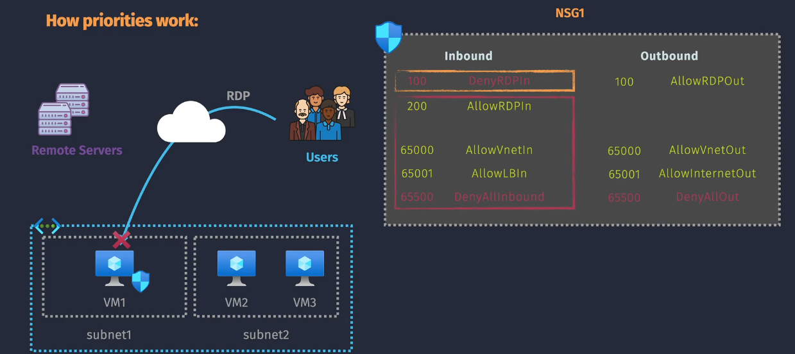
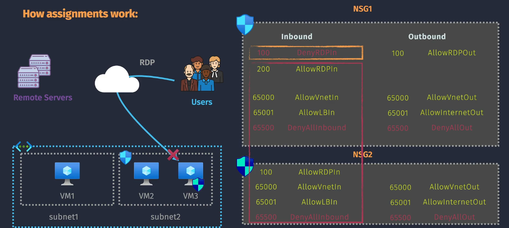
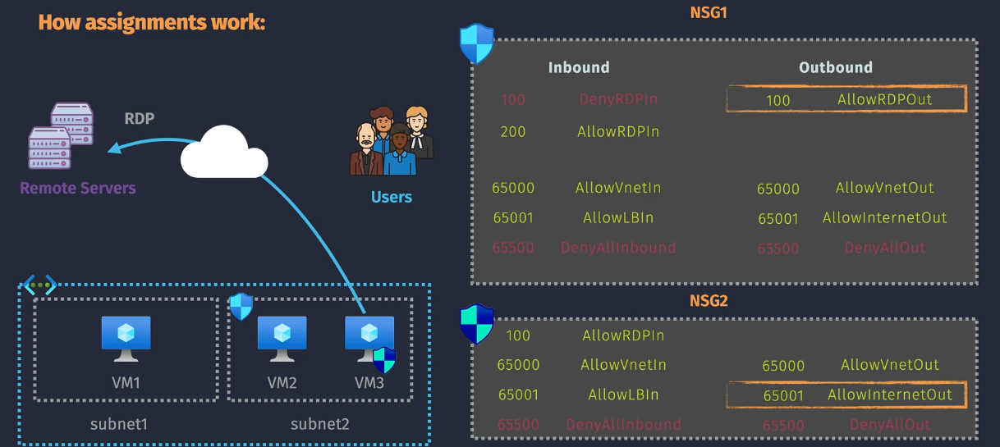
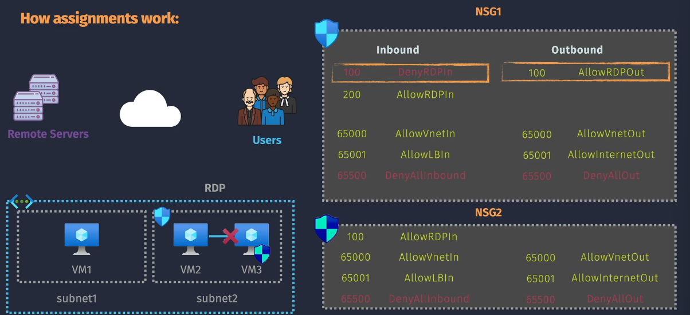

# 🔐 Azure NSG Security Rules – Inbound, Outbound & VM-to-VM Examples

## 🚪 Inbound Rule Examples

### 🔹 Example 1: Deny Overrides Allow

  

---

| Priority | Name        | Action | Source            | Destination | Protocol | Port |
| -------- | ----------- | ------ | ----------------- | ----------- | -------- | ---- |
| 100      | DenyRDPIn   | Deny   | Any               | Any         | TCP      | 3389 |
| 200      | AllowRDPIn  | Allow  | Any               | Any         | TCP      | 3389 |
| 65000    | AllowVnetIn | Allow  | VNet              | VNet        | Any      | Any  |
| 65001    | AllowLBIn   | Allow  | AzureLoadBalancer | Any         | Any      | Any  |
| 65500    | DenyAllIn   | Deny   | Any               | Any         | Any      | Any  |

🧪 **Scenario:**
User tries to RDP into VM1 using TCP port 3389.

🛑 **Result:**
**Traffic is denied** because:

- The `DenyRDPIn` rule (priority 100) **matches first** and blocks traffic.
- `AllowRDPIn` (priority 200) is **never evaluated** due to first-match-wins behavior.

---

### 🔹 Example 2: Subnet NSG Denies, NIC NSG Allows

  

---

#### 🧱 NSG1 – Attached to Subnet

| Priority | Name        | Action | Source            | Destination | Protocol | Port |
| -------- | ----------- | ------ | ----------------- | ----------- | -------- | ---- |
| 100      | DenyRDPIn   | Deny   | Any               | Any         | TCP      | 3389 |
| 200      | AllowRDPIn  | Allow  | Any               | Any         | TCP      | 3389 |
| 65000    | AllowVnetIn | Allow  | VNet              | VNet        | Any      | Any  |
| 65001    | AllowLBIn   | Allow  | AzureLoadBalancer | Any         | Any      | Any  |
| 65500    | DenyAllIn   | Deny   | Any               | Any         | Any      | Any  |

#### 🧩 NSG2 – Attached to VM3 NIC

| Priority | Name        | Action | Source            | Destination | Protocol | Port |
| -------- | ----------- | ------ | ----------------- | ----------- | -------- | ---- |
| 100      | AllowRDPIn  | Allow  | Any               | Any         | TCP      | 3389 |
| 65000    | AllowVnetIn | Allow  | VNet              | VNet        | Any      | Any  |
| 65001    | AllowLBIn   | Allow  | AzureLoadBalancer | Any         | Any      | Any  |
| 65500    | DenyAllIn   | Deny   | Any               | Any         | Any      | Any  |

🧪 **Scenario 1:**
User tries to RDP into **VM1** (protected only by NSG1).

🛑 **Result:**
**Traffic is denied** due to `DenyRDPIn` in NSG1 (subnet level).

🧪 **Scenario 2:**
User tries to RDP into **VM3**, which has **NSG1 on subnet** and **NSG2 on NIC**.

🛑 **Result:**
**Still denied** because:

- **NSG1 (subnet)** is evaluated **first**.
- `DenyRDPIn` (priority 100) **blocks traffic before NSG2 is considered**.

> 🧠 **NIC NSG cannot override a deny in subnet NSG. Both must allow the traffic.**

---

## 📤 Outbound Rule Examples

### 🔹 Example 3: Allow Outbound RDP

  

| Priority | Name             | Action | Source | Destination | Protocol | Port |
| -------- | ---------------- | ------ | ------ | ----------- | -------- | ---- |
| 100      | AllowRDPOut      | Allow  | Any    | Any         | TCP      | 3389 |
| 65000    | AllowVnetOut     | Allow  | VNet   | VNet        | Any      | Any  |
| 65001    | AllowInternetOut | Allow  | Any    | Internet    | Any      | Any  |
| 65500    | DenyAllOut       | Deny   | Any    | Any         | Any      | Any  |

🧪 **Scenario:**
VM1 initiates outbound RDP connection to a remote server.

✅ **Result:**
**Traffic is allowed** due to:

- `AllowRDPOut` (priority 100) matching first and permitting traffic.
- Evaluation stops before default `DenyAllOut` is reached.

---

## 🔄 VM-to-VM Communication Example

### 🔹 Example 4: Subnet NSG blocks SQL traffic between VMs

  

#### NSG1 – Attached to Subnet (Hosts VM2)

##### Inbound Rules

| Priority | Name        | Action | Protocol | Port |
| -------- | ----------- | ------ | -------- | ---- |
| 100      | DenyRDPIn   | Deny   | TCP      | 3389 |
| 200      | AllowRDPIn  | Allow  | TCP      | 3389 |
| 65000    | AllowVnetIn | Allow  | Any      | Any  |
| 65500    | DenyAllIn   | Deny   | Any      | Any  |

##### Outbound Rules

| Priority | Name         | Action | Protocol | Port |
| -------- | ------------ | ------ | -------- | ---- |
| 100      | AllowRDPOut  | Allow  | TCP      | 3389 |
| 65000    | AllowVnetOut | Allow  | Any      | Any  |
| 65500    | DenyAllOut   | Deny   | Any      | Any  |

#### NSG2 – Attached to VM3 NIC

##### Inbound Rules

| Priority | Name        | Action | Protocol | Port |
| -------- | ----------- | ------ | -------- | ---- |
| 100      | AllowRDPIn  | Allow  | TCP      | 3389 |
| 65000    | AllowVnetIn | Allow  | Any      | Any  |
| 65500    | DenyAllIn   | Deny   | Any      | Any  |

##### Outbound Rules

| Priority | Name         | Action | Protocol | Port |
| -------- | ------------ | ------ | -------- | ---- |
| 100      | AllowRDPOut  | Allow  | TCP      | 3389 |
| 65000    | AllowVnetOut | Allow  | Any      | Any  |
| 65500    | DenyAllOut   | Deny   | Any      | Any  |

🧪 **Scenario:**
**VM3** tries to connect to **VM2** on **TCP port 1433** (SQL).

🛑 **Result: Denied**

### 🧠 Why?

1. **Outbound (NSG2 on VM3)** allows VNet traffic — ✅
2. **Inbound (NSG1 on Subnet/VM2)** has:

   - No specific rule for SQL (1433)
   - So default `DenyAllIn` (priority 65500) applies — ❌

✅ **Key Takeaway:**
Even if outbound is allowed, **inbound NSG must also allow** the port.

> Both subnet + NIC NSGs must allow traffic — **a single deny blocks it.**

---

## 📌 Summary of Lessons Learned

| Scenario                            | Outcome    | Key Rule                        |
| ----------------------------------- | ---------- | ------------------------------- |
| Deny before Allow (same NSG)        | ❌ Denied  | First match wins                |
| Subnet denies, NIC allows           | ❌ Denied  | Subnet evaluated first          |
| Explicit Allow (early priority)     | ✅ Allowed | Rule 100 matched before DenyAll |
| Default Deny (no matching rule)     | ❌ Denied  | DenyAllIn/Out at priority 65500 |
| VNet traffic not explicitly allowed | ❌ Denied  | No rule = Deny                  |
