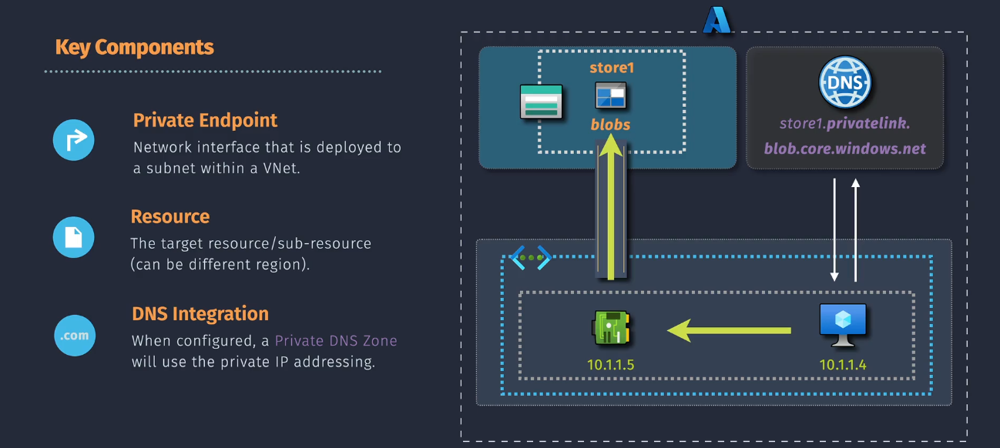
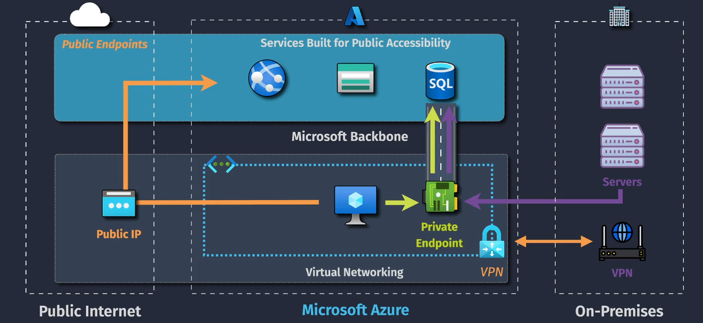
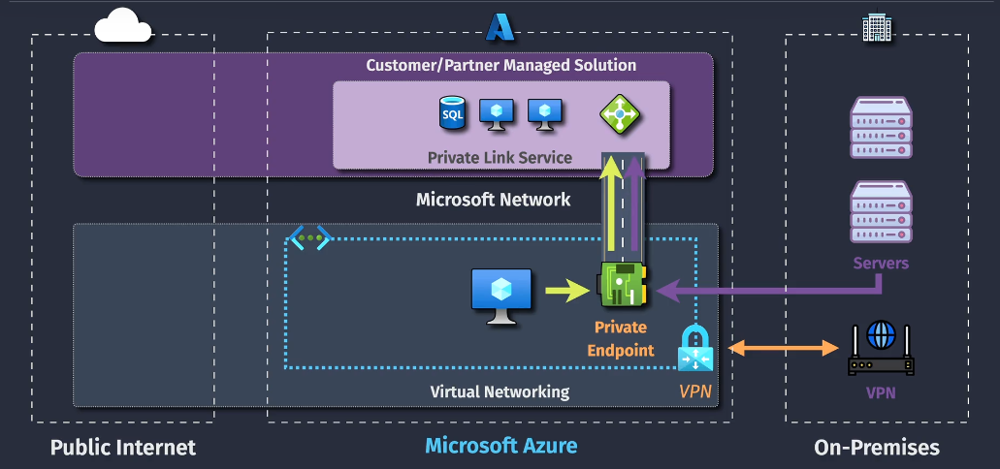
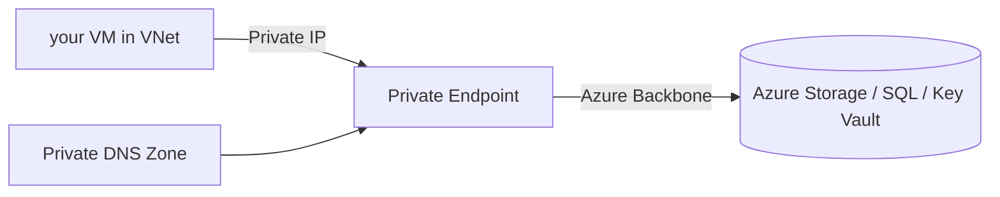
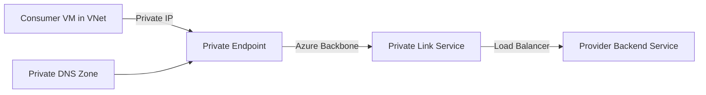

# 🔗 Azure Private Link — **Private Endpoint vs Private Link Service**

## 🚨 **The Problem It Solves**

Before Private Link existed, Azure PaaS services (like Storage, SQL, Key Vault) were accessible only via **public IP addresses** (even if traffic stayed on Microsoft’s backbone when using **Service Endpoints**).

- Public exposure increases **attack surface**.
- Customers in regulated industries need **no-internet paths** for compliance.
- Partners (ISVs, SaaS providers) want to expose services **privately** to customers **without** creating **VPN tunnels** or **peering VNets**.

💡 **Private Link** solves both by **embedding the service directly into your VNet via a private IP**.

---

<div align="center">
  
</div>

---

## 🧩 **Core Building Blocks**

| Term                           | Meaning                                                                                                                                                                  |
| ------------------------------ | ------------------------------------------------------------------------------------------------------------------------------------------------------------------------ |
| **Private Endpoint (PE)**      | A network interface with a private IP in your subnet that connects securely to an Azure PaaS resource (Storage, SQL, Key Vault, etc.) or to a Private Link Service.      |
| **Private Link Service (PLS)** | A way for you (or a partner) to expose **your own service** privately over Private Link so that consumers in other VNets (or tenants) can connect via Private Endpoints. |
| **Private DNS Zone**           | Overrides public DNS names to point to the private IP address of the PE.                                                                                                 |

---

## 📌 **Two Faces of Private Link**

### 1️⃣ **Private Endpoint for Azure Resources**

- **Purpose:** Securely access **Microsoft-managed PaaS services** (Azure Storage, SQL Database, Key Vault, etc.) via private IP.
- **How:** Azure provisions a NIC in your subnet linked to the PaaS resource.
- **Traffic Flow:**

  ```plaintext
  VM (10.0.0.4) → Private IP (PE) → Azure Backbone → Azure PaaS Service
  ```

- **Example:**
  You have an Azure Storage account `mystorage.blob.core.windows.net`.
  Normally, this resolves to a public IP like `52.x.x.x`.
  With Private Endpoint:

  - DNS now resolves to `10.0.1.5` (private IP in your subnet).
  - Public network access to the storage can be disabled.

- **_Private Endpoint:_**

    <div align="center">
    
    </div>

---

### 2️⃣ **Private Link Service for Partner or Custom Services**

- **Purpose:** Expose **your own service** running behind an Azure Standard Load Balancer privately to other VNets or tenants.
- **How:**

  - You (Provider) create a **Private Link Service** linked to your Standard Load Balancer frontend.
  - Consumers connect via **Private Endpoints** in their VNets.
  - Traffic flows **over Azure backbone**, never touching the internet.

- **Traffic Flow:**

  ```plaintext
  Consumer VM (10.10.0.4) → Private Endpoint → Azure Backbone → Provider Load Balancer → Backend VM/App
  ```

- **Example:**
  A SaaS company in Azure hosts an API for multiple enterprise customers.
  Instead of exposing it over a public IP:

  - They publish a **Private Link Service**.
  - Each customer gets a **Private Endpoint** in their own VNet pointing to that service.
  - The API appears like it’s inside the customer’s network.

- **_Private Link Service:_**

    <div align="center">
    
    </div>

---

## 🔄 **Commonality — Both Use Private IP Links**

Whether it’s **Private Endpoint** to Azure PaaS or **Private Endpoint** to a partner’s **Private Link Service**:

- A **private IP** is allocated in your subnet.
- All traffic uses Azure’s private backbone.
- The only visible IP to you is that private IP.

---

## 📊 **Side-by-Side Comparison**

| Feature                     | Private Endpoint (Azure Resources) | Private Link Service (Partner/Custom) |
| --------------------------- | ---------------------------------- | ------------------------------------- |
| **Target**                  | Microsoft PaaS resources           | Partner or your own services          |
| **Setup Owner**             | Consumer only                      | Provider + Consumer                   |
| **Requires Load Balancer?** | ❌ No                              | ✅ Yes (Standard SKU)                 |
| **Cross-Tenant Support**    | ✅ Yes                             | ✅ Yes                                |
| **DNS Override Needed**     | ✅ Yes                             | ✅ Yes                                |
| **Example**                 | Private IP to Azure SQL            | Private IP to Partner’s API           |

---

## 🖼 **Architecture Diagrams**

### **Private Endpoint to Azure PaaS**



---

### **Private Link Service for Partners**



---

## ✍🏻 **Hands-On Examples**

### 📌 **Example 1 — Private Endpoint to Azure SQL**

1. Go to your SQL Server → Networking → **Private endpoint connections** → **+ Private endpoint**.
2. Choose your VNet + Subnet.
3. Create Private DNS Zone: `privatelink.database.windows.net`.
4. Test:

   ```bash
   nslookup mydb.database.windows.net
   # Returns 10.x.x.x
   ```

---

### 📌 **Example 2 — Private Link Service for Partner API**

**Provider Side:**

1. Create a Standard Load Balancer for backend VMs.
2. Publish **Private Link Service** pointing to the Load Balancer.
3. Share the **Resource ID** or **Alias** with the consumer.

**Consumer Side:**

1. Create Private Endpoint → **Connect to resource by alias**.
2. Wait for Provider to approve.
3. Test:

   ```bash
   curl https://partnerapi.privatelink.azure.com
   ```

---

## 🧠 AWS Analogy

| Azure                              | AWS Equivalent                                |
| ---------------------------------- | --------------------------------------------- |
| Private Endpoint (Azure Resources) | VPC Endpoint (Interface Type)                 |
| Private Link Service               | AWS PrivateLink (for Partner/Custom Services) |
| Private DNS Zone                   | AWS Private Hosted Zone                       |

---

## 🚨 Gotchas

- Without **Private DNS Zone**, your VMs may still resolve to public IPs.
- **Private Link Service** needs **Standard Load Balancer**, not Basic.
- Disable public access on PaaS resources to fully enforce private-only access.

---

## 🧑🏻‍💻 Practice

If you want, I can now make a **side-by-side lab** where we:

1. Create a Private Endpoint to Azure SQL.
2. Create a Private Link Service from a web API and connect as a consumer.
3. Show how DNS overrides the public IP in both cases.

This would give you **real muscle memory** between the two.

Do you want me to prepare that lab next?
