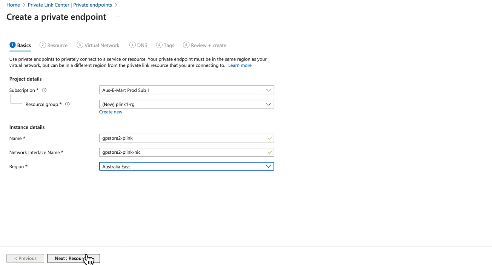
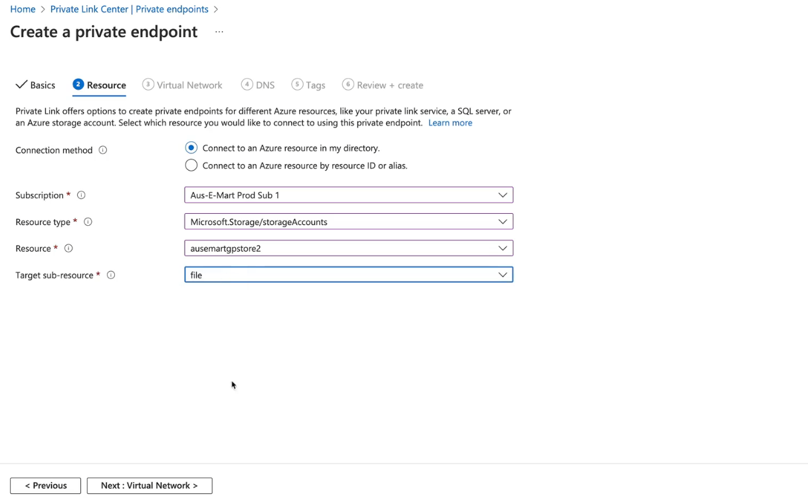
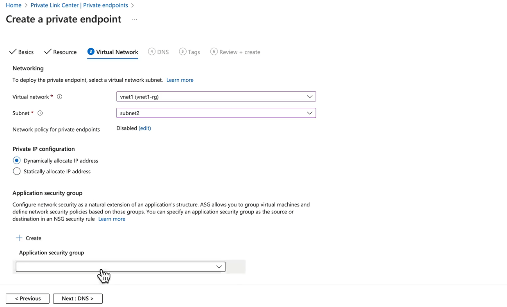
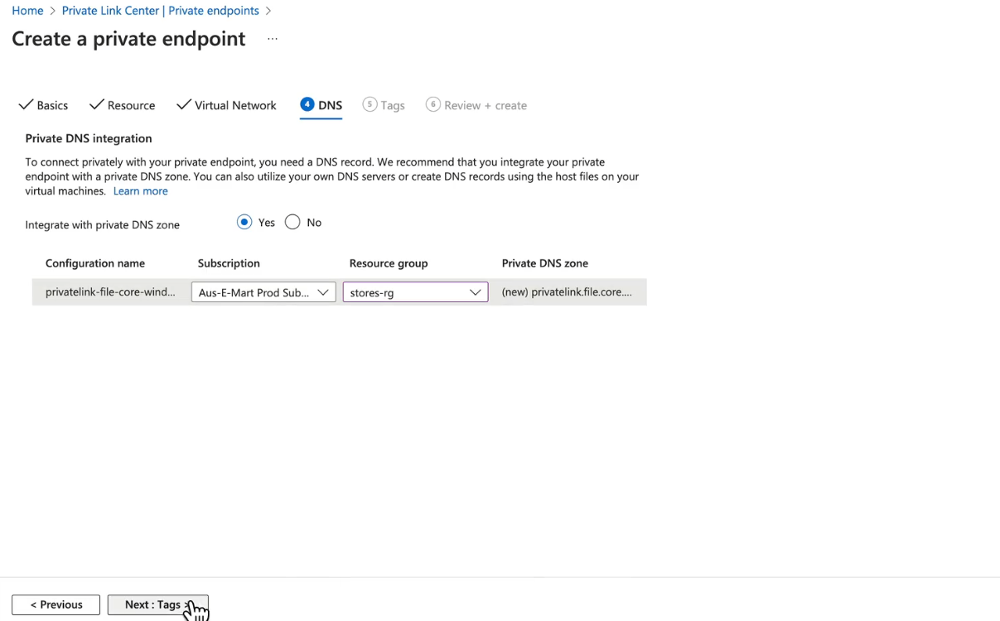

# 🧑🏻‍💻 **Azure Private Links Demos**

## ✍🏻 **Azure Private Endpoint** — Demo (Storage Account Example)

We’ll create a **Private Endpoint** to connect a subnet **privately** to an Azure Storage Account.
This ensures that traffic to the storage account flows **over a private IP on your VNet** instead of the public internet.

---

### 1️⃣ **Start Creating a Private Endpoint**

- Navigate to the **Azure Portal**.
- Go to **Private Link Center** → **Private Endpoints**.
- Click **+ Create**.

---

### 2️⃣ **Basics Configuration**

<div align="center">
  
</div>

---

- **Subscription**: Choose the subscription (e.g., `Aus-E-Mart Prod Sub 1`).
- **Resource Group**: Pick an existing one or create a new one (e.g., `plink1-rg`).
- **Instance Details**:

  - **Name**: `gpstore2-plink`
  - **Network Interface Name**: `gpstore2-plink-nic`
  - **Region**: Must match the VNet’s region (e.g., `Australia East`).

Click **Next: Resource**.

---

### 3️⃣ **Resource Configuration**

<div align="center">
  
</div>

---

- **Connection Method**: `Connect to an Azure resource in my directory`
- **Subscription**: Ensure it matches the earlier selection.
- **Resource Type**: `Microsoft.Storage/storageAccounts`
- **Resource**: Select `ausemartgpstore2`
- **Target Sub-Resource**:

  - `blob` for Blob Storage
  - `file` for File Shares (example: `file`)

Click **Next: Virtual Network**.

---

### 4️⃣ **Virtual Network Configuration**

<div align="center">
  
</div>

---

- **Virtual Network**: `vnet1`
- **Subnet**: `subnet2`
- **Private IP Configuration**:

  - `Dynamic` (auto-assigned) or
  - `Static` (you choose)

- **Application Security Group**: Optional.

Click **Next: DNS**.

---

### 5️⃣ **DNS Configuration**

<div align="center">
  
</div>

---

- Enable **Private DNS Zone** integration → **Yes**.
- **Configuration Name**: `privatelink-file-core-windows`
- Create or select an existing **Private DNS Zone**.

  - Example for Azure Files: `privatelink.file.core.windows.net`

Click **Next: Tags**.

---

### 6️⃣ **Tags (Optional)**

- Example:

  - `Environment`: Production
  - `Owner`: Networking Team

Click **Next: Review + Create**.

---

### 7️⃣ **Review and Create**

- Double-check all settings.
- Click **Create**.

✅ Your **Private Endpoint** now connects your VNet **privately** to the Azure Storage Account.
DNS resolution ensures that `ausemartgpstore2.file.core.windows.net` now resolves to the **private IP** (e.g., `10.0.2.4`) inside your subnet.

---

💡 **No UDR Needed** — Once Private Endpoint + DNS is configured, VM1 in the subnet can access the storage account without additional routing changes.

---

## ✍🏻 **Azure Private Link Service** — Demo (Partner/Custom Service Example)

Now let’s create a **Private Link Service** so a **provider** can expose an internal service to other VNets (or tenants) privately.

---

### **Scenario**

- **Provider**: Runs an API on VM(s) behind a **Standard Load Balancer**.
- **Consumer**: Needs to access the API privately via a Private Endpoint.

---

### **Provider Steps**

#### 1️⃣ **Prepare Backend**

- Deploy VM(s) running your service in a VNet.
- Place them **behind a Standard Load Balancer** (Basic SKU not supported).
- The LB must have a **Frontend IP Configuration**.

---

#### 2️⃣ **Create Private Link Service**

- Go to **Private Link Center** → **Private Link services** → **+ Create**.
- **Basics**:

  - Subscription: Choose your subscription.
  - Resource Group: Example `provider-pls-rg`.
  - Name: `provider-api-pls`
  - Region: Same as Load Balancer.

- Click **Next: Configuration**.

---

#### 3️⃣ **Configuration**

- **Frontend IP Configuration**: Select the LB frontend.
- **Visibility**:

  - Restrict to specific subscriptions/tenants **or**
  - Allow all (not recommended for sensitive services).

- Enable **Auto-Approval** (optional).

Click **Review + Create** → **Create**.

---

### **Consumer Steps**

#### 1️⃣ **Create Private Endpoint**

- Go to **Private Link Center** → **Private Endpoints** → **+ Create**.
- **Connection Method**: `Connect to an Azure resource by resource ID or alias`.
- Paste **Provider Alias** (given by the provider).
- Select your **VNet + Subnet**.
- Configure DNS (Private DNS Zone for the provider’s custom domain or FQDN).

---

#### 2️⃣ **Approval**

- Provider receives a connection request in the **Private Link Service** → **Connections**.
- Provider **approves** the request.

---

#### 3️⃣ **Test Connectivity**

```bash
nslookup partnerapi.privatelink.azure.com
# Should resolve to a private IP from your subnet

curl https://partnerapi.privatelink.azure.com
# Response from provider API
```

---

## 📊 **Key Differences in the Demos**

| Feature              | Private Endpoint   | Private Link Service    |
| -------------------- | ------------------ | ----------------------- |
| Target               | Azure-managed PaaS | Partner/custom services |
| Setup Owner          | Consumer           | Provider + Consumer     |
| Load Balancer Needed | ❌ No              | ✅ Yes (Standard)       |
| Example              | Storage Account    | SaaS API                |
