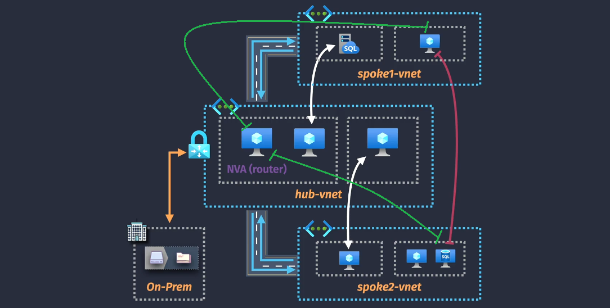
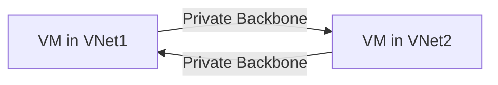
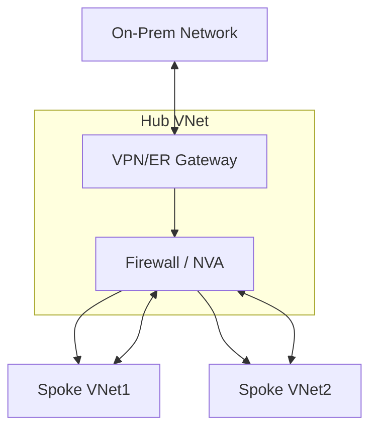

# 🔗 Azure VNet Peering

> **Seamlessly Connect Virtual Networks**

Azure **VNet Peering** is a feature that allows two **Azure Virtual Networks (VNets)** to communicate with each other **privately** over the **Microsoft backbone network**, no public internet, no VPN gateway needed.

> 💡 **AWS Tip:** Think of it as **AWS VPC Peering**, but with a few Azure-specific behaviors (like global peering and service chain considerations).

---

  

---

## 🧩 Key Characteristics

| Feature                 | Azure VNet Peering                                                | AWS Equivalent                    | Notes                                             |
| ----------------------- | ----------------------------------------------------------------- | --------------------------------- | ------------------------------------------------- |
| **Traffic Path**        | Microsoft private backbone                                        | AWS private backbone              | No public IP exposure by default.                 |
| **Latency & Bandwidth** | Low latency, high throughput  (same as VM-to-VM in same VNet) | Same                              | Azure doesn’t throttle peered traffic.            |
| **Transitive Routing**  | ❌ Not supported                                                  | ❌ Not supported                  | Each VNet must be directly peered to communicate. |
| **Cross-region**        | ✅ Yes (Global VNet Peering)                                      | ✅ Yes (Inter-region VPC Peering) | Charged per GB egress.                            |
| **Cross-subscription**  | ✅ Yes                                                            | ✅ Yes                            | Must have correct permissions.                    |

---

## 🏗 Types of VNet Peering

### 1️⃣ **Virtual Network Peering** (Intra-region)

- Connects VNets **within the same Azure region**.
- Private backbone routing, no extra cost for ingress/egress in same region (except per-GB egress charges in some cases).

### 2️⃣ **Global VNet Peering** (Inter-region)

- Connects VNets **across different Azure regions**.
- Still uses Azure backbone network, but **egress charges apply** (similar to AWS inter-region VPC Peering).

---

## 📦 How Traffic Flows

> - Communication is **direct**: No public IPs, no NAT, no VPN.
> - Same security rules still apply: **NSGs** and **UDRs** can allow/deny traffic.

---

## ⚙ Key Configuration Options in Peering

When you create a peering between two VNets, you configure each side separately:

| Option                              | Description                                                                                       | AWS Equivalent                                            |
| ----------------------------------- | ------------------------------------------------------------------------------------------------- | --------------------------------------------------------- |
| **⚙️ Allow Virtual Network Access** | Enables VM-to-VM communication over private IPs.                                                  | "Allow DNS resolution + routing" in VPC Peering           |
| **⚙️ Allow Forwarded Traffic**      | Lets traffic from one peered VNet forward through this VNet to somewhere else (service chaining). | Similar to enabling routing via EC2 instance              |
| **⚙️ Allow Gateway Transit**        | Lets one VNet use the other’s VPN/ER Gateway.                                                     | AWS: No direct equivalent (would require Transit Gateway) |
| **⚙️ Use Remote Gateway**           | Lets your VNet use the other VNet’s Gateway for on-prem or internet.                              | AWS: Transit Gateway scenario                             |

---

## 📋 Example Scenario

**Goal:**

- VNet-A in East US
- VNet-B in East US
- Need direct private communication between them for application tiers.

**Setup Steps:**

1. Go to VNet-A → **Peerings** → Add Peering.

   - Name: `VNetA-to-VNetB`
   - Select VNet-B as the peer.
   - Enable **Allow Virtual Network Access**.

2. Go to VNet-B → **Peerings** → Add Peering.

   - Name: `VNetB-to-VNetA`
   - Select VNet-A as the peer.
   - Enable **Allow Virtual Network Access**.

3. Update NSGs if needed to allow traffic (default is allow within VNet).

---

## 🔍 **Hub-and-Spoke Using VNet Peering with Gateway Appliance** _(better to use Transit Gateway instead)_

> 📌 One of the **most common Azure architectures**:
>
> - **Hub VNet**: Has the VPN Gateway / ExpressRoute Gateway + Firewall.
> - **Spoke VNets**: Peered to Hub, route through it for on-premises and shared services.

---

---

> 🚨 **Important:**
>
> - Enable **Allow Gateway Transit** on Hub.
> - Enable **Use Remote Gateway** on each Spoke.
> - Ensure **Allow Forwarded Traffic** if firewall/NVA is doing inspection.

---

## 🚫 Limitations

- ❌ No **transitive peering** → must peer every VNet pair or use a **hub-and-spoke** model.
- ❌ Cannot apply NSGs directly to the peering connection (NSGs apply at subnet/NIC level).
- ❌ Cannot use overlapping address spaces (same as AWS).

---

## 🆚 Azure VNet Peering vs AWS VPC Peering

| Feature               | Azure VNet Peering               | AWS VPC Peering             |
| --------------------- | -------------------------------- | --------------------------- |
| Cross-region Support  | ✅ Yes (Global VNet Peering)     | ✅ Yes                      |
| Gateway Sharing       | ✅ Yes (Gateway Transit)         | ❌ Requires Transit Gateway |
| Service Chaining      | ✅ Yes (Allow Forwarded Traffic) | Limited                     |
| Overlapping CIDR      | ❌ Not Allowed                   | ❌ Not Allowed              |
| Effective Routes View | ✅ Yes                           | ❌ No native tool           |

---

## 💡 Use Cases

1. 💡 **Hub-and-Spoke Network Topology**: Create a central hub virtual network that connects to multiple spoke virtual networks.
2. 💡 **Cross-Region Data Replication**: Enable seamless data replication between virtual networks in different regions.
3. 💡 **Hybrid Networking**: Connect on-premises networks to Azure virtual networks using VNet peering and VPN gateways.

---

## 📌 Summary

Azure VNet Peering is your go-to **low-latency, high-throughput** option for connecting VNets securely without VPN gateways.

- 🌍 Works across regions (Global Peering).
- 🛡 Still secured by NSGs and UDRs.
- 🚦 Allows service chaining and gateway transit for hub-and-spoke.
- 🆚 AWS equivalent is **VPC Peering**, but Azure adds built-in **Gateway Transit** without needing extra transit infrastructure.
