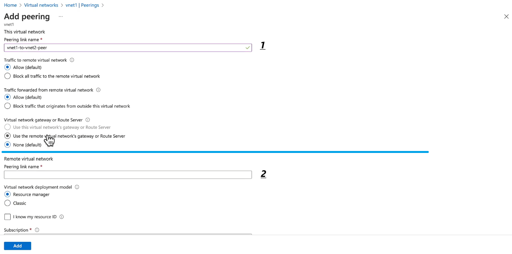
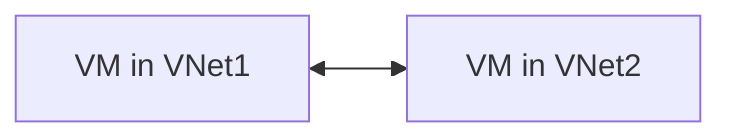

# 🛠 Creating VNet Peering in Azure

  

---

## 🧪 Demo Architecture

> - **Before Peering:** VM1 ↔ VM2 = ❌ (no route)
> - **After Peering:** VM1 ↔ VM2 = ✅ (private IP, no public internet)

---

## 📍 Steps to Create VNet Peering

### 1️⃣ Navigate to Virtual Networks

- Go to the **[Azure Portal](https://portal.azure.com/)**.
- In the left-hand menu, select **"Virtual networks"**.
- Click on the **first VNet** you want to peer (e.g., `VNet1`).

---

### 2️⃣ Initiate Peering

- In the **selected VNet's** menu, go to **"Peerings"** under **"Settings"**.
- Click **"+ Add"** to create a new peering.

---

### 3️⃣ Configure Peering Settings

- **Peering Link Name (Local):** e.g., `VNet1-to-VNet2`.
- **Remote Virtual Network:** Choose `VNet2` from the dropdown.
- **Peering Link Name (Remote):** e.g., `VNet2-to-VNet1`.

---

### 4️⃣ Set Peering Options

Here’s how each option works:

#### 🔹 **Traffic to Remote VNet**

- **What It Is:** Allows VNet1 resources to talk to VNet2 resources.
- **Options:**

  - **Enabled:** Full communication over **private IPs**.
  - **Disabled:** No connectivity.

- **Use Case:** Always enabled for typical VNet-to-VNet communication.

---

#### 🔹 **Traffic Forwarded from Remote VNet**

- **What It Is:** Lets traffic from the remote VNet **pass through** this VNet to reach somewhere else.
- **Options:**

  - **Enabled:** Supports **service chaining / transit** scenarios.
  - **Disabled:** Blocks transit routing.

- **Use Case:** Needed for **hub-and-spoke** where this VNet is the **hub**.

---

#### 🔹 **Virtual Network Gateway or Route Server**

- **Allow Gateway Transit:** Remote VNets can use **your** VPN Gateway or ExpressRoute Gateway.
- **Use Remote Gateway:** Your VNet uses **remote** VNet’s Gateway.
- **Enable Forwarded Traffic:** Required for transit routing via NVAs/Firewalls.

💡 **AWS comparison:** This is something AWS VPC Peering **doesn’t** natively do — you’d need a **Transit Gateway** in AWS to share VPN/Direct Connect gateways.

---

## ❓ Do You Need a UDR?

- **By Default:** **No** → Once you create VNet Peering **and enable "Allow Virtual Network Access"**, Azure automatically adds **system routes** to each VNet’s **effective routes** table, so VMs can talk instantly.
- **When UDR is Needed:**

  - You have a **custom route table** that overrides the system route.
  - You want to **force traffic** through an NVA/Firewall before it reaches the other VNet.

---

## 🔍 Quick Verification Steps

1. **Ping Test:**

   - Enable ICMP on NSGs for both subnets.
   - Ping VM2’s private IP from VM1.

2. **Effective Routes Check:**

   - Go to the NIC of VM1 → **Effective routes**.
   - You’ll see a **VNet peering route** with **next hop = Virtual network peering**.

---

## 📌 Summary Table

| Setting                      | Default | Required for Basic VM ↔ VM | Required for Hub-Spoke |
| ---------------------------- | ------- | -------------------------- | ---------------------- |
| Allow Virtual Network Access | ✅      | ✅                         | ✅                     |
| Allow Forwarded Traffic      | ❌      | ❌                         | ✅                     |
| Allow Gateway Transit        | ❌      | ❌                         | ✅                     |
| Use Remote Gateway           | ❌      | ❌                         | ✅                     |
