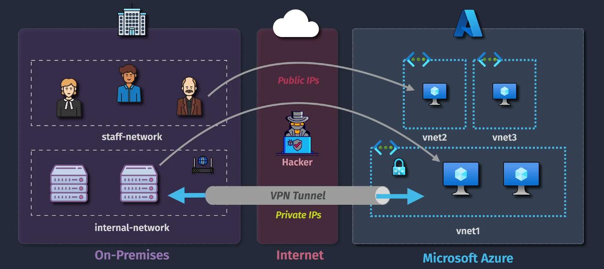
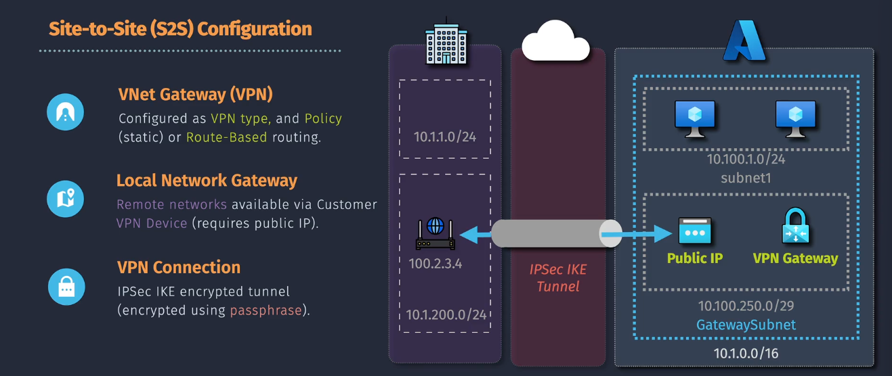
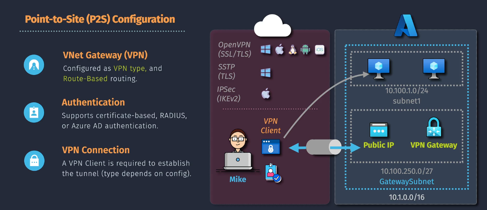

# 🔐 **Azure VPN Gateway** — Secure Hybrid Connectivity in Azure

> 📜 Official Definition  
> **Azure VPN Gateway** is a **specific type of virtual network gateway** that provides **secure, encrypted connectivity** between your **Azure VNets** and:
>
> - **On-premises networks** (Site-to-Site VPN)
> - **Individual remote devices** (Point-to-Site VPN)
> - **Other Azure VNets** (VNet-to-VNet VPN)

---

<div align="center">
  
</div>

> It uses **IPSec/IKE** for encryption and **runs inside a dedicated subnet** in your VNet called `GatewaySubnet`.

---

## 🧩 **Core Components**

### 1️⃣ **Gateway Types**

- **VPN Gateway** → IPSec/IKE-based encrypted tunnel over the Internet.
- **ExpressRoute Gateway** → Connects VNets to ExpressRoute circuits (private MPLS-based).
- **Both** → If you need hybrid scenarios.

---

### 2️⃣ **Connection Types**

| Connection Type         | Purpose                                                                | AWS Equivalent          |
| ----------------------- | ---------------------------------------------------------------------- | ----------------------- |
| **Site-to-Site (S2S)**  | Connects an entire on-prem network to Azure VNet                       | AWS Site-to-Site VPN    |
| **Point-to-Site (P2S)** | Connects individual remote devices (laptops, mobiles)                  | AWS Client VPN          |
| **VNet-to-VNet**        | Securely connect Azure VNets (same or different regions/subscriptions) | AWS VPC Peering + VPN   |
| **Multi-Site**          | Multiple S2S VPNs from different locations to one VNet                 | AWS TGW VPN attachments |

---

### 3️⃣ **Gateway SKUs & Performance**

- **Generation 1** → Up to 1 Gbps aggregate throughput.
- **Generation 2** → Up to 10 Gbps aggregate throughput.
- Features depend on SKU:

  - **Basic** → Cheapest, fewer features (no BGP, no zone-redundancy).
  - **VpnGw1–VpnGw5** → Scale in throughput and tunnels.
  - **AZ SKUs** → Zone-redundant for high availability.

---

### 4️⃣ **Protocols Supported**

- **IKEv2**
- **OpenVPN** (for P2S only)
- **SSTP** (legacy P2S option for Windows)

---

## 🤹🏻 **Types of VPN Gateway Connections**

### 1️⃣ **Site-to-Site (S2S) VPN:**

<div align="center">
  
</div>

- **Definition**: Connects an entire on-premises network to an Azure VNet. This type of connection extends your on-premises network to Azure over an IPsec/IKE VPN tunnel.
- **Use Case**: Suitable for scenarios where you need to connect two or more networks. For example, connecting your company's main office network to your Azure infrastructure.
- **Requirements**: Requires a VPN device (router or firewall) that supports IPsec/IKE.

### 2️⃣ **Point-to-Site (P2S) VPN:**

<div align="center">
  
</div>

- **Definition**: Connects individual devices (clients) to an Azure VNet. This type of connection allows users to connect to Azure from anywhere using a secure connection.
- **Use Case**: Ideal for remote workers who need to securely connect to the Azure VNet from their laptops or mobile devices.
- **Requirements**: Only requires a client device with VPN client software. No need for a dedicated VPN device on the on-premises side.

---

## 💡 **Example Scenarios**

### **Scenario 1 — Site-to-Site VPN**

**Use case:** Corporate HQ needs to securely access Azure-hosted apps.

- On-premises firewall: Cisco ASA, Fortinet, Palo Alto, etc.
- Tunnel established over the Internet using IPsec/IKE.
- All traffic between networks is encrypted.

---

### **Scenario 2 — Point-to-Site VPN**

**Use case:** Remote employees access Azure VNet securely.

- Employees install Azure VPN Client.
- Authenticate via:

  - Azure AD
  - Certificate-based
  - RADIUS server

- Useful for work-from-home or contractors.

---

### **Scenario 3 — VNet-to-VNet VPN**

**Use case:** Two VNets in different Azure regions (or subscriptions) need encrypted connectivity without VNet Peering.

- Uses the Microsoft global backbone for transport.
- Can be combined with BGP for dynamic routing.

---

## 🪜 **Step-by-Step** — Site-to-Site VPN Gateway Setup

### 1️⃣ **Create the GatewaySubnet**

```plaintext
Name: GatewaySubnet
CIDR: /27 or larger (e.g., 10.0.255.0/27)
```

💡 This subnet is **reserved** for the VPN Gateway VMs managed by Microsoft.

---

### 2️⃣ **Deploy the VPN Gateway**

- Azure Portal → `+ Create Resource` → Search **Virtual Network Gateway**.
- **Gateway type:** VPN
- **VPN type:** Route-based (recommended)
- **SKU:** VpnGw2AZ (for HA)
- **Public IP:** Create new
- **VNet:** Select your VNet with `GatewaySubnet`

---

### 3️⃣ **Configure the Local Network Gateway**

- Represents your on-premises VPN device.
- Provide:

  - Public IP of on-prem firewall
  - Local network address ranges (e.g., 192.168.0.0/16)

---

### 4️⃣ **Create the VPN Connection**

- Link **Virtual Network Gateway** to **Local Network Gateway**.
- Provide **shared key** (must match on both ends).
- Enable **BGP** if using dynamic routing.

---

## 📊 **Routing Behavior**

- **Static routing** → Manual prefix definition in Local Network Gateway.
- **Dynamic routing with BGP** → Gateway exchanges routes automatically with on-prem router.

💡 AWS Comparison: Similar to **AWS VGW + Site-to-Site VPN**, but Azure’s VPN Gateway supports **multi-region hub-and-spoke with BGP** more seamlessly.

---

## ⚔️ **Security Best Practices**

- Always use **Route-based VPN** (better for dynamic routing and multiple connections).
- Enable **Active-Active** mode for redundancy.
- Use **IKEv2** with strong encryption (`AES256`, `SHA256`).
- If using P2S, enforce Azure AD MFA for users.
- Monitor via **Azure Network Watcher** and **Connection Monitor**.
