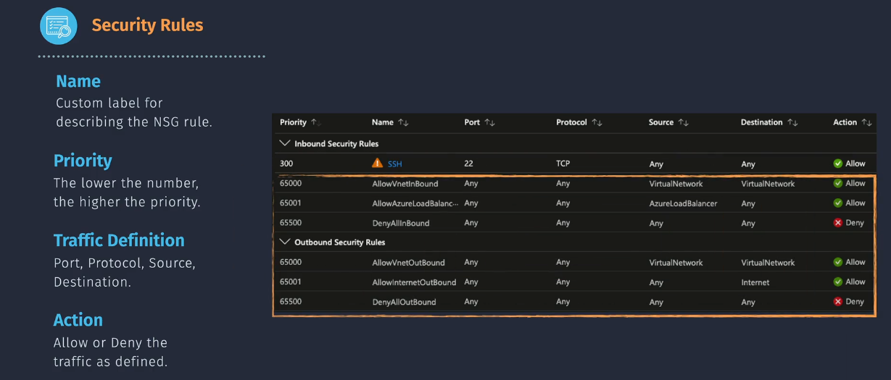

# 🔐 Azure Network Security Group (NSG)

> An **Azure Network Security Group (NSG)** is a **stateful Layer 3–4 firewall** that filters **inbound and outbound** traffic to/from Azure resources. It’s like **AWS Security Groups**, but Azure offers **more granular control** through dual scope: **Subnet and/or NIC**.

---

<div align="center">
  
</div>

---

## 🧱 Core Capabilities of NSG

| 🔧 Feature                           | ✅ Description                                                                  |
| ------------------------------------ | ------------------------------------------------------------------------------- |
| 🤯 **Stateful Rules**                | Return traffic is automatically allowed (**no need to define both directions**) |
| 🧩 **Attach to Subnet or NIC**       | Apply NSG at subnet, NIC, or both — for layered defense                         |
| 🔢 **Priority Evaluation**           | Rules processed in order of ascending priority (**lower = higher precedence**)  |
| 🚫 **NSGs use a whitelisting model** | Allow or Deny — **last rule always denies** (like default deny-all)             |
| 🧠 **Destination Flexibility**       | Use **IPs**, **Service Tags**, or **Application Security Groups** (ASGs)        |

---

## 🧭 Rule Evaluation Logic

### 📌 Rule Matching (Inside One NSG)

- Evaluated **top-down by priority**
- **First match wins**
- Once a rule matches (Allow or Deny), **no further rules are processed**

### 📌 Scope Evaluation Order (Multiple NSGs)

| Direction    | Evaluation Order     | Notes                                        |
| ------------ | -------------------- | -------------------------------------------- |
| **Inbound**  | Subnet NSG ➜ NIC NSG | Traffic must be allowed by **both** NSGs     |
| **Outbound** | NIC NSG ➜ Subnet NSG | Both NSGs must allow it — any deny = dropped |

🧠 Final Rule Logic:

> ✅ If both NSGs allow the packet → traffic passes  
> ❌ If **any NSG denies** → traffic is blocked immediately

---

## 🧾 NSG Rule Anatomy (With Destination Types)

| Field                    | Description                                                       |
| ------------------------ | ----------------------------------------------------------------- |
| `name`                   | Unique rule name per NSG                                          |
| `priority`               | Range: `100` (highest) to `4096` (lowest)                         |
| `direction`              | `Inbound` or `Outbound`                                           |
| `access`                 | `Allow` or `Deny`                                                 |
| `protocol`               | `TCP`, `UDP`, `ICMP`, or `*` (any)                                |
| `source`                 | IP/CIDR, **Service Tag**, or **Application Security Group (ASG)** |
| `source_port_range`      | Usually `*`, unless port-specific filtering needed                |
| `destination`            | Same options as `source` (IP, Service Tag, ASG)                   |
| `destination_port_range` | `22`, `80`, `443`, `3389`, or range like `1024-65535`             |

---

## ✍🏻 Destination Type Examples

| Destination Type                     | Value Example                                                | When to Use It                                |
| ------------------------------------ | ------------------------------------------------------------ | --------------------------------------------- |
| **IP Address / CIDR**                | `10.0.1.5`, `192.168.0.0/24`                                 | Directly filter to/from static IPs or subnets |
| **Service Tag**                      | `Internet`, `VirtualNetwork`, `AzureLoadBalancer`, `Storage` | Access to common Azure services or ranges     |
| **Application Security Group (ASG)** | `asg-app`, `asg-backend`                                     | Logical grouping of VMs within a VNet         |

### ✅ Sample Rules with Destination Types

```json
// Allow VM access to Azure Storage
{
  "direction": "Outbound",
  "priority": 100,
  "access": "Allow",
  "destination": "Storage",               // Service Tag
  "destinationPortRange": "*",
  "source": "VirtualNetwork",
  "protocol": "*"
}

// Allow Web VMs (in asg-web) to access Backend ASG (asg-backend) on port 1433
{
  "direction": "Outbound",
  "priority": 200,
  "access": "Allow",
  "source": "asg-web",
  "destination": "asg-backend",           // ASG ➜ ASG
  "destinationPortRange": "1433",
  "protocol": "TCP"
}
```

---

## 🔒 Default NSG Rules (Whitelisting)

Azure injects 3 default rules per direction (inbound/outbound), which **can be overridden** by custom rules with higher priority.

<div align="center">
  
</div>

### ✅ Inbound Defaults

| Priority | Rule Name                | Description                       |
| -------- | ------------------------ | --------------------------------- |
| 65000    | AllowVnetInbound         | Allow all traffic from same VNet  |
| 65001    | AllowAzureLoadBalancerIn | Allow from Azure LB health probes |
| 65500    | DenyAllInbound           | Deny everything else              |

### ✅ Outbound Defaults

| Priority | Rule Name             | Description                            |
| -------- | --------------------- | -------------------------------------- |
| 65000    | AllowVnetOutbound     | Allow all traffic to same VNet         |
| 65001    | AllowInternetOutbound | Allow any outbound traffic to internet |
| 65500    | DenyAllOutbound       | Deny everything else                   |

---

## 🧭 Azure Public IP SKUs

| SKU          | Status           | Key Features                                                                                                         |
| ------------ | ---------------- | -------------------------------------------------------------------------------------------------------------------- |
| **Basic**    | ❌ _Retiring_    | - Limited security<br>- No zone redundancy<br>- Fewer features                                                       |
| **Standard** | ✅ _Recommended_ | - Enhanced security (NSG required)<br>- Zone-redundant support<br>- Static only<br>- Regional or global tier options |

### ⚠️ Basic SKU Retirement

- **Basic SKU Public IPs will be retired on September 30, 2025**.
- Microsoft recommends upgrading all Basic SKU IPs to Standard SKU before that date to avoid service disruption.

---

### 🛠️ Migration Notes

- You can **upgrade Basic to Standard** using the Azure Portal, PowerShell, or CLI.
- The IP address itself can be retained during upgrade, but it must be **disassociated from any resource first**.
- For services like **VPN Gateway**, Microsoft provides a migration tool to simplify the process.

---

## 🔐 NSG Use Cases

| Scenario                           | Recommended NSG Strategy                                |
| ---------------------------------- | ------------------------------------------------------- |
| 🧱 Public Web Server               | NSG on NIC — Allow port `80/443`, deny all others       |
| 🔁 Internal-only Backend           | NSG on subnet — Allow traffic only from specific ASG/IP |
| 🚫 Block all internet outbound     | Deny `0.0.0.0/0` in outbound rules                      |
| ☁️ PaaS Integration (Storage, SQL) | Use **Service Tags** like `Storage`, `AzureSQL`         |
| 🔐 Tiered App Access               | Use **ASG → ASG** rules to restrict lateral movement    |

---

## 📊 Best Practices for NSGs

| 🧠 Best Practice                         | ✅ Why It Matters                                           |
| ---------------------------------------- | ----------------------------------------------------------- |
| Use NSGs at both **subnet + NIC** levels | Enables **defense-in-depth** (macro and micro segmentation) |
| Prefer **ASGs** for internal VM control  | Scalable, tag-based, and human-readable rule definitions    |
| Use **Service Tags** for Azure services  | Prevents needing to hardcode IP ranges for PaaS endpoints   |
| Set clear **priority structure**         | Avoid overlapping rule logic — 100 = top priority           |
| Monitor with **NSG Flow Logs**           | Troubleshoot and audit with diagnostics + Azure Monitor     |

---

## 🔥 NSG vs Azure Firewall

| Feature     | Network Security Group (NSG)         | Azure Firewall                          |
| ----------- | ------------------------------------ | --------------------------------------- |
| Layer       | L3 / L4 (IP, Port, Protocol)         | L3–L7 (App rules, FQDN, TLS)            |
| Scope       | Subnet/NIC (distributed)             | Centralized (in a hub subnet)           |
| NAT Support | ❌ No                                | ✅ Yes (SNAT/DNAT)                      |
| Logging     | Flow logs only                       | Full diagnostics, insights, threat logs |
| Best For    | Microsegmentation, traffic isolation | Deep inspection, egress control         |

> 🧠 **Use both together**:
>
> - NSGs = fast packet filtering
> - Azure Firewall = central control + app-layer intelligence

---

## ✅ NSG Quick Recap

| 🧩 Topic             | 🔑 Key Point                                        |
| -------------------- | --------------------------------------------------- |
| Attach Scope         | Subnet, NIC, or both                                |
| Evaluation Order     | Inbound: Subnet ➜ NIC<br>Outbound: NIC ➜ Subnet     |
| Destination Types    | IP Address, Service Tag, or ASG                     |
| Rule Matching        | First match wins — no implicit "next rule"          |
| Default Rules        | AllowVnet + DenyAll (both directions)               |
| Public IP Support    | Requires NSG if Standard SKU; secure by default     |
| Firewall Integration | Combine NSG + Azure Firewall for layered protection |
