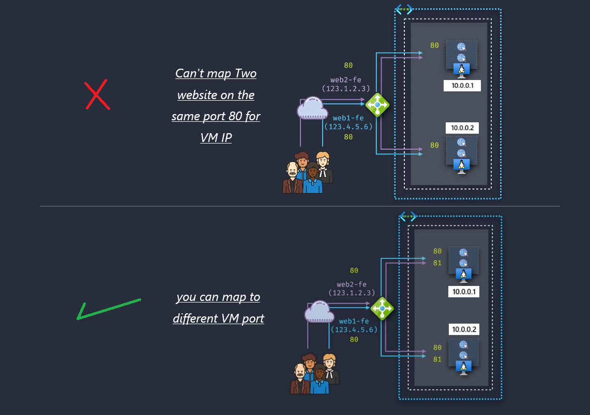
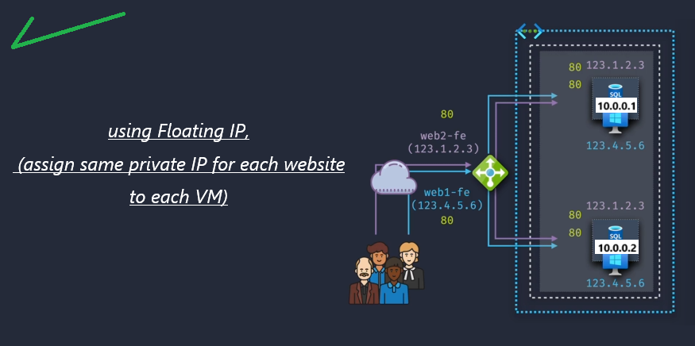
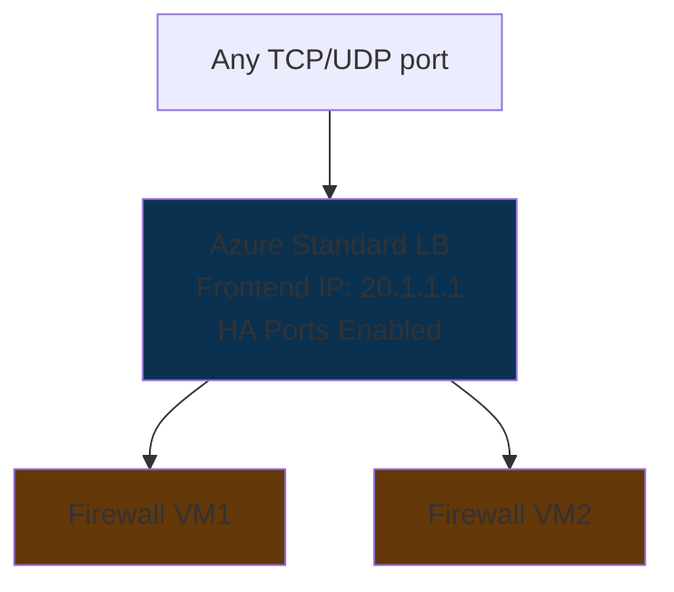

# ⚖️ Azure Load Balancer — Advanced Configuration Considerations

> This section is about **fine-tuning your Azure Load Balancer** so it doesn’t just _work_, but works **optimally, securely, and with the right feature set**.

---

## 1️⃣ **Sticky Sessions** (Session Persistence) 🍪

### 📌 What It Is

A **sticky session** (also called _session affinity_) ensures that once a client connects to a backend VM, **all future requests from that same client go to the same VM** for the lifetime of the session.

---

### 🔍 How It Works in Azure LB

- **Session persistence** is configured **per Load Balancing Rule**.
- Azure LB uses **Source IP Affinity** (a.k.a. _2-tuple_ or _3-tuple_ hashing) to make sure the same client IP hits the same backend.

| Mode                     | Description                                          | Example                                  |
| ------------------------ | ---------------------------------------------------- | ---------------------------------------- |
| **None**                 | No persistence, each request is routed independently | Good for stateless APIs                  |
| **Client IP**            | Maps based on client’s IP address                    | All requests from 203.0.113.25 → same VM |
| **Client IP + Protocol** | Maps based on client IP + protocol (TCP/UDP)         | HTTP vs HTTPS connections separated      |

---

### 💡 Use Case

- ✅ When backend VMs store **local session state** (e.g., ASP.NET in-process session state) rather than using Redis/AppFabric/SQL Session State.
- ⚠️ Not recommended for truly stateless apps — it can create uneven load distribution.

---

## 2️⃣ **Matching SKUs** (Public IP & Load Balancer) 🎭

### 📌 What It Is

Your **Public IP Address SKU** must match your **Load Balancer SKU** — otherwise, they won’t work together.

---

### 🔍 Why It Matters

- **Basic Public IP** ↔ **Basic Load Balancer**
- **Standard Public IP** ↔ **Standard Load Balancer**
- A mismatch = failed frontend binding.

---

### 📊 Feature Differences

| Feature            | Basic SKU            | Standard SKU               |
| ------------------ | -------------------- | -------------------------- |
| Availability Zones | ❌                   | ✅                         |
| Cross-region LB    | ❌                   | ✅                         |
| Secure by default  | ❌ (Open by default) | ✅ (Closed unless allowed) |
| SLA                | None                 | 99.99%                     |

---

### 💡 Best Practice

- Always check SKU match **before** associating IP with LB.
- For production — **always** use Standard SKU (better security + HA + SLA).

---

## 3️⃣ **Floating IPs** (Direct Server Return) 🌊

### 📌 What It Is

Enables **Direct Server Return (DSR)** — where the **frontend IP port + backend port are the same** for multiple backends, and backend VMs can reply directly to the client without going back through the LB.

---

### 🚧 The Problem Without Floating IP

Imagine you have **two services** (e.g., two SQL Always On replicas, or two websites) that both want to use **the same frontend port** — say **TCP 1433** for SQL or **Port 80** for HTTP.

**In a normal Load Balancer setup:**

- You must map **frontend port** → **backend port** in a **1:1 mapping**.
- If two services use the same port, you **can’t** send both through the LB to the same backend port because Azure says:

  > “Sorry, that port is already taken by another rule.”

💡 **Example:**

- LB Frontend 1433 → Backend VM1:1433 ✅
- LB Frontend 1433 → Backend VM2:1433 ❌ (conflict — same mapping)

---

### 💡 The Solution: Floating IP (Direct Server Return)

**Floating IP Mode** (enabled in the LB rule):

- Removes the requirement to translate ports.
- Allows the **same frontend IP + same frontend port** to be mapped to **multiple backend instances**, each listening on the **same backend port**.
- Used for **HA clustering** scenarios, where each backend VM has a **secondary private IP** that represents the service.

📌 **How it works:**

1. LB **forwards traffic** directly to the backend VM **without changing the destination IP or port**.
2. The backend VM **already owns** that IP (secondary IP config on its NIC), so it responds directly to the client (bypassing LB on the return path — called Direct Server Return).
3. This makes it possible for **multiple VMs** to handle requests on the same IP\:Port combo.

---

### 🎯 Why it’s Called “Floating”

Because the **secondary IP** “floats” between VMs in a cluster —

- If **VM1** goes down, **VM2** takes over the IP instantly.
- The LB doesn’t need to change the rule — the IP just “moves” to another VM.

---

### 📍 Real Example – SQL Always On

**Without Floating IP:**

- You’d need SQL replicas listening on **different ports** (ugly and breaks client connection strings).

    

    
    

**With Floating IP:**

- Both replicas have the **same secondary private IP** and **same port 1433**.
- LB sends traffic to whichever node currently owns that IP.

    

    
    

---

### ✅ When to Use Floating IP

- SQL Always On Availability Groups
- NLB-style clustering
- Any service requiring **same IP + same port** across multiple backend nodes

---

### ❌ When NOT to Use Floating IP

- Simple web apps without clustering
- When you don’t control backend OS network config (Floating IP requires OS-level IP binding)
- For NAT scenarios (Floating IP disables port translation)

---

### 💡 Use Case

- Database clustering (SQL Always On, MySQL HA)
- Failover scenarios where IP must remain constant

⚠️ **Not for web apps** — they usually require the LB to handle all responses.

---

## 4️⃣ **HA Ports** (High Availability Ports) 🚪

### 📌 What It Is

A **catch-all load balancing mode** — instead of defining individual LB rules for each port, you enable HA Ports so **all TCP/UDP ports** are load balanced.

---

### 🚧 The Problem Without HA Ports

A **normal Load Balancer rule** is locked to:

- **One frontend port** (e.g., 80)
- Mapped to **one backend port** (e.g., 80)

If you want to load balance **all TCP or UDP traffic** from a frontend IP (any port), you’d need **one LB rule per port**.
That’s fine for a website, but what if your VM needs to handle **thousands of ports**?

💡 Example:

- You have an **NVA (Network Virtual Appliance)** or a **firewall VM** that should inspect **all TCP traffic on all ports**.
- Creating 65,535 LB rules is… insane.

---

### 💡 The Solution: HA Ports

**HA Ports** = One LB rule that says:

> “Send **all traffic on all ports** from this frontend IP to the backend pool.”

📌 **How it works:**

- No port filtering — it forwards **everything** (all TCP or all UDP ports).
- Used for **L3 scenarios** like NVAs, firewalls, or routing appliances.
- Works only with **Standard Load Balancer**.
- Backend VMs usually have **IP forwarding** enabled so they can route packets instead of terminating them.

---

### 🎯 Key Difference from Floating IP

- **Floating IP**: Lets multiple VMs share **the same specific [IP+port]** without port translation (cluster failover scenario).
- **HA Ports**: Lets the LB forward **all ports** from a frontend IP to backend VMs (network appliance/routing scenario).

---

### 📍 Real Example – Firewall in Azure

Without HA Ports:

- You’d need separate LB rules for each port the firewall handles (HTTP = 80, HTTPS = 443, RDP = 3389, etc.).
- If tomorrow you need port 8443, you must add another rule.

With HA Ports:

- **One rule** → forwards everything (0–65535 TCP) to firewall VM.
- Firewall VM decides what to allow/block.

---

### 🖼 Visual Flow

---

### ✅ When to Use HA Ports

- NVAs, firewalls, routers in Azure
- Highly dynamic port requirements (no fixed list)
- Hybrid network appliances where you don’t know in advance all the ports

---

### ❌ When NOT to Use HA Ports

- Simple web or API load balancing (use normal LB rules)
- When you want to NAT ports (HA Ports doesn’t do port translation)

---

### 💡 Use Case

- NVA (Network Virtual Appliances)
- Azure Firewall load balancing
- VPN gateways needing multi-port handling

---

## 🏁 **Summary**

| Feature         | Purpose                      | Where to Use               | Caution                 |
| --------------- | ---------------------------- | -------------------------- | ----------------------- |
| Sticky Sessions | Keep same client on same VM  | Local session state apps   | Uneven load possible    |
| Matching SKUs   | Ensure IP & LB compatibility | All deployments            | Mismatch = broken LB    |
| Floating IPs    | Direct Server Return for HA  | DB clusters, NLB migration | Not for normal web apps |
| HA Ports        | LB all ports/protocols       | NVAs, Azure Firewall       | Internal LB only        |

---

## 💡 Quick Best Practices

- ✅ Use **Standard SKU** for production
- ✅ Enable **HA Ports** for appliances needing full port handling
- ✅ Avoid Sticky Sessions for stateless apps
- ✅ Document **SKU match** in infra diagrams to avoid config issues
