# 🏰 Azure Application Gateway (AGW) – The Layer 7 Traffic Boss

## 🌩 1. **What It Is**

Azure Application Gateway is **Microsoft’s fully managed Layer 7 (HTTP/HTTPS) load balancer**.  
Think of it as a **traffic cop** for web apps — it not only forwards traffic but also **inspects HTTP(S) requests**, makes decisions, and can even block bad actors.

If Azure Load Balancer is a **road intersection manager**,
Application Gateway is the **VIP event security guard** — checks your ID, sees if you’re on the list, and tells you exactly where to go. 😎

---

## 🎯 2. **When You Need It**

You’d choose AGW when you need:

- **HTTP(S) intelligent routing** (host/path-based)
- **SSL/TLS termination** (offloading work from your VMs)
- **End-to-end SSL encryption**
- **Web Application Firewall (WAF)** for OWASP protection
- **Cookie-based session affinity** (stick users to the same backend)
- **URL rewrites** (change paths before hitting backend)
- **Redirection rules** (HTTP → HTTPS, site1 → site2)

---

## 🏗 3. **How It Works (Simplified Flow)**

```mermaid
flowchart LR
    Client(("🌍 Client Browser"))
    AGW["Azure Application Gateway\n(L7 Load Balancer + WAF)"]
    Rule1["Rule: If Host = shop.example.com\n→ Send to Backend Pool 1"]
    Rule2["Rule: If Path starts with /api\n→ Send to Backend Pool 2"]
    Backend1["VMSS / App Service 1"]
    Backend2["VMSS / App Service 2"]

    Client -->|HTTPS Request| AGW
    AGW --> Rule1
    AGW --> Rule2
    Rule1 --> Backend1
    Rule2 --> Backend2
```

---

## 🧩 4. **Key Components**

  

Understanding the core components of Azure Application Gateway is essential for effective configuration and management:

### 📌 **1. Frontend IP Configuration**

- **Description:** Represents the IP address that clients use to connect to the Application Gateway.
- **Types:**
  - **Public IP:** Accessible from the internet.
  - **Private IP:** Accessible only within a virtual network.

### 📌 **2. Backend Pool**

- **Description:** A collection of backend servers (e.g., virtual machines, VM scale sets, App Services) that receive traffic from the Application Gateway.
- **Configuration:** You can group backend resources based on application tiers or other logical separations.

### 📌 **3. Listeners**

- **Description:** Define how the Application Gateway listens for incoming traffic.
- **Types:**

  - **HTTP Listener:** For unsecured traffic.
  - **HTTPS Listener:** For secured traffic with SSL certificates.

### 📌 **4. Routing Rules**

- **Description:** Determine how incoming traffic is directed to backend pools based on specified criteria.
- **Types:**

  - **Basic Rules:** Simple path-based routing.
  - **Path-Based Rules:** Direct traffic based on URL paths.
  - **Multi-Site Routing:** Host-based routing for multiple domains.

### 📌 **5. HTTP Settings**

- **Description:** Define how the Application Gateway communicates with backend servers.
- **Parameters:**

  - **Protocol:** HTTP or HTTPS.
  - **Port:** Backend port.
  - **Cookie-Based Affinity:** Enables session persistence.
  - **Connection Draining:** Ensures graceful removal of backend instances.

### 📌 **6. Web Application Firewall (WAF) Policies**

- **Description:** Configurable policies that define how the WAF protects your applications.
- **Features:**
  - Custom rule sets.
  - OWASP Core Rule Sets.
  - Exclusions and overrides.

### 📌 **7. Health Probes**

- **Description:** Continuously monitor the health of backend servers to ensure traffic is only sent to healthy instances.
- **Types:**
  - **HTTP Probe:** Checks a specific URL path.
  - **TCP Probe:** Checks if a specific TCP port is open.

---

## 🔍 5. **Key Features in Detail**

### 4.1 🗺 **Routing Types**

- **Host-based routing** → `shop.example.com` vs `blog.example.com`
- **Path-based routing** → `/api/*` vs `/image/*`
- **Combination** → `shop.example.com/api/*`

---

### 4.2 🔐 **SSL/TLS Handling**

- **SSL Termination**: AGW decrypts HTTPS, inspects request, forwards HTTP to backend (saves backend CPU).
- **End-to-End SSL**: AGW decrypts, inspects, then re-encrypts before sending to backend.
- **Re-encryption optional** based on security needs.

---

### 4.3 🛡 **Web Application Firewall (WAF)**

- Protects against **OWASP Top 10** threats (SQL injection, XSS, etc.).
- Modes:

  - **Detection** → Logs but doesn’t block.
  - **Prevention** → Blocks malicious requests.

- Custom rules possible (block specific IP ranges, patterns).

---

### 4.4 🍪 **Session Affinity**

- Uses cookies (`ApplicationGatewayAffinity`) to stick users to the same backend instance — useful for stateful apps.

---

### 4.5 🔄 **Rewrite & Redirect**

- **URL rewrite**: Change request/response headers or path before reaching backend.
- **Redirect**: Send HTTP 302/301 to client for URL change (e.g., HTTP → HTTPS).

---

## 👔 6. **SKU Types**

Azure Application Gateway offers different deployment modes and configurations to cater to various application needs:

### 1️⃣ **Standard Application Gateway**

- **Purpose:** Provides essential load balancing features suitable for most web applications.
- **Features:**

  - Basic routing capabilities.
  - SSL termination.
  - Session affinity.

### 2️⃣ **Web Application Firewall (WAF) Application Gateway**

- **Purpose:** Offers enhanced security features by integrating a Web Application Firewall.
- **Features:**

  - Protection against common web vulnerabilities.
  - Customizable WAF rules.
  - Logging and monitoring of security events.

### 3️⃣ **Standard_v2 and WAF_v2 SKUs**

- **Purpose:** Advanced versions of the Standard and WAF Application Gateways with improved performance and scalability.
- **Features:**

  - Autoscaling based on traffic load.
  - Zone redundancy for higher availability.
  - Enhanced performance and reduced latency.

---

## 📦 7. **Integration Examples**

- **Front Door + App Gateway** → Front Door for global routing + WAF, App Gateway for app-level routing.
- **AKS Ingress Controller** → App Gateway as ingress for Kubernetes workloads.
- **App Gateway + Load Balancer** → LB for TCP traffic, AGW for HTTP traffic.

---

## 🖥 8. **Example Scenario**

You run:

- `shop.example.com` → VM Scale Set in West Europe
- `blog.example.com` → Azure App Service
- `/api/*` → AKS service

**AGW Rules:**

1. Host = shop.example.com → BackendPool1 (VMSS)
2. Host = blog.example.com → BackendPool2 (App Service)
3. Path starts `/api` → BackendPool3 (AKS)

---

## 📊 9. **Comparison to Azure Load Balancer**

| Feature          | Azure Load Balancer | Azure Application Gateway |
| ---------------- | ------------------- | ------------------------- |
| OSI Layer        | L4 (TCP/UDP)        | L7 (HTTP/HTTPS)           |
| Protocol Support | Any TCP/UDP         | HTTP, HTTPS, WebSocket    |
| Routing Logic    | IP & port-based     | Host, path, headers       |
| SSL Termination  | ❌                  | ✅                        |
| WAF              | ❌                  | ✅                        |
| URL Rewrite      | ❌                  | ✅                        |

---

## ⚡ 10. **Pro Tips**

- Always enable **WAF Prevention** mode for public apps unless testing.
- Use **Autoscaling SKU** for production — scales based on traffic.
- Combine with **Azure Front Door** for global edge delivery + caching.
- For private apps, integrate with **Private Link** or internal VNet.
