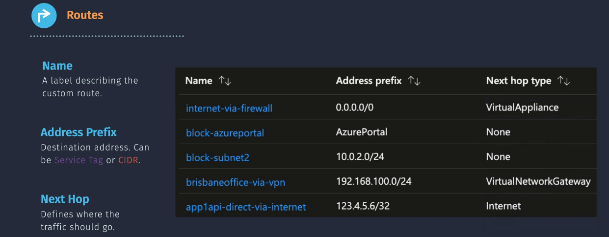
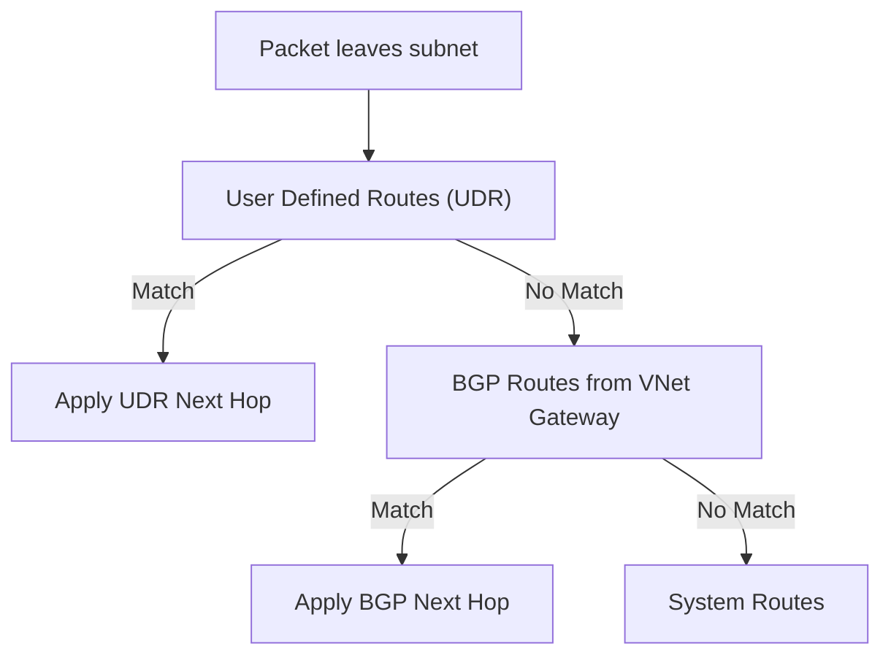

# 🛣️ **Azure User Defined Routing (UDR)**

> **Customizing Traffic Flow Inside Your Virtual Network**

Azure **User Defined Routing (UDR)** lets you **override default system routes** to send traffic exactly where you want — to a firewall, on-prem network, internet, or nowhere at all.

> 💡 **AWS Tip:** Think of UDR like **Custom VPC Route Tables** in AWS, but with Azure-specific **Next Hop Types** and a slightly different evaluation order.

---

<div align="center">
  
</div>

---

## 🧩 **Key Components of UDR**

1️⃣ **Route Table**: A collection of routes that define how traffic should be ro uted within your virtual network.  
2️⃣ **Routes**: Individual entries in a route table that specify the destination address prefix, the next hop type, and the next hop address.  
3️⃣ **Subnet Association**: Route tables are associated with subnets, and the routes within the table apply to the traffic within that subnet.

---

<div align="center">
  
</div>

---

## 🚦 **Azure Next Hop Types**

| Next Hop Type                  | What It Does                                 | AWS Equivalent              | Example                                           |
| ------------------------------ | -------------------------------------------- | --------------------------- | ------------------------------------------------- |
| **1. Virtual Network**         | Keeps traffic inside same VNet.              | Local route                 | Send `10.0.1.0/24` → another subnet in same VNet. |
| **2. Virtual Network Gateway** | Sends traffic to VPN/ExpressRoute gateway.   | Virtual Private Gateway     | Route `10.50.0.0/16` → on-prem network.           |
| **3. Virtual Appliance**       | Sends traffic to private IP of firewall/NVA. | NAT Instance / Firewall EC2 | All outbound via firewall at `10.0.0.4`.          |
| **4. Internet**                | Sends traffic directly to internet.          | Internet Gateway            | Public subnet with direct outbound.               |
| **5. None**                    | Drops traffic (blackhole).                   | Blackhole route             | Block `10.2.0.0/24`.                              |

---

## 📋 **Example Route Table**

| Route Name         | Address Prefix | Next Hop Type           | Next Hop Address | Action                    |
| ------------------ | -------------- | ----------------------- | ---------------- | ------------------------- |
| RouteToDBSubnet    | 10.0.2.0/24    | Virtual Network         | —                | Subnet-to-subnet traffic. |
| ToOnPrem           | 10.1.0.0/16    | Virtual Network Gateway | —                | Send to on-prem via VPN.  |
| ForceOutboundViaFW | 0.0.0.0/0      | Virtual Appliance       | 10.0.0.4         | Outbound via firewall.    |
| AllowInternet      | 0.0.0.0/0      | Internet                | —                | Direct internet access.   |
| BlockSensitiveNet  | 10.2.0.0/24    | None                    | —                | Drop packets.             |

---

## 🛠 **How to Configure UDR**

### **1️⃣ Create a Route Table**

- Azure Portal → **Route Tables** → **Create** → Choose RG & region.

### **2️⃣ Add Routes**

Example: Route all outbound through firewall:

- **Name:** `ForceOutboundViaFW`
- **Address Prefix:** `0.0.0.0/0`
- **Next Hop Type:** Virtual Appliance
- **Next Hop Address:** `10.0.0.4`

### **3️⃣ Associate with Subnet**

- Route Table → **Subnets** → Associate to your subnet.

### **4️⃣ Verify**

- Use **Network Watcher → Effective Routes** or run `tracert` from VM.

---

<div align="center">
  
</div>

---

## 📦 **Default / System Routes in Azure**

When you create a subnet, Azure **automatically** adds system routes — even before you add any UDRs.

| Address Prefix                              | Next Hop Type                | Purpose                                                 |
| ------------------------------------------- | ---------------------------- | ------------------------------------------------------- |
| VNet address range (e.g., `10.0.0.0/16`)    | Virtual Network              | Enables internal subnet-to-subnet routing.              |
| `0.0.0.0/0`                                 | Internet                     | Provides default outbound internet (unless restricted). |
| Azure service tags (e.g., `Storage`, `Sql`) | Internet or Service Endpoint | Ensures PaaS services remain reachable.                 |
| `VirtualNetworkGateway` routes              | Virtual Network Gateway      | Added automatically if VPN/ER is attached.              |

> 💡 **AWS Comparison:**  
> AWS also adds a **local route** for the VPC CIDR automatically, plus IGW/VGW routes when those are attached.  
> Azure's system routes are more **service-aware** (service tags, forced tunnel prevention, etc.).

---

## 🧮 **Route Evaluation Order**

<div align="center">



</div>

---

**Priority:**

- 1️⃣ User Defined Routes (you override defaults)
- 2️⃣ BGP Routes (from VPN/ER)
- 3️⃣ System Routes (Azure-provided defaults)

---

## 🏁 **Effective Routes** (Your Final Routing Table)

Azure has a **killer feature AWS doesn’t**: the **Effective Routes** view in **Network Watcher**.

- Shows **merged** routes from: UDRs + BGP + System.
- Lets you see **why** a packet takes a certain path.
- Flags **conflicts** and which route "wins".

**How to view:**

1. Azure Portal → Network Watcher → **Effective Routes**.
2. Select the **NIC** of a VM in your subnet.
3. Review table showing:

   - Address Prefix
   - Next Hop Type
   - Source (User, BGP, Default)
   - State (Active/Invalid)

💡 **Pro Tip:** Use this for **troubleshooting** blackholes or unexpected internet exposure.

---

## 🎯 **Common Use Cases**

### 🔹 Force All Outbound Through Firewall

```text
0.0.0.0/0 → Virtual Appliance (10.0.0.4)
```

Ensures all internet-bound traffic is inspected.

### 🔹 Hybrid Routing to On-Premises

```text
10.50.0.0/16 → Virtual Network Gateway
```

Routes to on-prem over VPN/ExpressRoute.

### 🔹 Block a Subnet

```text
10.2.0.0/24 → None
```

Prevents access to a sensitive network.

---

## 🆚 **Azure vs AWS Route Tables**

| Feature               | Azure UDR             | AWS Route Table        |
| --------------------- | --------------------- | ---------------------- |
| Default Routes        | System-generated      | Local + IGW/VGW routes |
| Blackhole Support     | Yes (`None`)          | Yes                    |
| Firewall Routing      | Virtual Appliance     | EC2 instance target    |
| VPN Integration       | VNet Gateway          | VGW                    |
| Effective Routes View | Yes (Network Watcher) | No native equivalent   |

---

## 📌 **Summary**

Azure UDR is your **traffic control tower** in a VNet:

- 🧭 Decide where packets go.
- 🛡 Route through firewalls.
- 🌉 Connect to on-prem.
- 🚫 Block unwanted destinations.
