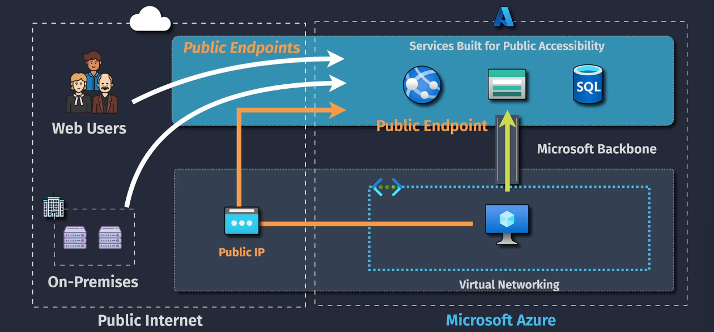
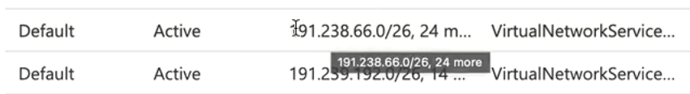
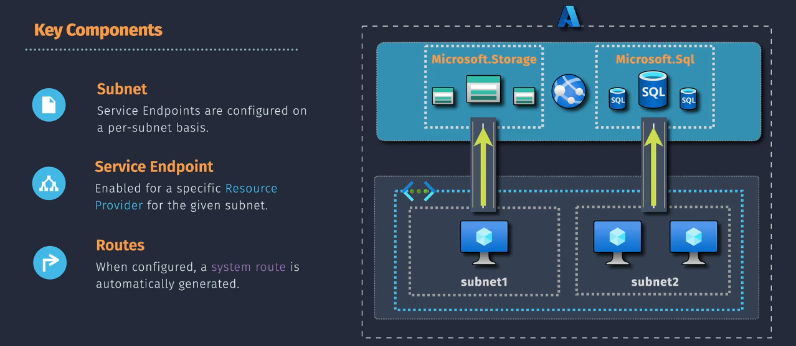

# 🔍 Service Endpoints

## 💡 Official Definition

A **Service Endpoint** in Azure extends your **VNet’s private IP space** to specific **Azure PaaS services** over the Azure backbone network, instead of sending traffic over the public internet.

It’s like saying:

> _"Hey Azure, when my VNet talks to Storage or SQL Database, please keep it private and secure on your internal highways — no detour through the scary public internet."_

---

<div align="center">
  
</div>

---

## 📌 What Service Endpoints Actually Do

- When you enable a Service Endpoint on a **subnet**, Azure **adds a system route**:

  ```ini
  Destination: Public IP range of the service (e.g., Azure Storage public ranges)
  Next hop: VirtualNetworkServiceEndpoint
  ```

  

- The destination is still the **public IP of the Azure service**.
- BUT traffic **never leaves the Azure backbone** — it’s just internally routed inside Microsoft’s private network.

---

## 📌 Public IP Is Still Used

- Yes, the connection is **to the service’s public IP**, not a private IP in your VNet.
- This means:

  - The DNS for `mystorageaccount.blob.core.windows.net` still resolves to a public IP.
  - Packets still have that public IP as the destination — but Azure intercepts them before they hit the “internet edge” and keeps them inside.

- **Security Filtering**: The service sees your **VNet/subnet identity** via Azure metadata, not by checking the private source IP.

---

## 📌 Why This Matters (vs Private Endpoint)

| Feature              | Service Endpoint                        | Private Endpoint                             |
| -------------------- | --------------------------------------- | -------------------------------------------- |
| **IP type in VNet**  | No private IP, uses service’s public IP | Gets a private IP inside your VNet           |
| **Traffic path**     | Azure backbone (still to public IP)     | Azure backbone (to private IP in VNet)       |
| **Firewall control** | Allow by VNet/Subnet                    | Allow by private IP only                     |
| **DNS changes**      | None needed                             | Needs Private DNS Zone to resolve private IP |
| **Cross-region**     | Regional only                           | Can be cross-region                          |

---

## ✍🏻 Example Flow

### ❌ With Service Endpoint

```plaintext
VM (10.0.1.4) → DNS → 52.x.x.x (Storage Public IP)
Route Table: 52.x.x.x/xx → ServiceEndpoint → Azure Backbone → Storage
```

### ✅ With Private Endpoint

```plaintext
VM (10.0.1.4) → DNS → 10.0.2.5 (Private IP of Private Endpoint)
Route Table: 10.0.2.5 (Inside VNet) → Azure Backbone → Storage
```

---

## 🔍 AWS Analogy

- Closest AWS feature: **VPC Endpoint (Gateway type)**
- Difference:

  - **AWS VPC Endpoint** actually creates an endpoint inside your VPC (no public IP needed).
  - **Azure Service Endpoint** doesn’t create a resource in your VNet — it just changes routing to the Azure backbone.

---

## 📦 Supported Azure Services (Common)

- **Microsoft.Storage** (Blob, File, Queue, Table)
- **Microsoft.Sql** (Azure SQL Database)
- **Microsoft.KeyVault**
- **Microsoft.EventHub**, **Microsoft.ServiceBus**, etc.

---

## ✍🏻 Scenario Use Case

You have:

- A **VM in VNet1**
- An **Azure Storage Account** with public network access enabled
- You want **private** access from your VM to the Storage

---

### 🚨 Problem (Without Service Endpoint)

- Traffic from VM → Storage goes through **public internet** (even if Azure manages it internally).
- Risks:

  - Possible exposure to public IP space
  - Public firewall rules required (`Allow from Azure services`), which can be too broad
  - Performance might be slightly worse because of internet routing paths

---

### ✅ Solution (With Service Endpoint)

- Traffic from VM → Storage **never leaves Azure backbone**
- You can lock Storage firewall to **allow only traffic from this VNet/subnet**
- No need to allow “All Azure services” — much stricter security

---

## Key Components

1️⃣ **Virtual Network (VNet)**: A logically isolated network in Azure where your resources, such as VMs, are deployed.  
2️⃣ **Subnet**: A segment within a VNet where you can enable service endpoints to control access to Azure services.  
3️⃣ **Service Endpoint**: A configuration that enables secure, direct access to Azure services from a specified subnet within your VNet.  
4️⃣ **Azure Service**: The specific Azure service (e.g., Azure Storage, Azure SQL Database) that you are connecting to via the service endpoint.

---

<div align="center">
  
</div>

---

## 📌 Step-by-Step Example – Configure Service Endpoint for Storage

1. Go to your **VNet** → **Subnets** → Select subnet → **Service endpoints** → Add `Microsoft.Storage`.
2. Go to your **Storage Account** → **Networking** → Set **Public network access** = Enabled, but **Selected networks** only.
3. Add your **VNet/Subnet** in allowed networks.
4. Test with `nslookup` and `tracert` from VM — you’ll see traffic stays inside Azure.

---

## ⚠ When Not to Use Service Endpoints

- You need **truly private IP addresses** for the PaaS service — in that case, use **Private Endpoints** (private link).
- Your resources are **across regions** and service endpoints don’t support that (they’re regional).

---

## 5️⃣ Common Interview Trap

> “⁉️ Does a Service Endpoint make your Azure service have a private IP in your VNet?”  
> ✅ Correct Answer: **No.** It just ensures traffic to the service’s public IP uses the Azure backbone and allows subnet-based access restrictions.
> If you need the service to have an **actual private IP** inside your VNet, you must use **Private Link (Private Endpoint)**.

---

> 💡If you want, I can now prepare a **hands-on lab** that shows:
>
> - `nslookup` results for Service Endpoint vs Private Endpoint
> - `tracert` path differences
> - How to test if traffic is really staying on Azure backbone
