# 🌍 Azure Front Door – Global Entry Point for Your Apps

> 💡 **Rule of Thumb:**  
> If you know AWS **CloudFront + Route 53 + ALB + WAF + Global Accelerator**,
> then **Azure Front Door is basically those rolled into one**, with management centralized and always global.

---

<div align="center">
  
</div>

---

## 🛑 **Problem** – The Need for a Global, Secure Entry

If your application serves users worldwide:

- Users far from your servers face **high latency**.
- Direct exposure to the internet makes you vulnerable to **DDoS and malicious traffic**.
- You want **one global URL** but need to route to **different backends** (multi-region, multi-cloud).
- You need **instant failover** if one backend goes down.

**Without AFD:**

- Users in Asia hitting a US data center → **slow performance**.
- DNS-level load balancing is slow to update in failover.
- No unified WAF or TLS termination across all regions.

---

## ✅ **Solution:** Azure Front Door

**Azure Front Door** is a **global, scalable entry point** for web applications.
It provides:

- **Layer 7 load balancing** (HTTP/HTTPS).
- **Dynamic site acceleration** via Microsoft’s global edge network.
- **Web Application Firewall (WAF)** integration.
- **Smart routing** to the fastest, healthiest backend.
- **Single global anycast IP** for your app.

---

## 🧩 **Core Components**

<div align="center">
  
</div>

---

| Component             | Purpose                                           | Example                                     |
| --------------------- | ------------------------------------------------- | ------------------------------------------- |
| **Frontend Endpoint** | Public hostname users connect to.                 | `www.contoso.com`                           |
| **Backend Pool**      | Group of backends (Azure, on-prem, or external).  | West US App Service + East Asia App Service |
| **Routing Rules**     | How requests are matched and sent to backends.    | `/api` → API backend, `/images` → Storage   |
| **Health Probes**     | Periodic checks to ensure backend health.         | HTTP GET `/health` every 30s                |
| **Rules Engine**      | Modify requests/responses at the edge.            | Add security headers, rewrite URLs          |
| **WAF Policy**        | Protect from OWASP Top 10 threats.                | Block SQL injection attempts                |
| **Caching**           | Store static content at edge for faster delivery. | Cache images/CSS at POPs                    |

---

## 🚦 **Traffic Flow**

```mermaid
flowchart LR
    User[User 🌐] --> FE[Frontend Endpoint 🌍]
    FE --> WAF[WAF Policy 🔒]
    WAF --> Rule[Routing Rules 📜]
    Rule --> Health{Healthy Backend?}
    Health -- Yes --> BE1[Backend 1 ✅]
    Health -- No --> BE2[Backend 2 ✅]
    BE1 & BE2 --> Response[Return Content ⚡]
    Response --> User
```



---

## Routing Flow

<div align="center">
  
</div>

---

## 💡 **Key Features**

### 1️⃣ **Global Load Balancing**

- **Anycast IP** – same IP worldwide.
- Uses **split TCP** and Microsoft backbone for acceleration.
- Supports **priority** (failover) and **weighted** (load share) routing.

---

### 2️⃣ **Web Application Firewall (WAF)**

- Integrated into AFD.
- Rule sets: OWASP 3.x.
- Modes: **Detection** (log only) or **Prevention** (block).

Example – Block SQL injection:

```plaintext
Condition: Request contains ' OR 1=1 --
Action: Block
```

---

### 3️⃣ **Rules Engine**

- Modify headers.
- URL rewrites.
- Redirects (301/302).
- Conditional logic (Geo-based, device type).

Example – Redirect mobile users:

```plaintext
If Request Header "User-Agent" contains "Mobile"
→ Redirect to m.contoso.com
```

---

### 4️⃣ **Caching**

- Store static content at POPs (Point of Presence) for faster delivery.
- Cache key can include **query strings, headers, or cookies**.

Example – Cache per language:

```plaintext
Cache-Key: URL + "Accept-Language" header
```

---

### 5️⃣ **Session Affinity**

- Uses cookies to route a user to the same backend during their session.

---

## 🛠 **Step-by-Step Example**

### Scenario:

Serve a global e-commerce site with **primary in West US** and **secondary in East Asia**.

1. **Create AFD Profile**

   - Choose **Standard/Premium** SKU depending on features needed (Premium includes Private Link, Rules Engine at more depth).

2. **Add Frontend Endpoint**

   - Map `www.contoso.com` to AFD.

3. **Create Backend Pool**

   - Backend 1: `usapp.azurewebsites.net` (Priority 1)
   - Backend 2: `asiaapp.azurewebsites.net` (Priority 2)

4. **Configure Health Probes**

   - Path: `/health` every 30 seconds.

5. **Add Routing Rule**

   - Match: `/*` → Backend Pool.
   - Enable caching for static content.

6. **Attach WAF Policy**

   - Enable OWASP rules.
   - Custom rule to block requests from certain countries.

7. **Test Failover**

   - Shut down Backend 1 → Traffic instantly switches to Backend 2.

---

## 🌐 **Common Use Cases**

| Use Case                  | How AFD Helps                              |
| ------------------------- | ------------------------------------------ |
| **Multi-region failover** | Priority-based routing with health probes. |
| **Global performance**    | Dynamic site acceleration via edge POPs.   |
| **DDoS protection**       | Built-in + WAF.                            |
| **Single global URL**     | Anycast IP + global DNS integration.       |
| **Edge caching**          | Faster static content delivery.            |

---

## 🔍 **Azure Front Door vs. Application Gateway vs. Azure Firewall**

| Feature                 | Front Door 🌍 | App Gateway 🚪 | Azure Firewall 🔥 |
| ----------------------- | ------------- | -------------- | ----------------- |
| Layer                   | 7             | 7              | 3–7               |
| Scope                   | Global        | Regional       | Regional          |
| CDN Caching             | ✅            | ❌             | ❌                |
| WAF                     | ✅            | ✅             | ❌                |
| Multi-region routing    | ✅            | ❌             | ❌                |
| Private Link to backend | ✅ (Premium)  | ✅ (v2)        | ❌                |
| TLS Termination         | ✅            | ✅             | ❌                |

---

## ⚠️ **Important Considerations**

1. **Private Backends** – Need Premium SKU with **Private Link**.
2. **WAF Costs** – WAF policy is billed separately.
3. **Caching** – Can save cost and improve speed but needs correct invalidation strategy.
4. **DNS TTL** – Changes propagate instantly since it’s edge-based, unlike traditional DNS failover.
5. **SSL Certs** – Managed certificates are free; custom certs supported.

---

## 📌 **Mini Real-World Example**

> **Company:** Contoso E-commerce
> **Goal:** Serve global users with <100ms latency.
> **Solution:**
>
> - Deploy App Service in **East US** + **West Europe**.
> - Place **Azure Front Door** in front with WAF.
> - Enable caching for product images.
> - Use rules engine to route `/api` → East US only (API with region-specific logic).
> - If East US API fails health probe, instantly switch to West Europe.

---

## 💰 Pricing Tiers

<div align="center">
  
</div>
