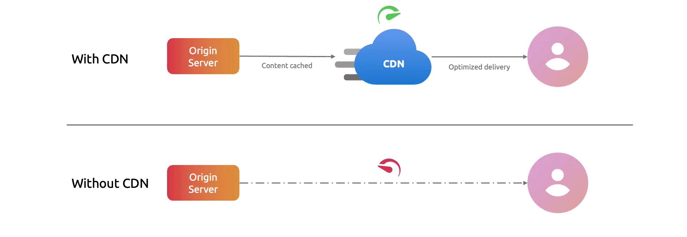

# 🌍 **Azure CDN (Content Delivery Network)**

## 📖 **What is Azure CDN?**

Azure CDN = **Content Delivery Network** → A **global network of edge servers** that caches and delivers content closer to users.

Think of it like:

- ❌ **Without CDN** → All users (US, EU, Asia) fetch content from your single web server in _East US_. Slow, high latency.
- ✅ **With CDN** → Copies of your content are cached at Microsoft’s edge servers worldwide → users fetch from the **nearest edge POP**.

  

👉 Result = **Faster performance, reduced latency, lower bandwidth cost, better reliability.**

---

## ✨ **Key Features of Azure CDN**

### ⚡ **Caching**

- Cache **static files** (images, CSS, JS, videos).
- Configurable **cache rules** (by path, file extension, query string).
- Delivers static & dynamic content fast.
- Uses **Anycast DNS** to route users to nearest POP.

### 🎯 **Rules Engine**

- Customize delivery (rewrite URLs, Custom headers, block requests, force HTTPS).

### 🔐 **Security**

- **HTTPS support with custom domain SSL** (free certs from Azure).
- Works with **Azure Front Door / WAF** for DDoS protection & advanced security.

### 📊 **Analytics**

- Logs, metrics → see cache hit/miss ratio, traffic usage.

---

## ⚙️ **How Azure CDN Works**

1. **Request**: User requests a file (image, video, CSS, JS, API).
2. **Routing**: Request goes to nearest **Point of Presence (POP)** via **Anycast DNS**.
3. **Cache Check**:

   - ✅ If cached → served immediately.
   - ❌ If not → pulled from origin (your Azure Storage, Web App, VM, or external server) → cached at POP.

4. **Next User**: Gets it instantly from edge → 🚀 speed.

---

## 🍦 **Azure CDN Providers** (Flavors)

Azure lets you choose **different CDN providers under the hood**:

- **Microsoft CDN** → Fully integrated with Azure global edge network.
- **Akamai CDN** → Good for global web apps with strong presence.
- **Verizon CDN** → Enterprise-grade CDN features.

---

## 🧬 **Azure CDN Integrations**

- **Azure Blob Storage** → Serve media files.
- **Azure Web Apps / App Service** → Speed up web apps.
- **Azure Media Services** → Stream video content globally.
- **Custom Origin** → Any server with public IP.

---

## 📈 **Scaling & Global Reach** 🌐

- CDN has **POP locations worldwide**.
- Requests auto-routed to **nearest healthy edge**.
- Handles sudden **traffic spikes** without killing your backend.

---

## 💭 **Real-World Use Cases**

- **Website acceleration** → Static assets like JS, CSS, HTML.
- **Video streaming** → Buffer-free media delivery.
- **Gaming** → Delivering game patches/updates globally.
- **API acceleration** → Reduce latency for REST/GraphQL APIs.
- **E-commerce** → Handle Black Friday traffic surges.

---

## ☁️ **Azure CDN vs AWS CloudFront**

| Concept          | AWS CloudFront                  | Azure CDN                                        |
| ---------------- | ------------------------------- | ------------------------------------------------ |
| Service Name     | **CloudFront**                  | **Azure CDN**                                    |
| Edge POPs        | Global Amazon POPs              | Microsoft POPs + (Akamai/Verizon POPs if chosen) |
| Origin           | S3, EC2, ALB, custom            | Blob Storage, Web App, VM, custom origin         |
| SSL              | ACM (free certs)                | Azure-managed (free certs)                       |
| Caching          | Behaviors (path, method, query) | Rules engine + cache rules                       |
| Integration      | Route53, S3, WAF                | Azure Front Door, Blob, WAF                      |
| Logging          | CloudWatch + S3 logs            | Azure Monitor + Logs + Metrics                   |
| Advanced Routing | Lambda@Edge                     | Rules Engine (basic), Front Door (advanced)      |

---

### 🚀 Example: How You’d Think in AWS → Azure Mapping

👉 AWS Way:

- Host images in **S3**.
- Add **CloudFront distribution**.
- Users get images from nearest edge location.

👉 Azure Way:

- Host images in **Blob Storage**.
- Add **Azure CDN Profile + Endpoint**.
- Users get images from nearest **Azure POP**.

---

## 🛠️ **Hands-On Mini Example**

Let’s say you have an **image-heavy site** hosted in Azure Blob Storage.

**Steps**:

1. Go to **Azure Portal → Create Resource → CDN Profile**.
2. Choose **Microsoft CDN** as provider.
3. Add **CDN Endpoint** → link it to your **Blob Storage origin**.
4. Configure **custom domain** (e.g., `cdn.myshop.com`).
5. Enable **HTTPS (free Azure SSL)**.
6. Deploy → now all static files are served from **global POPs** 🚀.

---

## ✅ **In short**

Azure CDN = **Your content, delivered faster, safer, cheaper — worldwide.**
