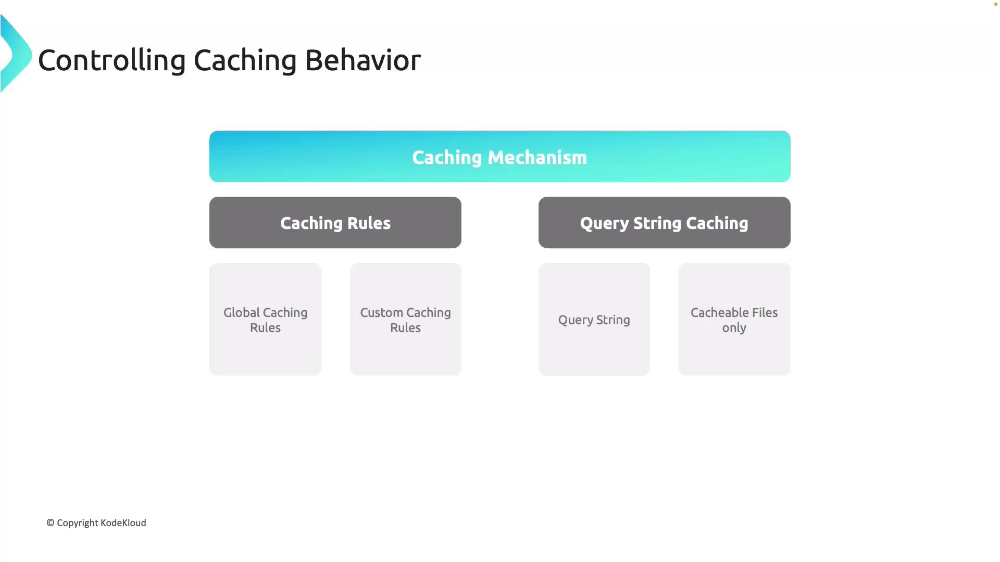
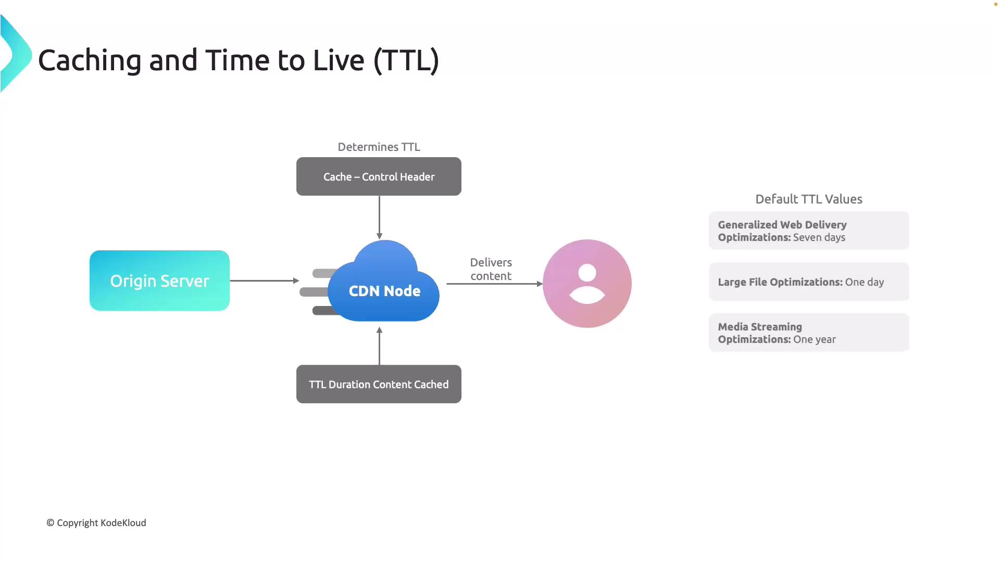

# ⚖️ Azure CDN – Controlling Caching Behavior

Caching = the **secret sauce** of CDN. It’s what makes your app _feel fast_ without hammering your origin servers. But caching is only great if you control it properly

Here’s the **Azure CDN caching brain map**, explained step by step.

---

<div align="center">
  
</div>

---

## 🧠 How Azure CDN Caching Works

- When a user requests content, Azure CDN checks the **edge POP cache**.
- If content is **fresh (within TTL)** → ✅ return instantly.
- If **expired or missing** → ❌ CDN goes back to origin (Storage, Web App, VM, etc.) and pulls a fresh copy.

👉 Think of TTL as the "freshness timer".  
👉 Exactly like CloudFront TTLs in AWS.

---

## ⚙️ 1. Caching Rules

Azure CDN gives you **two levels of rules**:

### 🔹 Global Caching Rules

- Apply to **all requests** on a CDN endpoint.
- Best for **default policies** like "cache everything for 7 days".

### 🔹 Custom Caching Rules

- Apply to **specific paths, file types, or conditions**.
- Example:

  - `/images/*` → cache for 30 days
  - `/api/*` → don’t cache (bypass)

👉 AWS analogy: Like **CloudFront cache behaviors per path pattern**.

---

## ⚙️ 2. Query String Caching

Requests often carry **query parameters** (`?id=123&lang=en`). Azure CDN lets you decide how to handle them:

- **Ignore Query Strings**:

  - All query variations use the **same cache object**.
  - Example: `index.html?id=1` and `index.html?id=2` → same cached file.

- **Bypass Caching**:

  - If query strings exist → skip CDN, always go to origin.
  - Used for **APIs or dynamic content**.

- **Cache Each Variant**:

  - Every unique query string = separate cache entry.
  - Perfect when query parameters actually change the content.

👉 AWS analogy: Like **Cache Based on Query Strings** in CloudFront.

---

## ⏱️ 3. TTL (Time-to-Live)

TTL = how long content lives in cache before CDN re-checks origin.



Azure CDN respects **Cache-Control** headers from origin.
But if origin doesn’t set them → Azure applies **default TTLs**:

- 🌍 **General Web Content** → 7 days
- 📂 **Large Files Delivery** → 1 day
- 🎬 **Media Streaming** → 1 year

👉 AWS analogy: CloudFront Default TTL / MinTTL / MaxTTL.

---

## 🔄 4. Content Updates & Refresh

How do you ensure users always see the **latest version**?

### 🔹 Normal Flow

- CDN serves cached content until TTL expires.
- After TTL, CDN revalidates with origin.

### 🔹 Versioning (Best Practice ✅)

- Append version strings to file names or query params.
- Example:

  - `app.css?v=2.1` → CDN sees this as a **new file**.

- Ensures **instant update** propagation across all POPs.

### 🔹 Manual Purging

- Admins can purge cache from Azure Portal, CLI, or API.
- Used when content **must refresh immediately** (breaking change, bug fix, etc.).

👉 AWS analogy: CloudFront **invalidations**.

---

## 🖥️ Hands-On Demo: CDN + Static Website

1. Create a **static website** in Azure Storage (`$web` container).
2. Attach a **CDN endpoint**:

   - Choose **Microsoft / Verizon / Akamai tier**
   - Pick an origin (storage account)
   - Provide endpoint name (`mysite.azureedge.net`)

3. Configure caching:

   - Query string behavior (ignore / bypass / cache each)
   - TTL rules (global + custom)

4. Access website via CDN endpoint → static files now delivered from **nearest POP**.

---

## 🔍 Verification with `nslookup`

Run:

```bash
nslookup mysite.azureedge.net
```

Output shows you’re routed to the **nearest POP IP**.

- If you VPN into US, EU, AU → you’ll see **different edge IPs**.
- That’s **global load balancing + caching in action**.

---

## 🧩 Memory Cheatsheet

- **Caching Rules** → Global vs Custom
- **Query Strings** → Ignore, Bypass, or Cache Each
- **TTL** → 7d Web, 1d Large, 1y Media
- **Updates** → TTL refresh, Versioning (best), Purging (manual)

👉 In short: **“Rules + Query + TTL + Update = Azure CDN Caching.”**
