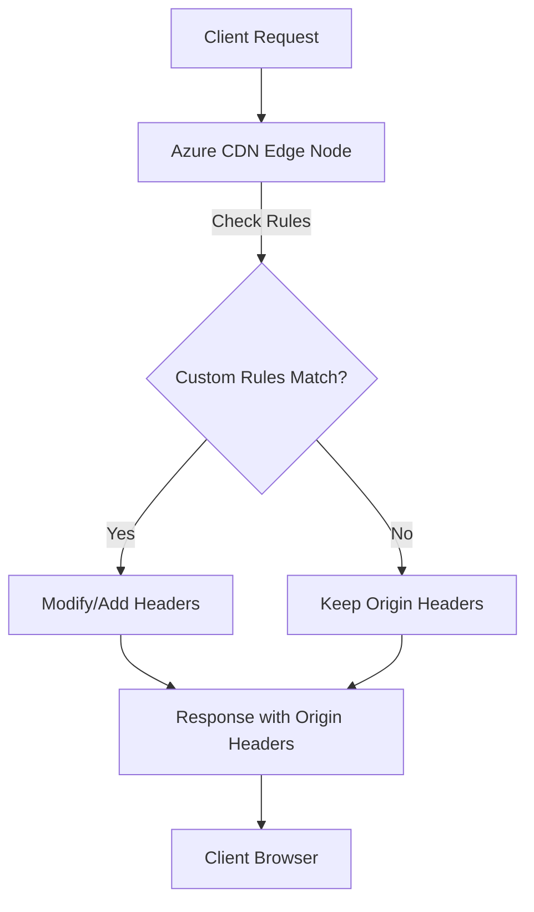

# 📝 Custom HTTP Headers in Azure CDN

## 🌐 What Are Custom HTTP Headers?

Custom HTTP headers are **extra key-value pairs** you add to HTTP responses (or requests) for **control, metadata, or security purposes**.
They are not just for caching (like `Cache-Control`) but for things such as:

- 🔒 **Security policies** (e.g., `Strict-Transport-Security`, `X-Frame-Options`)
- 🌍 **CORS rules** (`Access-Control-Allow-Origin`)
- 📦 **Download control** (`Content-Disposition`)
- 📃 **Custom metadata** (`X-Tenant-ID`, `X-App-Version`)

When using **Azure CDN**, you often want **all HTTP responses** to carry certain headers, or to **modify/remove** headers depending on request conditions.

---

## ⚙️ How Azure CDN Handles Headers

Azure CDN looks at two header sources:

1. **Origin headers** → Your backend (Storage, App Service, Function, etc.) may emit headers. CDN can forward them unchanged or override them.
2. **CDN-level rules** → You can define **rules in Azure CDN** to add/modify/remove headers on the edge nodes **before the client sees them**.

This gives you **control at the edge**, without modifying your origin app.

---

## 🔹 Where Can You Configure Headers?

Azure CDN has multiple **tiers** with different feature sets:

- **Standard Microsoft CDN / Azure Front Door Standard**

  - ✅ Custom Rules (simple match + action)
  - Add/modify/remove response headers
  - Basic conditions (URL, request method, protocol, etc.)

- **Premium Verizon / Premium Front Door**

  - ✅ Advanced Rules Engine
  - Complex logic: request path, device type, geo, query strings, cookies
  - Can apply headers only when certain **conditions match**

- **At the Origin**

  - Always an option: configure your backend service (App Service, Blob Storage, etc.) to emit headers.
  - CDN will respect them unless overridden.

---

## 🧩 Common Scenarios & Examples

### 🔒 1. Add Security Headers

Enforce best practices:

```http
Strict-Transport-Security: max-age=31536000; includeSubDomains
X-Content-Type-Options: nosniff
X-Frame-Options: DENY
Content-Security-Policy: default-src 'self'
```

📌 **Use case:** Improve security ratings (OWASP, security audits).

---

### 🌍 2. Enable CORS for APIs

```http
Access-Control-Allow-Origin: *
Access-Control-Allow-Methods: GET, POST, OPTIONS
Access-Control-Allow-Headers: Content-Type
```

📌 **Use case:** Allow browsers to call your CDN-hosted APIs or static files from any domain.

---

### 📦 3. Control Download Behavior

```http
Content-Disposition: attachment; filename="invoice.pdf"
```

📌 **Use case:** Force downloads instead of inline view.

---

### 🏷 4. Inject Custom Metadata

```http
X-App-Version: 5.2.1
X-Tenant-ID: A1B2C3
```

📌 **Use case:** Debugging, A/B testing, multi-tenant tracking.

---

## 🔄 How It Works (Flow)

<div align="center">



</div>

---

## 🛠 Implementation in Azure Portal

### Example: Add `X-Security: Enabled` to every response

1. **Go to your Azure CDN Profile**.
2. Select your **Endpoint**.
3. Navigate to **Rules Engine** (Standard Microsoft) or **Delivery Rules** (Premium).
4. Add a **Rule**:

   - **Condition:** Always (no filter).
   - **Action:** Modify Response Header → Add →

     - Name: `X-Security`
     - Value: `Enabled`
     - Action Type: `Append` (or Replace if exists).

5. Save & deploy.

🔍 Test with:

```bash
curl -I https://yourcdnendpoint.azureedge.net
```

Response:

```http
HTTP/1.1 200 OK
X-Security: Enabled
```

---

## 🎯 Best Practices

- ✅ Use **rules at CDN edge** for global headers (less origin work).
- ✅ Use **origin headers** for dynamic/per-tenant metadata.
- ✅ Prefer **Cache-Control** at origin but security/CORS headers at edge.
- ✅ Always test with `curl -I` or browser dev tools.
- ⚠️ Don’t leak sensitive data (avoid user tokens in custom headers).

---

## 🚀 Summary

- Azure CDN lets you **add, modify, remove headers** at the edge.
- Useful for **security, metadata, CORS, and download control**.
- Can be done at:

  - Origin → app controls headers.
  - CDN → rules override or inject headers.

- Advanced logic is possible with **Rules Engine (Premium)**.
- Always verify with real HTTP calls.
