# 🌐 **Azure DNS** — Your Cloud's Phonebook 📖

**Azure DNS** is Microsoft’s cloud-based **Domain Name System** hosting service that provides **ultra-fast, highly available** name resolution.
It supports **both Public DNS Zones** (internet-facing) and **Private DNS Zones** (internal-only).
You manage them using **the same Azure credentials, APIs, tools, and billing** as your other Azure services.

> 💡 **AWS Equivalent:**  
> Think of **Azure DNS Public Zones** like **Route 53 Public Hosted Zones** and **Azure Private DNS Zones** like **Route 53 Private Hosted Zones** linked to VPCs.

---


---

## 🧩 2. **Core Components**

| Component              | Description                                                   | AWS Equivalent    |
| ---------------------- | ------------------------------------------------------------- | ----------------- |
| **DNS Zone**           | Container for DNS records for a domain (e.g., `contoso.com`). | Hosted Zone       |
| **DNS Record**         | Maps domain/subdomain to IPs or other resources.              | DNS Record        |
| **Name Servers (NS)**  | Azure-assigned servers that resolve queries for your domain.  | NS Records        |
| **Azure DNS Resolver** | New service for conditional forwarding, hybrid scenarios.     | Route 53 Resolver |

---

## 🏗️ 3. **How Azure DNS Works**

```mermaid
sequenceDiagram
    participant User as 🌍 Client
    participant DNS as Azure DNS
    participant Resource as Azure Resource

    User->>DNS: Query www.contoso.com
    DNS-->>User: IP (from record set)
    User->>Resource: Connect to IP
```

<div align="center">



</div>

---

## 📃 4. **Record Types** You Can Create

| Record Type | Purpose                    | Example                                                 |
| ----------- | -------------------------- | ------------------------------------------------------- |
| **A**       | Name → IPv4 address        | `www → 10.0.0.4`                                        |
| **AAAA**    | Name → IPv6 address        | `api → 2606:2800:220:1:248:1893:25c8:1946`              |
| **CNAME**   | Alias name → another name  | `blog → mysite.azurewebsites.net`                       |
| **MX**      | Mail server records        | `mail → 10 mail.contoso.com`                            |
| **TXT**     | Text metadata (SPF, DKIM)  | `@ → "v=spf1 include:mail.protection.outlook.com -all"` |
| **SRV**     | Service location           | `_sip._tcp → sip.contoso.com`                           |
| **NS**      | Delegates zone             | `subdomain.contoso.com → ns1-xyz.azure-dns.com`         |
| **PTR**     | Reverse lookup (IP → name) | For reverse DNS zones                                   |

---

## 📌 5. **Public vs Private DNS Zones**

| Feature        | Public DNS Zone                     | Private DNS Zone                                 |
| -------------- | ----------------------------------- | ------------------------------------------------ |
| Scope          | Public Internet                     | Inside your VNets                                |
| Use Case       | Hosting `contoso.com` for the world | Internal name resolution (`db.internal.contoso`) |
| AWS Equivalent | Public Hosted Zone                  | Private Hosted Zone                              |
| Integration    | None by default                     | Can link to multiple VNets                       |

---

## ☁️ **Public DNS Zones**

> **Public DNS zones** host DNS records for domains accessible from anywhere on the internet.  
> Azure hosts these zones on its **global DNS server network**, providing **low latency** and **99.99% uptime**.


### 🖼️ How Public DNS Works

<div align="center">


</div>

---

### 🪜 Public DNS Zone Creation — Step-by-Step

#### **1️⃣ Create DNS Zone**

1. Go to **Azure Portal** → `Create a resource`
2. Search for **DNS Zone**
3. Fill in:

   - **Name**: `contoso.com`
   - **Resource Group**: `RG-DNS`

4. `Review + Create`

#### **2️⃣ Add DNS Records**

Example for a website + email:

| Record Type | Name | Value / Target    | TTL  | Purpose            |
| ----------- | ---- | ----------------- | ---- | ------------------ |
| **A**       | www  | 203.0.113.1       | 3600 | Website IP         |
| **MX**      | @    | mail.contoso.com  | 3600 | Email delivery     |
| **CNAME**   | shop | shops.example.com | 3600 | Alias to subdomain |

---

## 🔒 **Private DNS Zones**

> **Private DNS zones** are only accessible from inside your **Azure Virtual Networks (VNets)**.  
> They’re perfect for **internal applications, databases, and APIs**.

---


---

### 🖼️ Private DNS Workflow Example

<div align="center">


</div>

---

### 🪜 Private DNS Creation — Step-by-Step

#### **1️⃣ Create Private DNS Zone**

1. Azure Portal → `Create a resource` → Search **Private DNS Zone**
2. Name: `internal.contoso.com`
3. Link to **VNet** (enable Auto Registration)

#### **2️⃣ Create A Record**

- Name: `db`
- Type: `A`
- IP: `10.0.1.4`

#### **3️⃣ Test**

```bash
nslookup db.internal.contoso.com
```

---

### 📌 Key Feature — **Auto Registration**

If enabled, **VMs register themselves** automatically in the Private DNS Zone when created, and remove records when deleted.
Think of it like **AWS Route 53 Private Hosted Zone with VPC auto DNS hostnames ON**.

---

## ✍🏻 6. **Example — Public Website**

**Goal:** Host `contoso.com` DNS in Azure.

1. Create a **Public DNS Zone** named `contoso.com`.
2. Add records:

   - `@` → A → `52.170.12.5` (web server IP)
   - `www` → CNAME → `@`

3. Update your domain registrar NS records to Azure’s assigned NS servers.
4. Done — traffic now resolves via Azure DNS globally.

---

## ✍🏻 7. **Example — Internal Application**

**Goal:** Use `db.internal.contoso` to access SQL Server privately.

1. Create **Private DNS Zone** `internal.contoso`.
2. Add record:

   - `db` → A → `10.5.1.4` (SQL VM IP)

3. Link zone to VNets `prod-vnet` and `dev-vnet`.
4. Now VMs in those VNets can resolve `db.internal.contoso` without public exposure.

---

## 🌉 8. **Azure DNS Private Resolver**

- Works like **AWS Route 53 Resolver**.
- Lets **on-prem** and **Azure private DNS zones** talk to each other.
- Key use cases:

  - Forward unresolved queries to on-prem DNS
  - Resolve Azure Private DNS zones from on-prem

---

## 🛡️ 9. **Security Best Practices**

- Use **Private DNS zones** for sensitive resources (e.g., DB, Storage).
- Pair **Private DNS** with **Private Endpoints** for zero public exposure.
- Use **Role-Based Access Control (RBAC)** to limit who can edit DNS zones.
- Enable **activity logs** for DNS zone changes.

---

## ⚠️ 10. **Common Pitfalls**

| Pitfall                       | Why It Happens           | Fix                      |
| ----------------------------- | ------------------------ | ------------------------ |
| DNS not working in Azure VMs  | Zone not linked to VNet  | Link private DNS zone    |
| Public zone not resolving     | Registrar NS not updated | Update to Azure NS       |
| Records taking long to update | TTL too high             | Lower TTL before changes |

---

## 📊 11. **Azure DNS vs AWS Route 53**

| Feature                  | Azure DNS                       | AWS Route 53 |
| ------------------------ | ------------------------------- | ------------ |
| DNS Hosting              | ✅                              | ✅           |
| Domain Registration      | ❌                              | ✅           |
| Health Checks            | ❌                              | ✅           |
| Traffic Routing Policies | Limited (Azure Traffic Manager) | ✅           |
| Private Zones            | ✅                              | ✅           |
| Resolver for Hybrid      | ✅ (Private Resolver)           | ✅           |

---

## 🚀 **Real-World** Enterprise Setup

- **Public DNS**: Azure DNS hosts `contoso.com` for global users.
- **Private DNS**: `internal.contoso` resolves internal services across multiple VNets.
- **Private Resolver**: On-prem queries for Azure private endpoints resolve via ExpressRoute.
- **Traffic Manager**: Added for geo-based load balancing.
