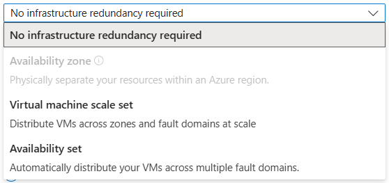

# ☁️ Azure VM Availability & Redundancy

In AWS, you’re used to terms like:

- **AZ (Availability Zone)** for fault isolation
- **Auto Scaling Group (ASG)** for redundancy
- **Placement Group (Cluster)** for low latency

In Azure, it’s a bit different—but don’t worry, here’s your **complete breakdown** with AWS equivalents, diagrams, and real use cases.

---

  

---

## 📌 TL;DR – Azure Availability Options vs AWS

| Azure Option                     | Purpose                                     | AWS Equivalent           |
| -------------------------------- | ------------------------------------------- | ------------------------ |
| ❌ No infrastructure redundancy  | Single VM only                              | EC2 in 1 AZ (no ASG)     |
| 🧱 **Availability Set**          | Fault + update domain separation (same DC)  | ASG in 1 AZ w/ spread    |
| 🏗️ **Availability Zone (AZ)**    | Zone-level isolation                        | Run EC2s across AZs      |
| 📈 **Virtual Machine Scale Set** | Auto-scaling group w/ zone+app redundancy   | Auto Scaling Group       |
| 📍 **Proximity Placement Group** | Low-latency placement in same hardware rack | EC2 Cluster Placement GP |

---

## 1️⃣ Option 1: **No Infrastructure Redundancy**

This means: **"I don’t care if the VM is single-instance"**

- This option **places your VM in a single data center**.
- No HA guarantee. If that data center goes down, your VM goes down too.

> 🔥 Use only for **dev/test**, low-priority workloads, or when app-layer handles redundancy.

➡️ AWS Equivalent: EC2 in **a single AZ**, no ELB, no ASG.

---

## 2️⃣ Option 2: **Availability Set** (Legacy but still useful)

An **Availability Set** is a logical group that spreads your VMs across:

| Concept                | Description                                                             |
| ---------------------- | ----------------------------------------------------------------------- |
| **Fault Domain (FD)**  | Represents a rack of hardware (power + network isolated) (**max 3 FD**) |
| **Update Domain (UD)** | Logical batch for OS/host updates (only one UD updates at a time)       |

> You define an availability set, and Azure handles **spreading** your VMs across multiple FDs and UDs.

### 📊 Default:

- **FDs**: up to 3
- **UDs**: up to 20

### 💡 Use Case:

- You want **2+ VMs running the same app** on separate physical hosts for **high availability** in a single region.

### 🧠 Why It Matters:

- Azure ensures VMs in an Availability Set **don’t reside in the same FD or UD**.
- Helps protect against both **hardware failures** and **planned updates**.

> ⚠️ Availability Sets are **only within a single Azure region and data center (no zone awareness)**.

➡️ AWS Equivalent:

- **Fault Domain ≈ EC2 AZ** (kind of)
- **Update Domain ≈ Rolling update batch in ASG**
- But there’s **no exact AWS match** to this combo
- Similar to **spreading EC2 instances across racks** inside a single AZ using **spread placement group**.

---

## 3️⃣ Option 3: **Availability Zones (AZs)**

An **Availability Zone** is a physically separate data center within an Azure region.

- Each **region typically has 3 AZs** (Zone 1, Zone 2, Zone 3)
- They are **isolated**, but connected with low-latency links
- Azure SLA guarantees **99.99% uptime** if you place VMs across zones

> ✅ Best for high-availability, mission-critical apps.

➡️ AWS Equivalent: **Availability Zones** in AWS

---

## 4️⃣ Option 4: **Virtual Machine Scale Set (VMSS)**

**VMSS = Auto-scaling fleet of identical VMs!**

- Supports **autoscaling**, **load balancing**, **zonal or regional distribution**
- Can be **zone-aware** (spread across AZs)
- Fully managed orchestration

> 🛠️ VMSS + Load Balancer = Easy HA + elasticity

➡️ AWS Equivalent: **EC2 Auto Scaling Group**

---

## 5️⃣ **Proximity Placement Groups (PPG)**

> When **latency really matters** (like HPC, SAP, or tightly-coupled services)

A **Proximity Placement Group (PPG)** ensures:

- All your VMs or VMs + databases are **physically close** to reduce latency
- Same data center or even same rack

> 🧠 PPG is **not** about availability — it's about **low latency**

➡️ AWS Equivalent: **Placement Group (cluster strategy)**

---

## ✅ When to Use What?

| Scenario                      | Best Option                  |
| ----------------------------- | ---------------------------- |
| 🧪 Dev/test VM, low HA needed | ❌ No Redundancy             |
| 🧱 Basic HA in 1 AZ           | ✅ Availability Set          |
| 🌍 HA across DCs              | ✅ Availability Zones        |
| 📈 Autoscaling & zone HA      | ✅ VMSS w/ AZs               |
| ⚡ HPC or real-time latency   | ✅ PPG + Manual Zone Control |

---

## 🎓 Final Notes for AWS Users

| Azure Concept             | AWS Equivalent              |
| ------------------------- | --------------------------- |
| Availability Zone         | AZ (us-east-1a, etc.)       |
| Availability Set          | Spread Placement Group      |
| VMSS                      | Auto Scaling Group          |
| Load Balancer (Azure LB)  | ELB (ALB/NLB)               |
| Proximity Placement Group | EC2 Cluster Placement Group |

> Azure mixes **redundancy + placement + scaling** differently than AWS, so you often combine **VMSS + AZ + NSG + Load Balancer** to achieve best results.
