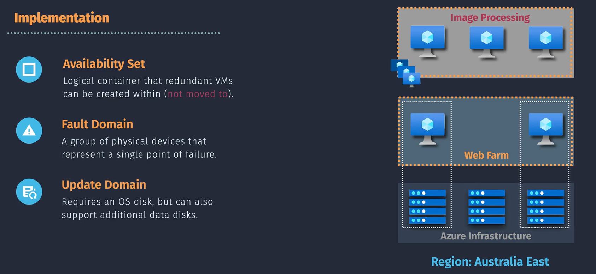
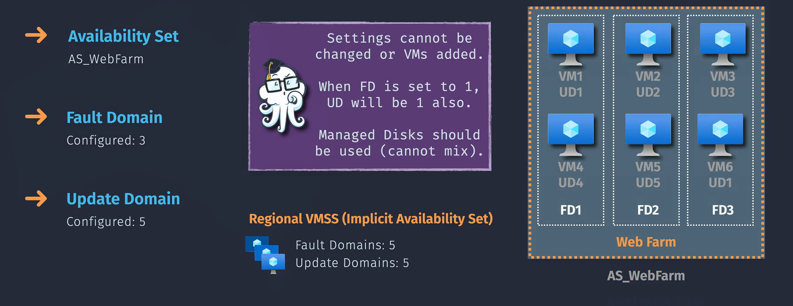
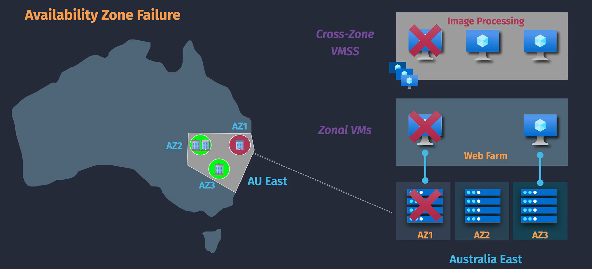
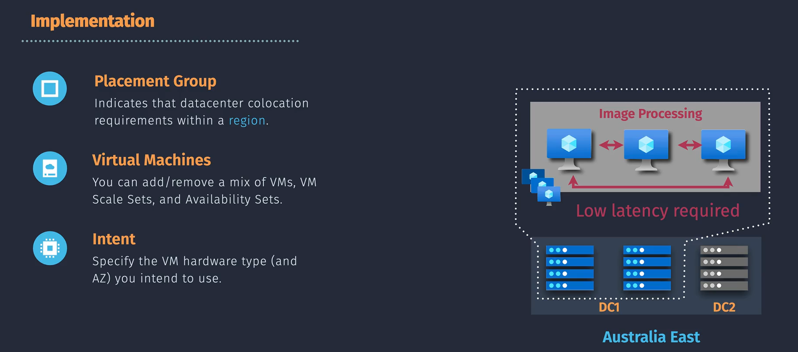

# 🌟 **Azure Virtual Machine Availability (HA)**

**High Availability (HA)** ensures that your applications and services remain **accessible** and **operational** even during hardware failures, maintenance, or unexpected disruptions. In Azure, achieving HA for **Virtual Machines (VMs)** involves strategically distributing your VMs across different fault domains, update domains, and physical locations. This minimizes downtime and ensures continuous service delivery.

**Why HA Matters:**

- **Business Continuity:** Keeps your services online, maintaining user trust.
- **Performance Reliability:** Ensures smooth application performance without interruptions.
- **Cost Efficiency:** Reduces financial losses associated with downtime and outages.

## ✨ **Key Features for Enhancing VM Availability**

Azure provides several robust features to maximize the availability of your VMs. Here's a breakdown of each:

### 🏢 **1. Availability Sets**

**Purpose:**  
Group multiple VMs within a single Azure data center to protect against hardware and software failures.

**Components:**

  

---

- **Fault Domains (FD):**

  - **Definition:** Physical units within a data center, such as racks, that share a common power source and network switch.
  - **Benefit:** Spreads VMs across different hardware to prevent all from being affected by a single hardware failure.

- **Update Domains (UD):**
  - **Definition:** Logical units that Azure uses to sequence updates and maintenance.
  - **Benefit:** Ensures that not all VMs are rebooted simultaneously during planned maintenance, maintaining application availability.

**Benefits:**

- **99.95% Availability:** Guarantees high availability by distributing VMs across multiple fault and update domains.

**How to Use:**

1. **Create an Availability Set** when deploying your VMs.
2. **Deploy VMs** within this set to automatically distribute them across fault and update domains.

**Example1:**

  

---

**Example2:**

| VM  | Fault Domain | Update Domain |
| --- | ------------ | ------------- |
| VM1 | FD1          | UD1           |
| VM2 | FD2          | UD1           |
| VM3 | FD3          | UD1           |
| VM4 | FD1          | UD2           |
| VM5 | FD2          | UD2           |
| VM6 | FD3          | UD2           |

**How They Work Together:**

- **Fault Domain Failure:** If FD1 fails, only VM1 and VM4 are impacted; other VMs remain operational.
- **Update Domain Maintenance:** During maintenance, Azure updates UD1 first (VM1, VM2, VM3), then UD2 (VM4, VM5, VM6), ensuring some VMs are always running.

**Use Case:**  
Ideal for multi-tier applications where different roles (e.g., web servers, database servers) need to remain available during maintenance or unexpected outages.

---

### 🌐 **2. Availability Zones**

  

**Purpose:**  
Distribute VMs across multiple, physically separate locations within an Azure region to achieve higher redundancy and fault tolerance.

**Key Features:**

- **Geographic Separation:** Each zone is isolated from others to prevent a failure in one zone from affecting the others.
- **Independent Infrastructure:** Each zone has its own power, cooling, and networking, ensuring that a failure in one does not impact the others.

**Benefits:**

- **99.99% Availability:** Higher than Availability Sets by protecting against entire datacenter failures.
- **Low Latency:** Zones within the same region offer low-latency connectivity, ensuring seamless application performance.

**How to Use:**

1. **Choose a Region** that supports Availability Zones.
2. **Deploy VMs** across different zones to ensure redundancy.

**Use Case:**  
Best suited for mission-critical applications that require maximum uptime and resilience against large-scale failures.

---

### 📍 **3. Proximity Placement Groups (PPG)**

  

**Purpose:**  
Keep Azure VMs physically close to each other within the same datacenter to reduce network latency and increase throughput.

**Key Features:**

- **Low Latency Networking:** Ensures that VMs communicate with minimal delay.
- **High Throughput:** Facilitates faster data transfer between VMs, enhancing application performance.

**Benefits:**

- **Optimized Performance:** Essential for high-performance applications requiring rapid data exchange.
- **Cost Efficiency:** Reduces the need for additional networking resources to achieve low latency.

**How to Use:**

1. **Create a Proximity Placement Group** in the Azure Portal.
2. **Deploy VMs** within this group to ensure they are physically close.

**Use Case:**  
Ideal for workloads that demand high-speed networking and low latency, such as gaming servers, financial trading applications, and data analytics platforms.

---

### 📈 **4. Virtual Machine Scale Sets (VMSS)**

**Purpose:**  
Automatically scale the number of VMs based on demand while ensuring their availability.

**Key Features:**

- **Auto-Scaling:** Add or remove VMs automatically based on predefined rules (e.g., CPU usage).
- **Integration with Availability Sets/Zones:** Ensures scaled VMs are distributed across fault and update domains or availability zones for high availability.

**Benefits:**

- **Load Balancing:** Distributes traffic evenly across VMs.
- **Cost Efficiency:** Scales resources up or down based on actual demand, avoiding over-provisioning.

**How to Use:**

1. **Create a VM Scale Set** in the Azure Portal.
2. **Configure scaling rules** based on metrics like CPU usage or memory consumption.
3. **Ensure distribution** by integrating with Availability Sets or Zones.

**Use Case:**  
Perfect for applications with variable workloads, such as web servers handling fluctuating traffic or batch processing tasks.

---

### 🌍 **5. Azure Site Recovery**

**Purpose:**  
Provides disaster recovery by replicating VMs to another Azure region.

**Key Features:**

- **Automated Replication:** Continuously replicates your VMs to a secondary Azure region.
- **Failover and Failback:** Quickly switches to replicated VMs during an outage and reverts back once resolved.

**Benefits:**

- **Business Continuity:** Ensures your applications remain available during regional disasters.
- **Minimal Data Loss:** Keeps your data up-to-date with continuous replication.

**How to Use:**

1. **Set Up Azure Site Recovery** in the Azure Portal.
2. **Select VMs** to replicate and choose a target region.
3. **Configure replication settings** and perform a test failover to ensure functionality.

**Use Case:**  
Essential for businesses requiring robust disaster recovery solutions to maintain operations during major outages or disasters.

## 📜 **Azure Service Level Agreements (SLAs)**

**Azure SLAs** define the guaranteed uptime and performance for Azure services, including VMs.

### **Key SLA Tiers:**

- **Single VM without Redundancy:** **99.9% Availability**
- **VMs in an Availability Set:** **99.95% Availability**
- **VMs in Availability Zones:** **99.99% Availability**
- **With Azure Site Recovery:** **99.99% +** (additional redundancy)

### **Why SLAs Matter:**

- **Reliability Assurance:** Understand the expected uptime for your deployments.
- **Financial Protection:** Azure offers service credits if SLAs aren’t met.
- **Planning and Compliance:** Helps in designing systems that meet business requirements.

### **Understanding SLAs:**

- **Availability Percentage:** Indicates the percentage of time the service is available.
- **Service Credits:** Compensation provided if Azure fails to meet the SLA.

## ✍🏻 **Example Scenario: Ensuring High Availability for a Web Application**

**Scenario:**  
Deploying a high-traffic web application that must remain online 24/7.

**Solution:**

1. **Deploy VMs in an Availability Set:**
   - **Setup:** Create an Availability Set with at least two fault and update domains.
2. **Use Azure Load Balancer:**
   - **Configuration:** Distribute incoming traffic across the VMs.
   - **Health Probes:** Ensure only healthy VMs receive traffic.
3. **Implement VMSS with Auto-Scaling:**
   - **Scaling Rules:** Add VMs when CPU > 70%, remove when CPU < 30%.
4. **Set Up Azure Backup:**
   - **Schedule:** Daily backups to protect data.
5. **Configure Azure Site Recovery:**
   - **Replication:** Mirror VMs to a secondary region for disaster recovery.
6. **Monitor with Azure Monitor:**
   - **Alerts:** Get notified of any performance issues or VM failures.

**Outcome:**  
Your web application remains **highly available**, **responsive**, and **protected** against both unexpected spikes and potential disasters! 🎉✨

## 🏆 **Best Practices for Maximizing VM Availability**

Follow these tips to ensure your Azure VMs are always available and performing optimally:

### **a. Use Availability Sets or Zones**

- **Deploy Multiple VMs:** Spread across different fault and update domains or availability zones.
- **Choose Based on Needs:** Use Availability Sets for regional redundancy and Availability Zones for higher availability.

### **b. Implement Auto-Scaling with VMSS**

- **Configure Scaling Rules:** Automatically adjust the number of VMs based on demand (e.g., CPU usage).
- **Ensure Distribution:** Ensure scaled VMs are spread across fault and update domains or zones.

### **c. Regular Backups and Disaster Recovery**

- **Set Up Azure Backup:** Schedule regular backups to protect your data.
- **Configure Azure Site Recovery:** Prepare for regional disasters by replicating VMs to another region.

### **d. Monitor and Maintain VMs**

- **Use Azure Monitor:** Track VM performance and health.
- **Set Up Alerts:** Get notified about issues before they escalate.

### **e. Optimize Load Balancing**

- **Configure Health Probes:** Ensure traffic is directed only to healthy VMs.
- **Distribute Traffic Evenly:** Prevent any single VM from becoming a bottleneck.
