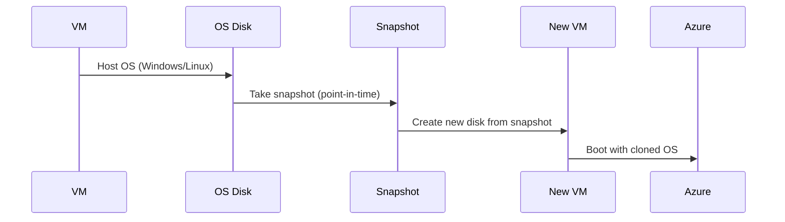

# 📸 Azure VM OS Disk Snapshot – Safe, Fast, and Powerful

> _Need to back up or clone your Azure VM OS disk?_ Use **Azure Snapshots** – they're like point-in-time photos of your disks.

---

## 🧠 What Is a Snapshot?

An **Azure snapshot** is a **read-only, point-in-time backup** of a **managed disk**. Think of it like taking a **screenshot** of your disk — you can later use it to restore, duplicate, or migrate the VM.

> ✅ Works for both **OS disks** and **data disks**  
> ✅ Can be **incremental** (saves space and cost)  
> ✅ Can be **used to create new disks/VMs**

---

## 🧱 Snapshot Types

| 📦 Type           | 🔍 Description                                                                |
| ----------------- | ----------------------------------------------------------------------------- |
| **Full Snapshot** | Captures the **entire disk** at that point in time                            |
| **Incremental**   | Captures **only the changes** since the last snapshot (default & recommended) |

> ✅ Azure now uses **incremental snapshots** by default for cost optimization
> ❌ Full snapshots use more storage and cost more

---

## 🛠️ Common Use Cases

| Scenario                        | How Snapshots Help                                               |
| ------------------------------- | ---------------------------------------------------------------- |
| 🛑 Rollback after patch failure | Take a snapshot before risky updates — revert if anything breaks |
| 🧪 Clone an existing VM         | Use a snapshot of the OS disk to spin up another identical VM    |
| 🔄 Backup strategy              | Schedule regular snapshots for business continuity               |
| 🏃‍♂️ Fast VM redeployment         | Deploy from snapshot faster than rebuilding from scratch         |

---

## 🔁 OS Disk Snapshot Lifecycle (Visual)



---

## ⚙️ How to Create a Snapshot (Azure Portal)

1. 🖥️ Go to your **VM → Disks**
2. Select the **OS Disk**
3. Click on **"Create Snapshot"**
4. Choose:

   - Name
   - Snapshot type (Incremental/Full)
   - Storage type (Standard/Premium)

5. ✅ Create!

---

## 🧪 Azure CLI Example

```bash
# Variables
RESOURCE_GROUP="my-rg"
DISK_NAME="myVM_OsDisk"
SNAPSHOT_NAME="mySnapshot"

# Create snapshot
az snapshot create \
  --resource-group $RESOURCE_GROUP \
  --source "/subscriptions/.../disks/$DISK_NAME" \
  --name $SNAPSHOT_NAME \
  --incremental true \
  --location eastus
```

> 💡 Tip: Use the snapshot ID later to create a new managed disk or VM!

---

## 🚀 Create a New VM from OS Disk Snapshot

1. 🧱 Create a new managed disk from snapshot
2. 📦 Use that disk as the **OS disk** for a new VM
3. 🟢 Start the new VM – it boots from the exact state you snapshotted

---

## 🛡️ Snapshot Is NOT a Full Backup?

> Correct! Snapshot ≠ backup.

- ❌ Snapshots are **stored in your subscription** (not cross-region)
- ✅ Use **Azure Backup** for long-term, geo-redundant backup of VMs

---

## 🧮 Retention Period – 🧊 How Long Are Snapshots Kept?

> 💡 Snapshots in Azure have **no auto-expiry**. They are **kept until you delete them** manually.

| Feature                   | Behavior in Azure                                        |
| ------------------------- | -------------------------------------------------------- |
| ❄️ **Default retention**  | **Forever** (manual cleanup needed)                      |
| 🔁 **Auto-retention**     | ❌ Not supported directly via snapshots                  |
| 📅 **Automated deletion** | ✅ Use **Azure Automation** or **Backup Vault Policies** |

### 🔄 How to Auto-Delete After X Days?

Use **Azure Automation + Tags** or **Lifecycle policies** with a script:

```bash
# Example logic:
# 1. Tag snapshots with creation date
# 2. Run Azure Automation script weekly to delete old ones
```

> ✅ Or: use **Azure Backup** which includes built-in retention policies (30/60/365 days).

---

## 📊 Snapshot vs Backup – Quick Comparison

| Feature               | **Snapshot**                | **Azure Backup**                   |
| --------------------- | --------------------------- | ---------------------------------- |
| Point-in-time Copy    | ✅ Yes                      | ✅ Yes                             |
| OS/Data Disk Support  | ✅ Both                     | ✅ Both                            |
| Long-Term Retention   | ❌ Not ideal                | ✅ Yes                             |
| Cross-Region Storage  | ❌ No                       | ✅ Yes                             |
| Automation/Scheduling | ❌ Manual (unless scripted) | ✅ Built-in                        |
| Ideal Use             | Testing, rollback, cloning  | Compliance, DR, production backups |

---

## 💰 Cost Considerations

- 🔢 **You pay per GB/month** of snapshot storage
- ✅ **Incremental snapshots** reduce cost by storing only changes
- 📦 Stored in the **same region** as the source disk

---

## ✅ Summary – Azure OS Disk Snapshots

| ✅ Feature             | 🔍 Description                                         |
| ---------------------- | ------------------------------------------------------ |
| Point-in-time copies   | Yes – ideal for quick restores or cloning              |
| OS/Data Disk supported | Yes – both can be snapshotted                          |
| CLI & Portal support   | Fully scriptable via Azure CLI                         |
| Default type           | Incremental (saves cost & space)                       |
| Reboot required?       | ❌ No downtime or VM restart needed to take a snapshot |
| Backup vs Snapshot     | Snapshot = short-term copy; Backup = long-term/DR      |
