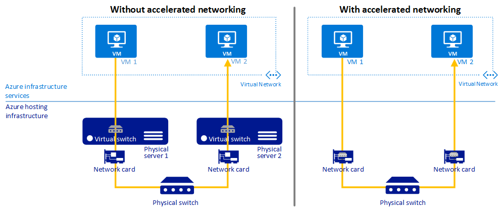
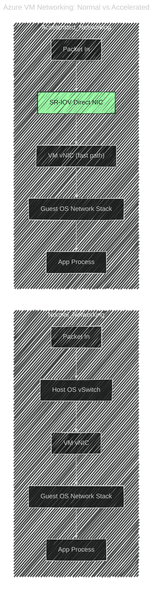
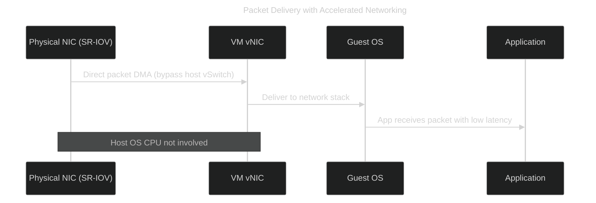

# 🚀 Accelerated Networking

## 📖 Official definition

**Azure Accelerated Networking (AN)** is a feature that gives your Azure VM **high-performance, low-latency networking** by bypassing the host OS virtualization stack and delivering packets directly to the VM’s NIC.

> 👉 In plain words: instead of your packets taking a “detour” through the Azure host OS, they go **straight into your VM’s kernel**, cutting latency and boosting throughput.

---

<div align="center">
  
</div>

---

## 🎯 Why use it?

- **Lower Latency**: up to ~10x faster packet delivery vs normal NIC.
- **Higher Packets per Second (PPS)**: suitable for high-traffic servers.
- **Reduced Jitter**: more consistent performance.
- **Lower CPU usage**: frees up vCPU cycles for app logic instead of packet processing.

🔑 Perfect for:

- High-performance web servers
- Low-latency trading apps
- Databases (SQL, NoSQL)
- Big data clusters (Hadoop, Spark)
- Real-time gaming/streaming apps

---

## 🏗️ How it works (under the hood)

**Normal (non-accelerated) networking:**

1. Packet → Azure host OS → Virtual Switch → VM NIC → Guest OS → App
   (adds CPU + latency overhead)

**With Accelerated Networking:**

1. Packet → SR-IOV (Single Root I/O Virtualization) → VM NIC → Guest OS → App
   (skips host OS, direct hardware path)

---

## 🧭 Flowchart: Normal vs Accelerated Networking



---

## 📜 Sequence: Accelerated Networking request



---

## ⚙️ Requirements

- **VM sizes**: supported on most modern instance families (Dv2/DSv2, Fsv2, Ev3, M-series, Lsv2, etc.).
- **OS support**: Windows Server 2012 R2+, most modern Linux distros with Mellanox/Intel drivers.
- **NIC type**: must be Azure-supported Accelerated Networking NIC.
- **Enable**: must be set **at NIC creation** (cannot toggle live).

---

## 🧪 Hands-on

1. **Check support for VM size**:

   ```bash
   az vm list-skus --location eastus --size Standard_D3_v2 --output table
   ```

   Look for `"AcceleratedNetworkingEnabled": true`.

2. **Create NIC with AN**:

   ```bash
   az network nic create \
     --resource-group MyRG \
     --name MyNic \
     --vnet-name MyVNet \
     --subnet MySubnet \
     --accelerated-networking true
   ```

3. **Attach NIC to VM**:

   ```bash
   az vm create \
     --resource-group MyRG \
     --name MyVM \
     --nics MyNic \
     --image UbuntuLTS \
     --size Standard_D3_v2
   ```

4. **Verify inside VM** (Linux):

   ```bash
   ethtool -S eth0 | grep vf
   ```

   → If you see SR-IOV counters, AN is enabled.

---

## 🧠 Cheat sheet

- **Accelerated Networking** = SR-IOV NIC offload.
- **Benefit**: lower latency, higher PPS, less jitter, lower CPU.
- **Enable**: at NIC creation time only.
- **Best for**: high-throughput & latency-sensitive workloads.
- **Not needed for**: small apps with low traffic (may not see noticeable gain).

---

✅ In summary:
Azure **VM Network Accelerator (Accelerated Networking)** is a **direct NIC → VM fast lane**.
Think of it as **ExpressRoute for packets inside your VM** 🛣️ — no host detours, just raw speed.
