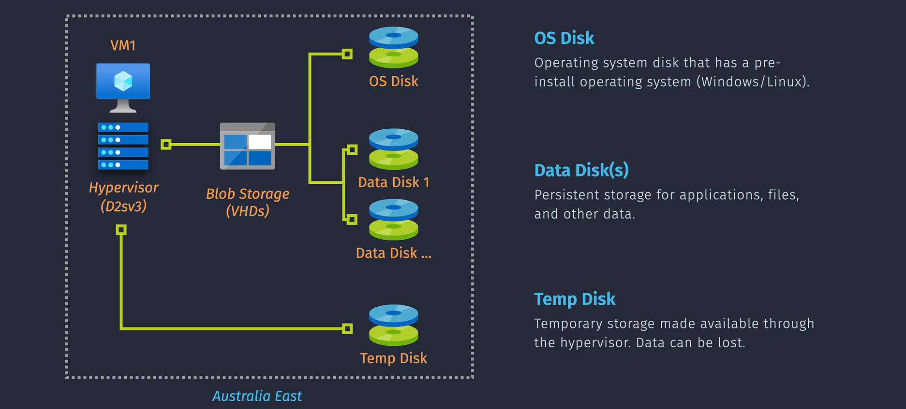
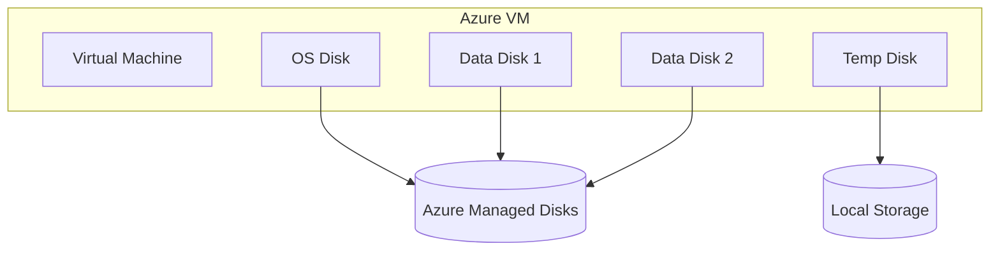

# 💽 **Azure Disk** — Storage Options for Your VMs

When you attach a disk to an Azure VM, you’re not just picking “a drive” — you’re picking **performance, durability, and cost model** that can make or break your workload.
Azure gives you multiple disk types, each optimized for different use cases.

---

## 🏗 Azure Managed Disks Overview

**Managed Disk** = Azure-managed block storage for VMs.
Azure handles:

- Storage provisioning
- Availability
- Encryption at rest (always on)
- Redundancy (LRS, ZRS, GRS)

You choose:

- **Disk type** (performance tier)
- **Disk size**
- **Redundancy option**

> 💡 **AWS Parallel**: Similar to **Amazon EBS volumes** (gp3, io2, st1, sc1).  
> 💡 Disks are stored behind the scenes in **azure blob Storage** AS **Page blobs**.

---

## 🧱 Azure VM Disk Types

Every Azure VM is backed by **Azure Managed Disks**, which come in different flavors depending on purpose and performance.

<div align="center">
  
</div>

---

### 1️⃣ OS Disk

| Property           | Description                                               |
| ------------------ | --------------------------------------------------------- |
| 📦 Purpose         | Holds the **Operating System** (Windows/Linux)            |
| 📌 Type            | Always a **Managed Disk**                                 |
| 💾 Mount Path      | Usually `C:\` (Windows) or `/dev/sda1` (Linux)            |
| 🔄 Snapshot/Backup | Snapshots are supported, integrated with **Azure Backup** |
| 📈 Resize          | Yes, requires **deallocation** (stop VM first)            |
| ➕ Attach/Detach   | OS Disk is **non-removable** (unlike data disks)          |

> 🧠 **AWS Equivalent**: This is like your EC2 instance's root EBS volume.

---

### 2️⃣ Data Disks

| Property      | Description                                                         |
| ------------- | ------------------------------------------------------------------- |
| 📦 Purpose    | Store app data, logs, files, DBs, etc.                              |
| 🔗 Attachment | Attach/detach **dynamically** (live attach supported)               |
| 🔄 Resize     | Supported **without reboot** (depending on VM SKU)                  |
| 💾 Mount Path | Windows: `F:\`, `G:\`, etc. <br>Linux: `/dev/sdc`, `/dev/sdd`, etc. |
| 📈 Scaling    | Up to **32 disks per VM** (depends on VM size)                      |

> 🧠 **AWS Equivalent**: Just like **EBS volumes** attached to EC2 — persistent, resizable block storage.

---

### 3️⃣ Temporary Disk (Local Ephemeral)

| Property        | Description                                                                   |
| --------------- | ----------------------------------------------------------------------------- |
| 📦 Purpose      | **Scratch disk** for temporary operations: pagefile, swap, caching, temp data |
| 🔁 Volatile     | **Data is lost** on stop/deallocate or host reboot                            |
| 💨 High IOPS    | Great for **fast, non-critical** read/write operations                        |
| 📍 Path         | `D:\` (Windows) or `/dev/sdb1` (Linux) – **auto-mounted**                     |
| 📉 Availability | Not available on all VMs (e.g., ephemeral OS VMs don’t include it)            |

> 🧠 **AWS Equivalent**: Like **instance store volumes**, but **not user-configurable** in Azure.

---

## 📦 Disk Tiers

| Disk Tier                | Performance Profile                                | Best For                                                                                  |
| ------------------------ | -------------------------------------------------- | ----------------------------------------------------------------------------------------- |
| **Premium SSD v2** 💎    | Ultra-fast, configurable IOPS & throughput         | Mission-critical workloads with high I/O requirements (databases, transaction-heavy apps) |
| **Premium SSD**          | Low-latency, fixed performance tiers               | Production VMs, SQL, high-performance apps                                                |
| **Standard SSD**         | Balanced cost/performance                          | Web servers, lightly used enterprise apps                                                 |
| **Standard HDD**         | Lowest cost, highest latency                       | Dev/test, infrequent access                                                               |
| **Ultra Disk** 🚀        | Highest performance, sub-ms latency, tunable specs | High-frequency OLTP, NoSQL, SAP HANA                                                      |
| **Ephemeral OS Disk** ⚡ | Temporary, stored on local VM storage (no cost)    | Stateless workloads, rapid scaling VMs                                                    |

---

## 🔗 Storage Architecture Behind the Scenes

Each disk is a **separate Azure Resource**:

<div align="center">



</div>

> 📌 Managed Disks are encrypted by default, replicated in Azure Storage, and support backup & snapshots.

---

## 🛡️ Backup and Recovery Options

| Feature                       | Support                                      |
| ----------------------------- | -------------------------------------------- |
| **Azure Backup**              | Yes – with full VM recovery support          |
| **Snapshot**                  | Yes – point-in-time for OS or data disks     |
| **Azure Site Recovery (ASR)** | Yes – disaster recovery across regions       |
| **Disk Encryption**           | Yes – Azure-managed or customer-managed keys |

---

## 🛠 How to Create and Attach Disks

**Portal**:

1. Go to **VM → Disks**.
2. Click **+ Add Data Disk** or configure OS Disk type.
3. Select Disk type (Premium SSD, Standard HDD, etc.).
4. Save & restart VM if needed.

**Azure CLI**:

```bash
# Create a premium SSD
az disk create \
  --resource-group MyRG \
  --name MyPremiumDisk \
  --size-gb 128 \
  --sku Premium_LRS

# Attach disk to VM
az vm disk attach \
  --resource-group MyRG \
  --vm-name MyVM \
  --name MyPremiumDisk
```

---

## 📤 How to Store, Share, and Reuse Disks

- **Shared Disks**: Premium SSD / Ultra Disk can be attached to multiple VMs (cluster scenarios like SQL FCI).
- **Snapshots**: Point-in-time, used for backup or replication.
- **Images**: Disks can be generalized and turned into custom VM images.
- **Export as VHD**: Download to on-prem or another region.

💡 **Note**: Managed Disks can’t be directly copied like blobs — use snapshot or image for portability.

---

## 🧠 Best Practices for Azure VM Storage

| Practice                            | Benefit                                 |
| ----------------------------------- | --------------------------------------- |
| Use **Premium SSD** for prod DBs    | Ensures performance and reliability     |
| Detach unused disks                 | Avoids unnecessary billing              |
| Use snapshots before resize         | Adds a fallback checkpoint              |
| Enable Azure Backup for OS & data   | Protects against deletion or corruption |
| Use separate disks for logs/db/data | Better performance & fault isolation    |

---

## 🧾 Summary – Azure VM Storage Essentials

| Component     | Purpose                            | AWS Equivalent  |
| ------------- | ---------------------------------- | --------------- |
| OS Disk       | Boot and OS storage                | EBS root volume |
| Data Disk(s)  | Persistent block storage for apps  | EBS volumes     |
| Temp Disk     | Ephemeral local storage            | Instance store  |
| Managed Disks | Azure-managed storage abstraction  | EBS-backed AMIs |
| Ultra/Premium | High-IO, high-throughput workloads | io1 / io2       |
