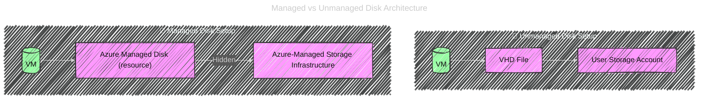

# ☁️ Azure Managed vs Unmanaged Disks

> 💡 Both store your **VM OS + data**, but differ in **who manages the storage account** — **you** or **Azure**.

---

## 1️⃣ What is an **Unmanaged Disk**?

**Think:** “You manage everything yourself.” 🧰

This is the **old-school** way (pre-2017).

### 🧩 How it works:

- Each disk (OS or data) is actually a **VHD file** stored in your own **Storage Account** inside Azure Blob Storage (`.vhd` in a container).
- You must **create and manage** that storage account yourself.
- You’re responsible for:

  - Storage capacity limits (max 20,000 IOPS or 50 TB per storage account).
  - Balancing disks across accounts (to avoid throttling).
  - Monitoring performance and redundancy.

### 🧠 Analogy:

> It’s like parking your car (VHD) in a garage (storage account) that _you_ own —
> you handle space, cleaning, and organization.

---

## 2️⃣ What is a **Managed Disk**?

**Think:** “Azure handles the garage for you.” 🤖

This is the **modern**, **default** option for all new VMs.

### 🧩 How it works:

- Azure automatically creates and manages the **storage accounts** that host your disks.
- Each disk is a **first-class Azure resource** (visible in the portal).
- You don’t deal with containers or `.vhd` paths anymore.
- Azure ensures:

  - High availability & load balancing
  - Scalability
  - Automatic placement across fault domains
  - Easy snapshots, backups, encryption, and role-based access

### 🧠 Analogy:

> You just tell Azure, “Give me a 128 GB Premium SSD,” and Azure takes care of _where_ and _how_ it’s stored.
> You don’t see the storage account anymore — Azure hides that layer.

---

## ⚔️ Key Comparison Table

| Feature                  | **Unmanaged Disk**                               | **Managed Disk**                             |
| ------------------------ | ------------------------------------------------ | -------------------------------------------- |
| 🏗️ Storage Account       | You create and manage it                         | Azure manages automatically                  |
| 📂 Disk Location         | Blob (`.vhd`) in your Storage Account            | Abstracted (Azure-managed resource)          |
| ⚙️ Scalability           | Limited by storage account IOPS (20,000)         | Virtually unlimited                          |
| 🧾 Billing               | Pay for storage account capacity                 | Pay per disk size                            |
| 🔁 Snapshots / Backup    | Manual scripts                                   | Native feature                               |
| 🔒 Security (Encryption) | Manual configuration                             | Built-in SSE + CMK supported                 |
| ☁️ Availability          | You manage redundancy                            | Azure distributes across zones/fault domains |
| 🧩 Integration           | Older model (classic VMs)                        | Required for ARM (modern VMs)                |
| 🚀 Performance           | Can be throttled if many disks share one account | Azure optimizes placement automatically      |
| 🧠 Best Use              | Legacy setups only                               | Default choice today                         |

---

## 🧭 How Azure Handles Them Under the Hood

---

## 🧩 Modern Features Only for Managed Disks

| Feature              | Available? | Why                                          |
| -------------------- | ---------- | -------------------------------------------- |
| Snapshots            | ✅ Yes     | Managed resource supports instant snapshots  |
| Shared Disks         | ✅ Yes     | For clustering (SQL FCI, WSFC)               |
| Disk Encryption Sets | ✅ Yes     | Managed disks integrate with Azure Key Vault |
| Zone Redundancy      | ✅ Yes     | Replicated across zones                      |
| Automatic Placement  | ✅ Yes     | Azure optimizes placement in the backend     |
| Scale                | ✅ Yes     | No storage account bottleneck                |
| ARM Support          | ✅ Yes     | Needed for all Resource Manager VMs          |

---

## 🎯 Exam/Interview Mnemonic

> 💬 **“Managed = Microsoft-managed; Unmanaged = User-managed.”**

✅ **Always choose Managed Disks** in real life and exams unless the question says:

> “You must use existing `.vhd` files stored in Blob storage.”

That’s the only time you’d choose Unmanaged.

---

## 💡 Summary

| Term           | Meaning                                  | Who Manages Storage? | Used In              |
| -------------- | ---------------------------------------- | -------------------- | -------------------- |
| Managed Disk   | Azure-managed storage, simpler, scalable | Azure                | Modern (ARM) VMs     |
| Unmanaged Disk | Your own storage account & VHD           | You                  | Legacy (Classic) VMs |
