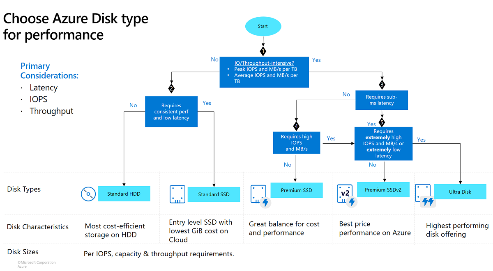

# 💽 **Azure Managed Disk Tiers**

Azure has **4 main performance families (tiers)** for managed disks:

1. **Standard HDD**,
2. **Standard SSD**,
3. **Premium SSD**,
4. **Ultra Disk**.

> Each is just a different _trade-off_ between **cost**, **latency**, and **throughput**.

---

  

## 1️⃣ **Standard HDD** — “Cheap & Sleepy”

**Mnemonic:** “HDD = Holiday Disk Drive” (slow, but affordable)

💡 Think: “Backup or dev/test disk.”

| Property       | Description                                           |
| -------------- | ----------------------------------------------------- |
| 💰 Cost        | 💸 Cheapest                                           |
| ⚡ Performance | Slowest, mechanical-like performance                  |
| 🧱 Backed by   | Hard drives (not SSDs)                                |
| ⏱ Latency      | High (~10–20 ms)                                      |
| 📊 IOPS        | 500 max                                               |
| 🚀 Use case    | Low-priority, backup, dev/test VMs, infrequent access |

🧠 **Remember:** HDD → “Hold Data Dormant”

---

## 2️⃣ **Standard SSD** — “Balanced Budget”

**Mnemonic:** “SSD = Some Speed, Decent.”

💡 Think: “Middle ground — SSD reliability without paying premium.”

| Property       | Description                                                               |
| -------------- | ------------------------------------------------------------------------- |
| 💰 Cost        | Moderate                                                                  |
| ⚡ Performance | Faster and more consistent than HDD                                       |
| 🧱 Backed by   | SSDs                                                                      |
| ⏱ Latency      | 5–10 ms                                                                   |
| 📊 IOPS        | Up to 6,000                                                               |
| 🚀 Use case    | Web servers, light workloads, low-latency needed but not mission-critical |

🧠 **Remember:** Standard SSD = _Stable but Sensible_.

---

## 3️⃣ **Premium SSD** — “Power Player”

**Mnemonic:** “Premium = Production Ready.”

💡 Think: “Fast disk for real apps — databases, production workloads.”

| Property       | Description                                  |
| -------------- | -------------------------------------------- |
| 💰 Cost        | High                                         |
| ⚡ Performance | Super fast and consistent                    |
| 🧱 Backed by   | High-performance SSDs                        |
| ⏱ Latency      | 1–2 ms                                       |
| 📊 IOPS        | Up to 20,000 per disk                        |
| 🚀 Use case    | SQL Server, SAP, OLTP, enterprise-grade apps |

🧠 **Remember:** Premium = “Performance Priority.”

---

## 4️⃣ **Ultra Disk** — “Formula 1 Mode”

**Mnemonic:** “Ultra = Unmatched Latency & Tuning.”

💡 Think: “Custom performance monster for heavy I/O.”

| Property        | Description                                              |
| --------------- | -------------------------------------------------------- |
| 💰 Cost         | 💸💸 Most expensive                                      |
| ⚙️ Configurable | You can tune IOPS + throughput separately                |
| ⏱ Latency       | Sub-millisecond (~<1 ms)                                 |
| 📊 IOPS         | Up to 160,000 (!)                                        |
| 🚀 Use case     | High-end databases, analytics, large transaction systems |

🧠 **Remember:** Ultra = “Unlimited Performance.”

---

## 🧠 **Quick Cheat Code to Memorize**:

| Tier            | Mnemonic                    | Speed           | Cost         | Best For              |
| --------------- | --------------------------- | --------------- | ------------ | --------------------- |
| 🪶 Standard HDD  | **“Hold Data Dormant”**     | 🐢 Slow         | 💰 Cheap     | Archive / Backup      |
| ⚙️ Standard SSD | **“Some Speed, Decent”**    | 🚗 Medium       | 💵 Moderate  | Light workload        |
| 🔥 Premium SSD  | **“Performance Priority”**  | 🚀 Fast         | 💸 Expensive | Production DBs        |
| 🏎️ Ultra Disk   | **“Unlimited Performance”** | ⚡⚡ Ultra-fast | 💸💸💸       | Mission-critical apps |

---

## 💡 **Disk Names by Type**

When you create a VM, Azure assigns a name like `P10`, `S20`, or `E30`:

- **P = Premium SSD**
- **S = Standard SSD**
- **E = Standard HDD**
- **U = Ultra Disk**

Each number roughly equals **size + performance tier**, e.g.:

- `P10` → 128 GB, ~500 IOPS
- `P30` → 1 TB, ~5000 IOPS

🧠 Mnemonic:

> “**P = Performance, S = Simple, E = Economical, U = Ultimate.**”

---

## ⏳ **Ephemeral OS Disk**

- OS stored in VM’s **local SSD** (not in Azure Storage).
- **Cost**: Free (uses VM local storage).
- **Boot time**: Extremely fast.
- **Data persistence**: Lost on VM stop/deallocate.
- **Use case**: Stateless workloads, auto-scale sets, short-lived compute.

💡 AWS Equivalent: **Instance Store volumes** in EC2.

---

## 🏁 **TL;DR Summary**

| Tier         | Type              | Latency  | IOPS  | Typical Use           |
| ------------ | ----------------- | -------- | ----- | --------------------- |
| Standard HDD | Cheap magnetic    | 10–20 ms | ~500  | Backup / cold data    |
| Standard SSD | Basic solid state | 5–10 ms  | ~6K   | Dev/Test / small apps |
| Premium SSD  | Fast solid state  | 1–2 ms   | ~20K  | Production workloads  |
| Ultra Disk   | Custom tuned SSD  | <1 ms    | 160K+ | High-end databases    |
