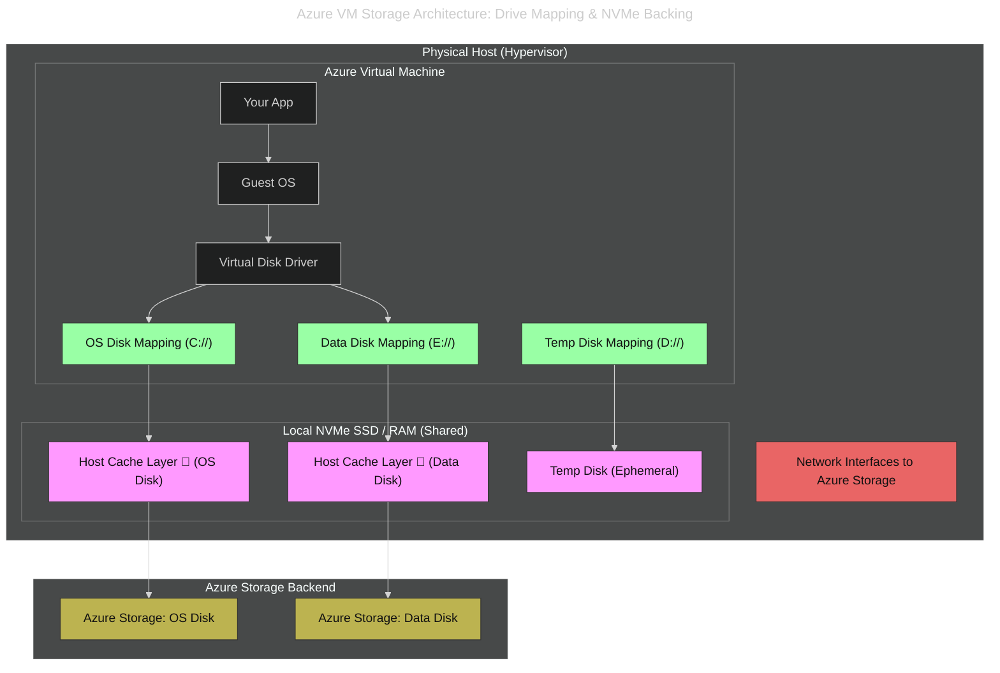

# ⚙️ **The Real Meaning of “Host Cache”**

## 🧠 Short definition

**Host caching** in Azure =

> keeping a **local copy of disk data** on the **physical host machine’s SSD** (or RAM) so that future reads/writes can be served faster, instead of always talking to Azure Storage across the network.

---

## 🏠 **Where is the “host”?**

The **host** is the **physical server** that runs your VM inside an Azure datacenter — under a hypervisor (Hyper-V–based).

It has:

- **RAM**
- **NVMe/SSD cache storage**
- **Network interfaces** to Azure Storage.

When you enable **host caching**, the hypervisor keeps a **local copy** of frequently accessed blocks of your virtual disk (managed disk).

---

## 🧩 **The architecture layers**

---

## 🧩 **Component Breakdown**

### 🟩 **1. VM Layer (Green)** — Your Virtual Machine

- **Your App**: The software you run — web server, database, etc.
- **Guest OS**: The operating system (Windows/Linux) running inside the VM. It boots from the OS Disk.
- **Virtual Disk Driver**: The bridge between your OS and virtual disks. It sends I/O requests to the hypervisor.
- **OS Disk Mapping (C://)**: The system disk where the OS is installed.
- **Data Disk Mapping (E://)**: An extra disk for app data, databases, etc.
- **Temp Disk Mapping (D://)**: A volatile disk used for scratch space, swap files, and temp folders.
- **Performance vs Persistence:**

  | Disk Type       | Backed By             | Persistent? | Use Case                         |
  | --------------- | --------------------- | ----------- | -------------------------------- |
  | **C:// (OS)**   | Azure Storage + Cache | ✅ Yes      | Boot OS, read-heavy workloads    |
  | **E:// (Data)** | Azure Storage + Cache | ✅ Yes      | App data, SELECT-heavy databases |
  | **D:// (Temp)** | Local NVMe SSD/RAM    | ❌ No       | Swap, temp files, scratch space  |

---

### 🟪 **2. Host Layer (Pink)** — The Physical Server Running Your VM

- **Host Cache Layer 💾 (OS Disk)**: Speeds up reads/writes to the OS Disk using local SSD/RAM.
- **Host Cache Layer 💾 (Data Disk)**: Same, but for the Data Disk.
- **Temp Disk (Ephemeral)**: The actual physical SSD/RAM that backs the D:// drive. It’s fast but wiped when the VM stops.

### 🟥 **3. Network Interfaces (red)** — The host’s NICs that connect to Azure Storage

- **Network Interfaces to Azure Storage**: The host’s NICs that connect to Azure’s backend storage over the network.

---

### 🟨 **4. Storage Layer (Yellow)** — Azure’s Persistent Disk Infrastructure

- **Azure Storage: OS Disk**: Where the C:// disk is actually stored.
- **Azure Storage: Data Disk**: Where the E:// disk lives.
- These are **managed disks** — persistent, billed, and replicated.

---

## 🔁 **The caching mechanism**

### 1️⃣ When **Read-only** caching is enabled:

- The host keeps a local copy of data blocks **after the first read**.
- Future reads → served **from local SSD** instead of Azure Storage.
- Writes → **bypass** cache and go directly to storage.

✅ Great for **read-heavy** workloads (like boot disk or SELECT-heavy databases).

---

### 2️⃣ When **Read/Write** caching is enabled:

- **Reads** served from cache (same as above).
- **Writes** initially stored in the host cache (RAM/SSD), and later **flushed asynchronously** to Azure Storage (write-back).
- If the host or VM crashes before flush → **data loss possible**.

✅ Great for **temporary/scratch data**, never for transactional DBs.

---

### 3️⃣ When **None** (no caching):

- Every read and write operation goes directly to Azure Storage.
- Slower, but **safest and most consistent**.

✅ Great for **write-heavy** and **integrity-sensitive** workloads like database logs.

---

## ⚡ **Real-world analogy**

Think of your Azure disk like a **Google Drive file** you use daily:

- You can open it in **offline mode (cache)** so it loads instantly (read cache).
- But if you make changes offline (write cache) and your laptop crashes before sync, you lose unsaved edits.

Same thing with VM disks. The host cache is your “offline” copy, and Azure Storage is the master copy.

---

## 🧠 **What is physically cached?**

- Data is cached at the **block level (4 KB or 8 KB)**.
- It uses the **local SSD on the host** (not visible to you).
- Each host cache is partitioned per VM.
- When the VM migrates to another host (due to scale or maintenance), the **cache is rebuilt** automatically — you don’t control it.

---

## 🧮 **Why Azure uses it**

- Reduces latency (I/O roundtrip to storage ~1 ms instead of ~10–15 ms).
- Offloads repeated reads.
- Improves VM boot and file access performance.
- But it introduces **data consistency complexity**, so you must pick the right mode.

---

## 🔐 **Key takeaway**

| Mode           | Cached on host? | Flush behavior   | Risk               | Use case                 |
| -------------- | --------------- | ---------------- | ------------------ | ------------------------ |
| **None**       | ❌ No           | N/A              | None               | Databases, logs          |
| **Read-only**  | ✅ Reads only   | Writes go direct | None               | OS disk, read-heavy apps |
| **Read/Write** | ✅ Both         | Writes async     | Data loss if crash | Temp data                |

Great question, Hady — especially coming from an AWS background where ephemeral storage (like instance store volumes) plays a similar but not identical role. Let’s break it down clearly 🔍

---

## 🆚 **Host Cache vs. Temp Disk in Azure**

| Feature            | **Host Cache**                                    | **Temp Disk** (Ephemeral OS/Data Disk)                   |
| ------------------ | ------------------------------------------------- | -------------------------------------------------------- |
| **Purpose**        | Accelerate I/O to **managed disks** via local SSD | Provide **scratch space** for temp files, paging, etc.   |
| **Attached To**    | Any **managed disk** (OS or data)                 | Comes **automatically** with most VM sizes               |
| **Configurable?**  | ✅ Yes — you choose: None, Read-only, Read/Write  | ❌ No — fixed behavior, not configurable                 |
| **Persistence**    | ✅ Persistent — data lives on managed disk        | ❌ Non-persistent — data lost on VM deallocation/restart |
| **Location**       | SSD/RAM on **host hypervisor**, invisible to user | SSD on **host**, exposed as a mounted disk (e.g., D:\)   |
| **Use Case**       | Speed up access to managed disks                  | Temporary storage for swap, temp files, build artifacts  |
| **Risk**           | Possible data loss with write cache on crash      | Guaranteed data loss on VM stop/deallocate               |
| **Price**          | Host caching itself is free                       | Host caching itself is free                              |
| **AWS Equivalent** | Similar to **EBS volume with local caching**      | Similar to **Instance Store (ephemeral)**                |

---

## 🧠 **Think of it like this:**

- **Host Cache** = a _performance layer_ for your **real disks** (managed disks). You still pay for and persist data in Azure Storage.
- **Temp Disk** = a _scratchpad_ that lives only as long as the VM does. It’s fast, local, and free — but **volatile**.

---

## 💡 **Best Practices**

- Use **host caching** for managed disks where performance matters (e.g., read-heavy workloads).
- Use **temp disk** for:
  - Pagefile/swap
  - Temp folders (e.g., `/tmp`, build artifacts)
  - Buffering intermediate data
  - Apps that can tolerate data loss
