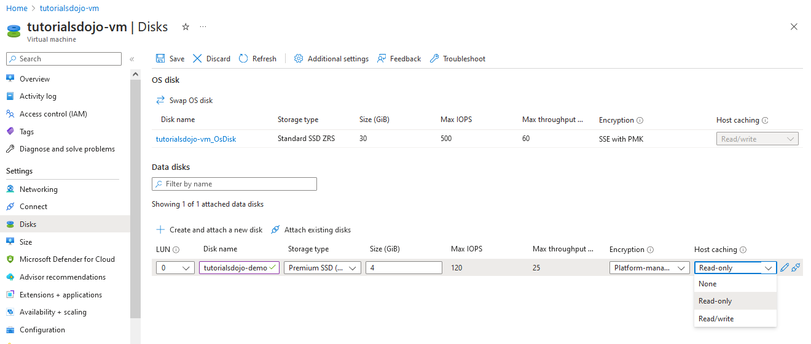
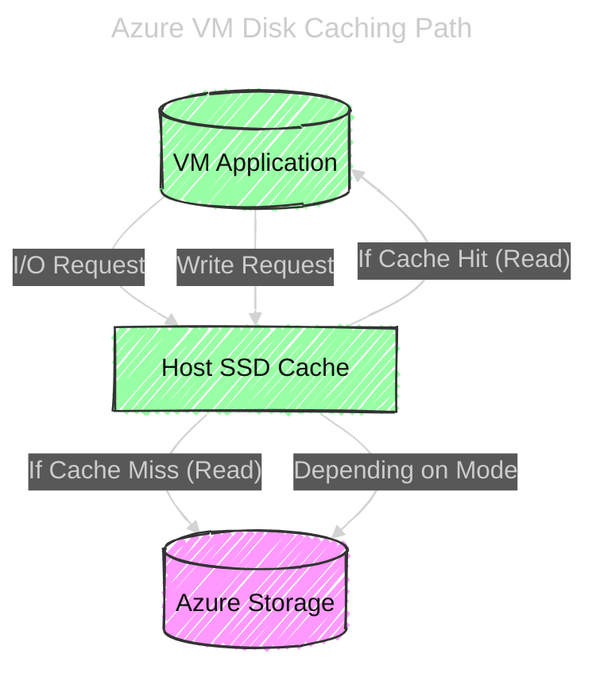

# 💽 **Host Caching in Azure VM Disks**

## 📖 **Official definition**

**Host caching** (also called **disk caching**) determines **how data is cached between the Azure VM and the underlying Azure Storage** where your managed disk resides.

Caching happens on the **VM host’s local SSD** — closer to the compute node — to **improve performance** for certain workloads.

---

<div align="center" style="background-color: #ffff; border-radius: 10px;">
  
</div>

---

## 🧩 **Key concept**

When your VM reads or writes data to its disk:

- Azure can **cache** some of that data locally (in RAM or SSD).
- This caching can **reduce latency** and **improve throughput**.
- However, caching introduces **consistency trade-offs** — so you must choose wisely based on workload type (read-heavy vs. write-heavy).

---

## ⚙️ **Types of Host Caching Options**

| Caching Mode   | Description                                                                 | Best for                                           | Notes                                                                                   |
| -------------- | --------------------------------------------------------------------------- | -------------------------------------------------- | --------------------------------------------------------------------------------------- |
| **None**       | No caching; every read/write goes directly to Azure Storage.                | Data disks for databases or write-heavy workloads. | Ensures strongest consistency and durability.                                           |
| **Read-only**  | Reads are served from host cache if available; writes always go to storage. | OS disks or read-heavy workloads.                  | Faster boot and faster read access.                                                     |
| **Read/Write** | Both reads and writes are cached on the host.                               | Temporary or scratch data (e.g., app caches).      | Fastest I/O but data may be lost on crash. Not recommended for transactional workloads. |

---

## 🧭 **Where caching applies**

| Disk Type                                     | Default Cache Setting                      |
| --------------------------------------------- | ------------------------------------------ |
| **OS Disk**                                   | `Read/Write`                               |
| **Data Disk (Standard HDD/SSD, Premium SSD)** | `None`                                     |
| **Temporary Disk (/dev/sdb or D:)**           | Always cached (host-local, non-persistent) |

---

## 🔄 **Flow: Read/Write path per cache mode**

<div align="center" style="background-color: #1e1e1e; border-radius: 10px; border: 2px solid white;">



</div>

---

## 🧪 Example: when to use which caching

| Scenario                  | Disk                 | Recommended Caching | Reason                               |
| ------------------------- | -------------------- | ------------------- | ------------------------------------ |
| OS disk for Windows/Linux | OS Disk              | **Read/Write**      | Faster boot & frequent reads.        |
| Database data disk        | Data Disk            | **None**            | Strong write consistency.            |
| Database log disk         | Data Disk            | **None**            | Avoid data loss or corruption.       |
| Web app static content    | Data Disk            | **Read-only**       | Cache improves read performance.     |
| Temp data or scratch disk | Ephemeral or Premium | **Read/Write**      | Speed matters, data loss acceptable. |

---

## 🧠 Best practices & tips

✅ **Understand workload pattern**

- **Read-heavy** → Read-only cache is beneficial.
- **Write-heavy** → Disable caching to avoid data corruption or delayed persistence.

✅ **Use Premium SSDs or Ultra Disks** for predictable IOPS; caching can still help OS disk but may not be needed for ultra-fast data disks.

✅ **For SQL / database workloads:**

- Data & log disks → `None`
- TempDB (if on separate disk) → `Read/Write` (performance-friendly)

✅ **Always test IOPS** using tools like `fio` (Linux) or `DiskSpd` (Windows) before finalizing cache configuration.

---

## ⚡ Advanced note

- The host cache uses **write-back strategy** for write caching, meaning data first lands on the host SSD before syncing to Azure Storage.
- During VM deallocation, scaling, or host maintenance → cached writes are **flushed** to ensure consistency.
- If the host crashes unexpectedly → cached writes **not yet committed** may be lost (that’s why write caching is risky for transactional systems).

---

## 🧾 CLI & PowerShell examples

### 💻 Using Azure CLI

```bash
# Create a VM with a data disk (no cache)
az vm create \
  --resource-group MyRG \
  --name MyVM \
  --image UbuntuLTS \
  --data-disk-caching None

# Update cache mode
az vm update \
  --name MyVM \
  --resource-group MyRG \
  --set storageProfile.dataDisks[0].caching=ReadOnly
```

### 💻 Using PowerShell

```powershell
$vm = Get-AzVM -ResourceGroupName "MyRG" -Name "MyVM"
$vm.StorageProfile.DataDisks[0].Caching = "ReadOnly"
Update-AzVM -ResourceGroupName "MyRG" -VM $vm
```

---

## 🧩 Summary table

| Setting        | Read speed | Write speed | Durability | Ideal for                  |
| -------------- | ---------- | ----------- | ---------- | -------------------------- |
| **None**       | Slow       | Slow        | High       | Databases, critical writes |
| **Read-only**  | Fast       | Slow        | High       | Boot, static content       |
| **Read/Write** | Fast       | Fast        | Medium     | Temp data, caches          |

---

## 🧠 Mnemonic to remember

> 💡 _“None for writes, Read for boots, Read/Write for temp”_

---

## 💡 Scenario Demo {AZ-305}

- You’re deploying **SQL Server** in an **Azure VM**.
- You have **two P30 (Premium SSD) data disks**:

  - **Disk 1:** stores **SQL Data files (.mdf/.ndf)**
  - **Disk 2:** stores **SQL Log files (.ldf)**

- You need to choose **host caching settings** that:

  - ✅ Optimize performance
  - ✅ Maintain **integrity** (no data loss or corruption)

---

### ⚙️ Correct Configuration

| Disk Purpose  | Host Caching  | Why                                                                                                                                          |
| ------------- | ------------- | -------------------------------------------------------------------------------------------------------------------------------------------- |
| **Data Disk** | **Read-only** | SQL queries mostly _read_ data pages (selects, lookups). Read caching speeds this up while still writing directly to storage for durability. |
| **Log Disk**  | **None**      | SQL logs are _write-intensive_ and sequential; caching can delay persistence and risk data loss if a VM or host fails.                       |

---

### 🚫 Why NOT “Read/Write” or “Write-only”

#### ❌ “Read/Write” (on Data)

- Uses **write-back cache**, meaning writes may stay on host SSD temporarily before being committed to Azure Storage.
- If the host reboots/crashes before flushing, you can **lose unflushed transactions**.
- SQL expects **ACID durability** — losing writes = data corruption.
  ✅ So we disable write caching for database data and logs.

---

#### ❌ “Write-only” (on Log)

- There is **no write-only cache** option in Azure — only “None”, “Read-only”, “Read/Write”.
- Using **Read/Write** (which affects writes) on logs causes the same issue: cached log entries might not be committed to persistent storage yet, violating SQL’s durability guarantee.

---

#### ✅ Correct logic (Microsoft’s best practice)

| Disk              | Access Pattern            | Recommended Caching |
| ----------------- | ------------------------- | ------------------- |
| **OS Disk**       | Mixed small reads/writes  | **Read/Write**      |
| **SQL Data Disk** | Random reads, some writes | **Read-only**       |
| **SQL Log Disk**  | Sequential write-heavy    | **None**            |

---

### 🔍 Deep reasoning

SQL Server relies on **write-order integrity**:

- Data modifications are written to the **transaction log first**, then to the **data file** later (checkpoint).
- If write caching interferes (delays or reorders writes), SQL’s recovery model breaks.
- That’s why **both log and data disks must bypass write caching** — but you can still enable **read caching** safely on the data disk to boost performance.

---

### 🧠 Mnemonic to remember

> 💡 **“Read-only for reads, None for logs”**

- **Read-only** → Safe speedup for SELECT-heavy workloads.
- **None** → Full durability for write-heavy logs.

---

✅ **Final Answer (exam)**

- **Data Disk:** `Read-only`
- **Log Disk:** `None`
