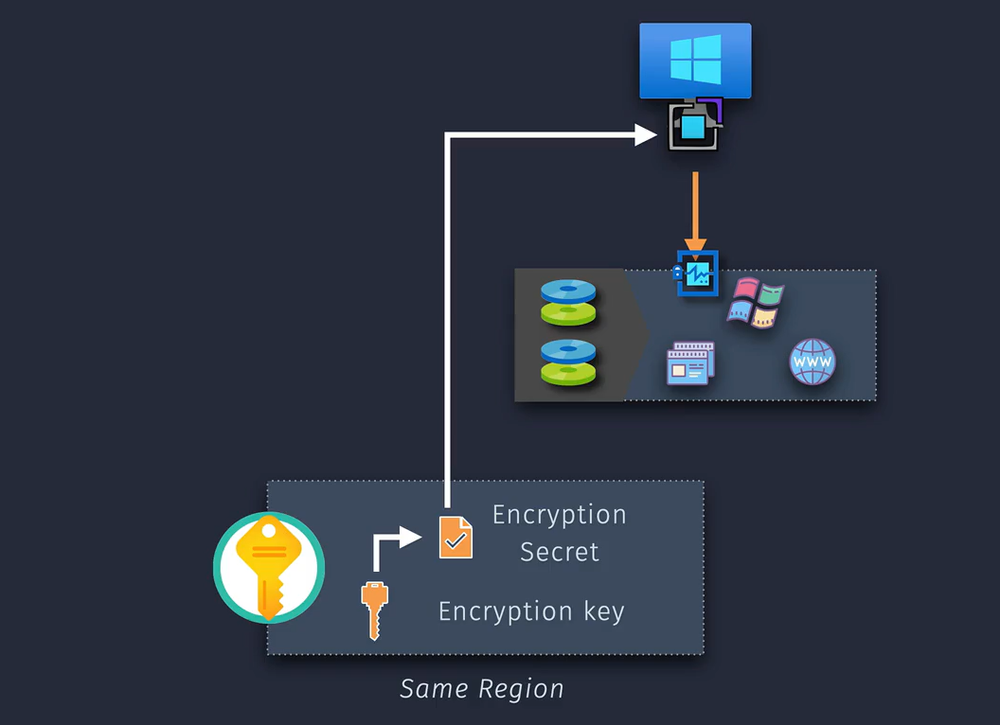
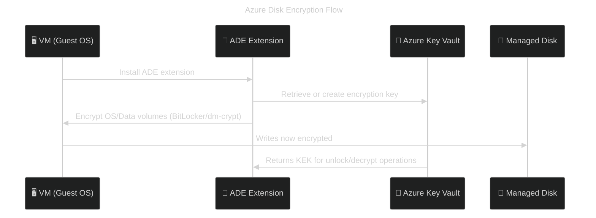
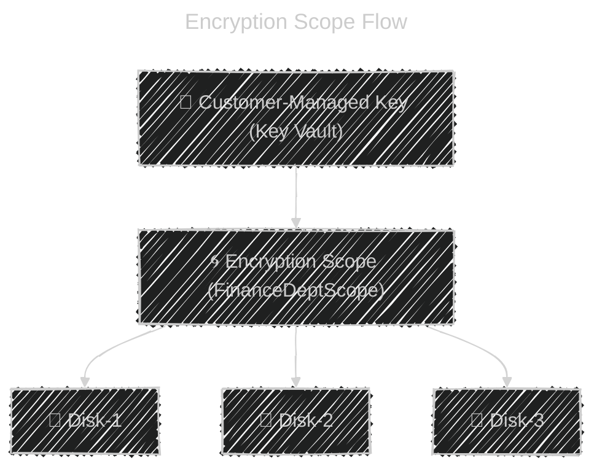

# 🔐 **Azure VM Disk Encryption (2025 Updated)**

> 💡 _Protecting data across all layers: inside the VM, at the storage layer, and on the physical host._

---

## 🧩 Overview — Three Core Encryption Layers

Azure protects your disks using **three complementary encryption layers**, plus an optional **encryption scope** for fine-grained control:

| 💡 Layer Purpose  | ✅ Azure Feature                 | 📍 Where It Happens     | 🔒 Protects                         |
| ----------------- | -------------------------------- | ----------------------- | ----------------------------------- |
| 1️⃣ **Inside VM**  | **Azure Disk Encryption (ADE)**  | _Within the Guest OS_   | Data volumes (BitLocker / dm-crypt) |
| 2️⃣ **At Storage** | **Server-Side Encryption (SSE)** | _Azure Storage layer_   | Managed disks, snapshots, images    |
| 3️⃣ **At Host**    | **Encryption at Host**           | _Physical compute host_ | OS/Data/Temp disks + caches         |

---

## 1️⃣ Azure Disk Encryption (ADE) — _Guest OS Encryption_

### 🧩 What It Is

Runs **inside the VM**, using:

- 🪟 **BitLocker** (Windows)
- 🐧 **dm-crypt** (Linux)

ADE uses an **agent extension** to encrypt disks and store encryption keys in **Azure Key Vault (AKV)**.

  

---

### ⚙️ Key Features

| Feature            | Details                                                   |
| ------------------ | --------------------------------------------------------- |
| 📍 Scope           | OS + Data disks (not temp disks)                          |
| 🔑 Key Management  | Azure Key Vault **(must be in same region)**              |
| 🔁 Requires Reboot | Yes (applies encryption to volumes)                       |
| 🚫 Unsupported     | Ultra Disks, ephemeral OS disks, A-series, low-memory VMs |
| 🧩 Encryption Type | Volume-level using BitLocker/dm-crypt                     |
| 🧱 Architecture    | Guest-side agent encrypts before host/storage layer       |
| 🔓 Decryption      | Performed inside VM using AKV key                         |
| 🔐 Key Rotation    | Manual — re-encrypt with new keys if needed               |

---

### 🔁 ADE Typical Flow

---

### 🧠 Quick Comparison

| AWS Term                  | Azure Equivalent          |
| ------------------------- | ------------------------- |
| EC2 BitLocker/LUKS        | Azure Disk Encryption     |
| AWS KMS CMK (client-side) | Azure Key Vault CMK (ADE) |

---

## 2️⃣ Server-Side Encryption (SSE) — _Storage-Level Encryption_

Azure encrypts all **Managed Disks**, **Snapshots**, and **Images** by default, using **AES-256** encryption before writing data to storage.

---

### 🧩 2.1. SSE with Microsoft-Managed Keys (MMK)

✅ **Default mode** for all managed disks.

| Property          | Details           |
| ----------------- | ----------------- |
| 🔑 Key Ownership  | Microsoft         |
| 🔄 Key Rotation   | Automatic         |
| 🧾 Billing Impact | None              |
| 🛠️ Agent Needed   | No                |
| 📊 Performance    | No impact         |
| 🧩 Use Case       | General workloads |

💡 _Equivalent to AWS-managed EBS encryption (`aws/ebs`)._

---

### 🧩 2.2. SSE with Customer-Managed Keys (CMK)

For compliance-focused workloads needing **key ownership** and **revocation**.

| Property         | Details                                                |
| ---------------- | ------------------------------------------------------ |
| 🔑 Key Ownership | Customer                                               |
| 🏦 Key Storage   | Azure Key Vault or Managed HSM                         |
| 🔁 Key Rotation  | Manual or via Azure Key Vault automation               |
| ⚙️ Requirements  | Managed Disk + Key Vault + RBAC permissions            |
| 🧩 Use Case      | Regulated industries (finance, healthcare, government) |

💡 _AWS Equivalent_: **EBS with KMS CMK**

---

### 🧩 2.3. SSE with Double Encryption

A **defense-in-depth** layer that encrypts data **twice** — once with a **platform key**, once with your **customer key**.

| Layer | Encryption Type            |
| ----- | -------------------------- |
| 1     | Customer-Managed Key (CMK) |
| 2     | Platform-Managed Key (PMK) |

💡 Provides additional resilience against potential key or storage compromise.
🧠 Supported for **Managed Disks**, **Snapshots**, and **Images**.

---

## 3️⃣ Encryption at Host — _Physical Layer Encryption_

Encrypts all data handled by the **Azure host machine** (compute node) before writing to storage.

✅ **Covers everything**, including:

- OS & Data disks
- **Temp Disks (D:)**
- **Host Cache**
- **Diagnostic Disks**

---

### ⚙️ Key Details

| Property           | Description                      |
| ------------------ | -------------------------------- |
| 🧩 Scope           | All disks attached to VM         |
| 📦 Encryption Type | AES-256                          |
| 🏗️ Applied On      | Physical host                    |
| ⚙️ Enabled         | At VM creation only              |
| 🚫 Limitation      | Cannot be toggled after creation |
| 💡 Tip             | Works seamlessly with SSE        |

---

### 🧠 Why It Matters

Without this, **temp disks and caches** may remain unencrypted — especially critical for workloads that store **sensitive intermediate data** (e.g., SQL tempdb or scientific processing).

💡 _AWS Equivalent_: Nitro host-level encryption for EC2 instances.

---

## 🔍 Encryption Scope — _Granular Key Control (Newer Feature)_

Introduced to simplify **key hierarchy management** across multiple disks or containers.

### 💡 What It Is

An **Encryption Scope** is a **boundary for applying an encryption key** — instead of assigning a key per resource, you can define one for:

- A **set of managed disks**, or
- A **container (like blob container)**

All items under that scope inherit the same encryption key and policy.

---

### ⚙️ Key Features

| Feature           | Description                                           |
| ----------------- | ----------------------------------------------------- |
| 📦 Scope          | Storage account or individual container/disk          |
| 🔑 Keys Supported | CMK (from Key Vault) or Microsoft-managed             |
| 🔄 Key Rotation   | Supported automatically                               |
| 🧠 Benefit        | Easier to manage CMKs across hundreds of disks        |
| 🛡️ Security       | Strong boundary — encryption scopes cannot share keys |

---

### 🧭 Example Use Case

> A financial institution encrypts all “FinanceDeptDisks” under a single **Encryption Scope** using one CMK — simplifying rotation, audit, and compliance.

---

### 🧠 Visual

---

## 🧾 Summary — Compare All Layers

| Layer     | Azure Feature                | Applies To                  | Key Location         | Key Type        | Default | Best For                        |
| --------- | ---------------------------- | --------------------------- | -------------------- | --------------- | ------- | ------------------------------- |
| Inside VM | Azure Disk Encryption (ADE)  | OS/Data volumes             | Azure Key Vault      | Customer        | ❌      | In-guest security policies      |
| Storage   | Server-Side Encryption (SSE) | Managed Disks, Snapshots    | Microsoft / Customer | Platform or CMK | ✅      | Default protection              |
| Physical  | Encryption at Host           | Temp + cache + all I/O      | Microsoft            | Platform        | ❌      | Full-stack encryption           |
| Scoped    | Encryption Scope             | Group of disks / containers | Customer             | CMK             | ❌      | Simplified large-scale key mgmt |

---

## 🧠 Recommended Combinations

| Use Case                             | Recommended Layers                                         |
| ------------------------------------ | ---------------------------------------------------------- |
| General workloads                    | **SSE (default MMK)**                                      |
| Compliance (BYOK)                    | **SSE with CMK**                                           |
| OS-level policy requirement          | **ADE + SSE**                                              |
| Full protection including temp/cache | **Encryption at Host + SSE**                               |
| Large disk fleet with one key        | **Encryption Scope (CMK)**                                 |
| Max security combo                   | **ADE + SSE(CMK) + Encryption at Host + Encryption Scope** |

---

## 🛑 Important Notes

- **ADE** introduces **VM reboot** and needs **manual key management**
- **SSE** is **always-on** and safest for most workloads
- **Encryption at Host** only applies if enabled at **VM creation**
- Combining all 3 adds **maximum protection**, but also **operational complexity**

---

## ✅ Quick Takeaways

- **SSE (MMK)** = default and mandatory
- **SSE (CMK)** = BYOK for compliance
- **ADE** = inside-VM encryption, needs reboot
- **Encryption at Host** = includes temp/cache
- **Encryption Scope** = simplifies key management across many disks
