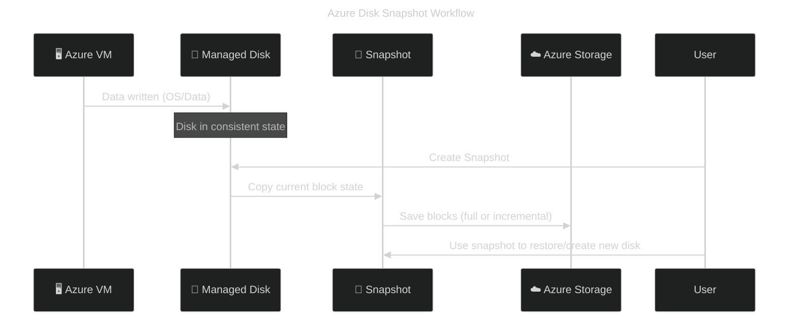
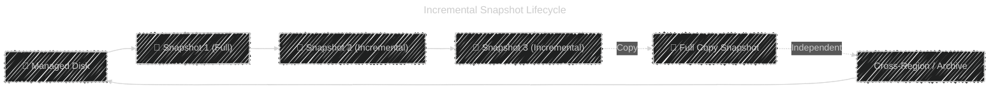

# 💾 **Azure Managed Disk Snapshots (2025 Updated)**

Snapshots in Azure are **point-in-time backups** of managed disks.
They’re **stored in Azure Storage**, are **incremental by default**, and can be used to **restore, clone, or migrate** VMs or disks.

---

## 📖 **What Is a Snapshot?**

A **snapshot** is a **read-only image** of a managed disk at a specific moment.
You can take a snapshot of:

- OS disk
- Data disk

…and use it later to:

- **Create a new managed disk**
- **Restore a VM**
- **Replicate to another region**
- **Export to Blob storage** for long-term backup

---

## 🏪 **Where Are Azure Snapshots Stored?**

> **Azure Managed Disk Snapshots** are stored in **Microsoft-managed Azure Storage**,You manage them as Azure resources, not as blobs — unless you explicitly export them.

---

### 🔹 What this means:

- When you create a snapshot using `az disk snapshot create` or via the portal, Azure stores it in **its own internal storage**, optimized for incremental tracking and performance.
- You **don’t see it** in your blob containers — it’s a **resource** in your subscription, not a blob.
- You can **export** a snapshot to a VHD in your blob container if needed (e.g., for backup, migration, or cross-cloud use).

---

### 🔹 Security & Access

- Snapshots are **isolated per subscription/resource group**.
- You control access via **RBAC** and **Azure Disk Snapshot permissions**.
- You can copy snapshots across regions or convert them to **read-only VHDs** in blob storage.

---

## 🧩 **Snapshot Types in Azure**

Azure technically supports **only one type of snapshot (incremental)**,
but functionally, there are two categories:

<div align="center" style="background-color: #1E1E1E; border-radius: 10px;">

| Snapshot Type          | How It Works                                           | Description                                                      |
| ---------------------- | ------------------------------------------------------ | ---------------------------------------------------------------- |
| 🧱 **Full (Baseline)** | Captures _all blocks_ from the source disk             | The **first** snapshot of a disk is automatically a **full** one |
| 🔁 **Incremental**     | Captures _only changed blocks_ since the last snapshot | Every subsequent snapshot is incremental, saving cost and time   |

</div>

💡 Azure **does not expose** a “full snapshot” option — but the **first** one is full by nature.

---

## ⚙️ Snapshot Storage and Retention

<div align="center" style="background-color: #1E1E1E; border-radius: 10px;">

| Property                   | Details                                                                                             |
| -------------------------- | --------------------------------------------------------------------------------------------------- |
| 📦 **Storage Type**        | Stored as **managed resources** in Azure Storage (not inside the VM)                                |
| 💰 **Billing**             | You pay only for the **unique blocks** (incremental savings)                                        |
| 🧹 **Retention Policy**    | **No automatic deletion** – you manage lifecycle manually (can automate via Azure Backup or Policy) |
| ♻️ **Dependency Handling** | When older snapshots are deleted, Azure merges blocks automatically so newer ones remain valid      |

</div>

---

## 🔐 Snapshot Encryption Options

Snapshots **inherit** encryption settings from their source disk, but you can **override or re-encrypt**:

<div align="center" style="background-color: #1E1E1E; border-radius: 10px;">

| Encryption Type                    | Description                                                 | Key Source     |
| ---------------------------------- | ----------------------------------------------------------- | -------------- |
| 🟦 **Platform-managed keys (PMK)** | Default; Microsoft manages encryption keys                  | Azure-managed  |
| 🟩 **Customer-managed keys (CMK)** | You manage keys in **Azure Key Vault**                      | Your Key Vault |
| 🟨 **Encryption at Host**          | If VM enabled it, temp + cache + disk I/O already encrypted | Host-level     |

</div>

🔧 Example:

```bash
az snapshot create \
  --name finance-snap \
  --resource-group RG1 \
  --source myManagedDisk \
  --encryption-type EncryptionAtRestWithCustomerKey \
  --encryption-set finance-encrypt-scope
```

---

## 🧭 Snapshot Workflow (Step-by-Step)

<div align="center" style="background-color: #1E1E1E; border-radius: 10px;">



</div>

---

## 🌍 Cross-Region & Full Snapshot Scenarios

If you need a **completely independent full backup** (for DR or migration):

<div align="center" style="background-color: #1E1E1E; border-radius: 10px;">

| Method                              | Description                                   | Result                                       |
| ----------------------------------- | --------------------------------------------- | -------------------------------------------- |
| 🔁 **Copy Snapshot**                | `az snapshot create --source <snapshot>`      | Produces a **full**, self-contained snapshot |
| 🌍 **Cross-Region Copy**            | Copy snapshot to another region               | Full copy is made automatically              |
| 💾 **Export to Blob (VHD)**         | Use `grant-access` to export                  | Independent full VHD backup                  |
| ⚙️ **Create Disk → Snapshot Again** | Make disk from old snapshot, then re-snapshot | New baseline (full)                          |

</div>

💡 **Rule:**

> Every copied or exported snapshot is treated as a **full snapshot** (no delta references).

---

## 🧾 Cost and Performance Behavior

<div align="center" style="background-color: #1E1E1E; border-radius: 10px;">

| Property             | Incremental         | Full Copy                   |
| -------------------- | ------------------- | --------------------------- |
| 🧱 Data Stored       | Changed blocks only | All blocks                  |
| 💰 Cost              | Lower               | Higher                      |
| ⏱️ Speed             | Faster              | Slower                      |
| 🔗 Dependency        | Yes                 | No                          |
| 📍 Cross-Region Copy | Requires full       | Native full                 |
| 🧩 Use Case          | Regular backups     | Migration, DR, cold archive |

</div>

---

## 🧰 CLI & PowerShell Examples

### 🟦 Create a Snapshot

```bash
az snapshot create \
  --name mySnap1 \
  --resource-group RG1 \
  --source myDisk \
  --incremental true
```

### 🟩 Create Full Copy Snapshot

```bash
az snapshot create \
  --name myFullSnap \
  --resource-group RG1 \
  --source existingSnapshot
```

### 🟨 Export Snapshot to Blob (Full VHD)

```bash
az snapshot grant-access \
  --name mySnap1 \
  --resource-group RG1 \
  --duration-in-seconds 3600
```

---

## 🧩 Snapshot Lifecycle Example



---

## 💡 Key Takeaways

| Concept                     | Quick Summary                                                          |
| --------------------------- | ---------------------------------------------------------------------- |
| 🧱 **First Snapshot**       | Always full                                                            |
| 🔁 **Subsequent Snapshots** | Incremental, store only changes                                        |
| 🧩 **Copy/Export**          | Produces full independent backup                                       |
| 🔐 **Encryption**           | Inherited from source, or via encryption scope                         |
| 🌍 **Cross-Region Copy**    | Automatically becomes full                                             |
| 🕒 **Retention**            | Manual — no default expiry                                             |
| 💰 **Cost**                 | Pay for stored blocks only                                             |
| ⚙️ **Automation**           | Can be integrated with **Azure Backup**, **Policy**, or **Logic Apps** |

---

## 🧭 AWS vs Azure Comparison

<div align="center" style="background-color: #1E1E1E; border-radius: 10px;">

| Feature              | **AWS EBS Snapshot**            | **Azure Managed Disk Snapshot** |
| -------------------- | ------------------------------- | ------------------------------- |
| Default Type         | Incremental                     | Incremental                     |
| Full Snapshot Option | Yes (on demand)                 | Implicit (first or copy)        |
| Storage              | S3 (Managed)                    | Azure Storage                   |
| Retention            | Manual or via Lifecycle Manager | Manual or via Policy            |
| Cross-Region Copy    | Full snapshot                   | Full snapshot                   |
| Export               | As AMI or to S3                 | As VHD (Blob)                   |
| Encryption           | KMS (CMK/MMK)                   | Key Vault (CMK/MMK)             |
| Incremental Chain    | Yes                             | Yes                             |
| Restore              | Create new volume               | Create new disk                 |

</div>

---

## ✅ Summary Table

<div align="center" style="background-color: #1E1E1E; border-radius: 10px;">

| Category                 | Snapshot Behavior           |
| ------------------------ | --------------------------- |
| 📸 Default Snapshot Type | Incremental                 |
| 🧱 First Snapshot        | Full baseline               |
| 🧩 Copy Snapshot         | Full                        |
| 🌍 Cross-region Copy     | Full                        |
| 🔐 Encryption            | Inherited or via scope      |
| 🕒 Retention             | Manual                      |
| 💾 Export                | As VHD to Blob              |
| ⚙️ Creation Time         | Few seconds for incremental |
| 💰 Billing               | Based on actual data stored |

</div>

---

## 🧩 Mnemonic Trick (to Remember Easily)

> 🔹 **“Azure Snapshots are smart — first full, rest small.”**

- ✅ First = Full
- 🔁 Next = Incremental
- 🌍 Copy = Full
- 🔐 Inherit Encryption
- 🕒 Retention = You manage it
