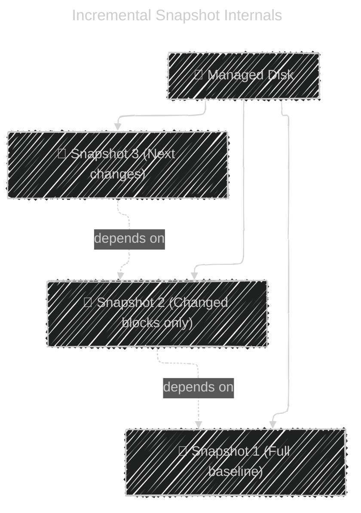

# ⚙️ **How Incremental Snapshots Work in Azure Managed Disks**

> 🧠 **TL;DR**
> Incremental snapshots in Azure are **not scheduled or automatic** (like AWS EBS Lifecycle Policies).  
> You **manually trigger** them — and **Azure internally tracks only changed blocks** since the **last snapshot**.

---

## 🧩 Core Concept

An **incremental snapshot** in Azure captures only **changed blocks** (deltas) from the last snapshot.

Think of your managed disk like this:

```ini
[ Block A ][ Block B ][ Block C ][ Block D ]
```

- 📸 **Snapshot 1:** Captures all blocks (A, B, C, D) → baseline
- 📸 **Snapshot 2:** Captures only blocks that changed (say, B and D)
- 📸 **Snapshot 3:** Captures only newly changed blocks (say, C)

Azure internally maintains a **block map** to keep track of which blocks changed since the last snapshot.

---

## ⏱️ When Are Incremental Snapshots Taken?

> ⚠️ **There’s no automatic schedule!**

You — or your automation — must **explicitly trigger** a snapshot using:

- Azure CLI
- PowerShell
- REST API
- SDK
- Azure Policy
- Azure Backup service (if you want scheduled snapshots)

---

### 🔧 Example Manual Snapshot Trigger

```bash
az snapshot create \
  --name daily-snap-001 \
  --resource-group RG1 \
  --source myManagedDisk \
  --incremental true
```

🧩 You decide **when** to run it — hourly, daily, weekly — using tools like:

- **Azure Automation**
- **Azure Logic Apps**
- **Azure Functions with Timer Trigger**
- **DevOps Pipelines**

💡 **So no**, Azure doesn’t take snapshots “every minute” by default.

---

## 🧠 What Happens Internally (Incremental Logic)

Let’s visualize how it behaves between snapshots 👇

<div align="center" style="background-color: #1E1E1E; border-radius: 10px;">



</div>

🧩 Azure keeps a **dependency chain**:

- If you delete **S1**, Azure merges its required blocks into **S2** automatically.
- So your later snapshots (S2, S3) remain valid — no broken references.

---

## 📦 How Azure Tracks Changes

Azure’s **storage layer** (think of it like “block diff tracking”) uses a **block change map**.

When you write to the disk:

- Azure flags changed blocks
- On snapshot trigger → only those blocks are persisted as new deltas

✅ Benefits:

- Low cost (only changed data stored)
- Fast snapshot creation (seconds)
- Minimal I/O impact on live VM

💡 Internally, Azure uses **incremental block blob storage** to store those delta blocks efficiently.

---

## 🧰 How to Automate Incremental Snapshots (Example)

Example: Take incremental snapshots every **6 hours**

### 🕒 Using Logic App / Automation Schedule

```yaml
recurrence:
  frequency: Hour
  interval: 6
actions:
  create_snapshot:
    type: Azure CLI
    script: >
      az snapshot create --name autosnap-$(date +%s)
      --resource-group RG1 --source myDisk --incremental true
```

---

## 🌍 When Full Snapshots Happen in This Chain

Even though you only ask for “incremental,”
Azure **automatically handles** the first one as **full baseline**.

| Snapshot # | Data Copied         | Depends On  |
| ---------- | ------------------- | ----------- |
| 🧱 #1      | All blocks          | None        |
| 🔁 #2      | Only changed blocks | Snapshot #1 |
| 🔁 #3      | Only changed blocks | Snapshot #2 |
| 🔁 #4      | Only changed blocks | Snapshot #3 |

If you **copy/export** snapshot #4 → it becomes a **full**, independent snapshot (Azure rehydrates the chain).

---

## 🧩 Retention & Cleanup

| Aspect                      | Behavior                                                        |
| --------------------------- | --------------------------------------------------------------- |
| 🧹 **Auto Cleanup**         | ❌ None (you manage retention manually)                         |
| 🔁 **Dependency Cleanup**   | ✅ Azure merges deltas automatically when old snapshots deleted |
| 🕒 **Retention Scheduling** | Use Azure Backup or Logic App                                   |
| 💰 **Cost Optimization**    | Delete unneeded deltas to save storage                          |

---

## 🧩 Common Automation Patterns

| Use Case              | Tool                                                          | Frequency     |
| --------------------- | ------------------------------------------------------------- | ------------- |
| 🕐 Hourly incremental | Azure Function Timer                                          | 1 hour        |
| 🗓️ Daily backup       | Azure Automation Runbook                                      | 24 hours      |
| 🗑️ Retain last 7      | Logic App (delete older than X days)                          | 7 days        |
| 🧭 Cross-region DR    | `az snapshot create --source existingSnap --location eastus2` | Weekly (full) |

---

## 🧱 Azure Incremental Snapshots vs AWS EBS Snapshots

| Concept                | Azure                     | AWS                       |
| ---------------------- | ------------------------- | ------------------------- |
| Default Type           | Incremental               | Incremental               |
| Auto Schedule          | ❌ Manual (or via Backup) | ✅ Lifecycle Manager      |
| First Snapshot         | Full baseline             | Full baseline             |
| Triggered By           | Manual / Policy / API     | Lifecycle Manager / API   |
| Changed Block Tracking | Yes (internal block map)  | Yes (CBT-based)           |
| Retention              | Manual                    | Automatic (if configured) |
| Cross-Region Copy      | Full snapshot             | Full snapshot             |

---

## 💡 Quick Memory Hook

> 🧠 “Incrementals don’t tick by time — they tick by your trigger.”

- ✅ You control _when_ snapshots occur
- ✅ Azure tracks _what_ changed
- ✅ It stores _only deltas_
- ✅ Delete old ones freely — Azure auto-merges

---

### 🧩 Summary Recap

<div align="center" style="background-color: #1E1E1E; border-radius: 10px;">

| Feature           | Behavior                                |
| ----------------- | --------------------------------------- |
| ⏱️ Frequency      | Manual trigger (not timed)              |
| 🔁 Type           | Incremental                             |
| 🧱 First Snapshot | Full                                    |
| 💰 Cost           | Per changed block                       |
| 🧹 Retention      | Manual                                  |
| ⚙️ Automation     | Use Azure Backup / Logic Apps / Runbook |
| 🔐 Encryption     | Inherited / Scoped                      |
| 🌍 Cross-region   | Creates full copy                       |

</div>
