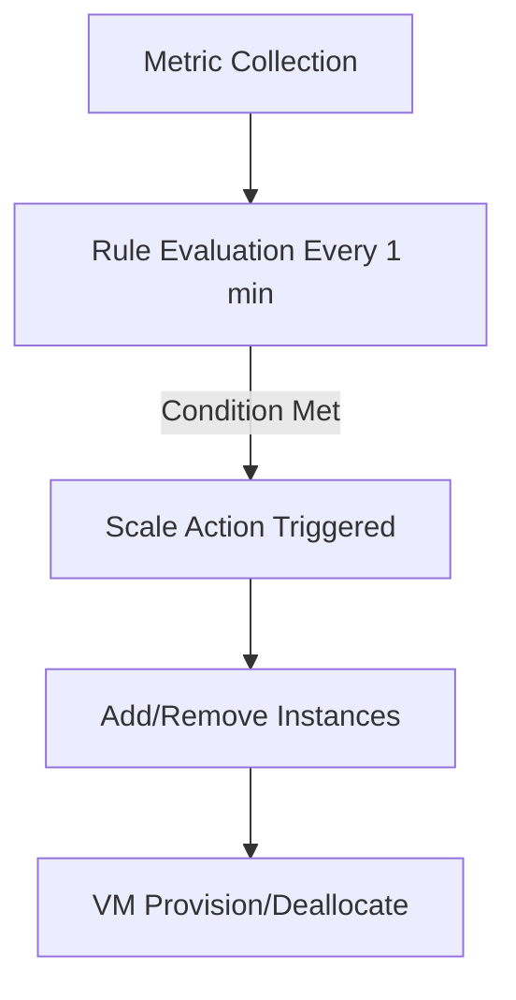
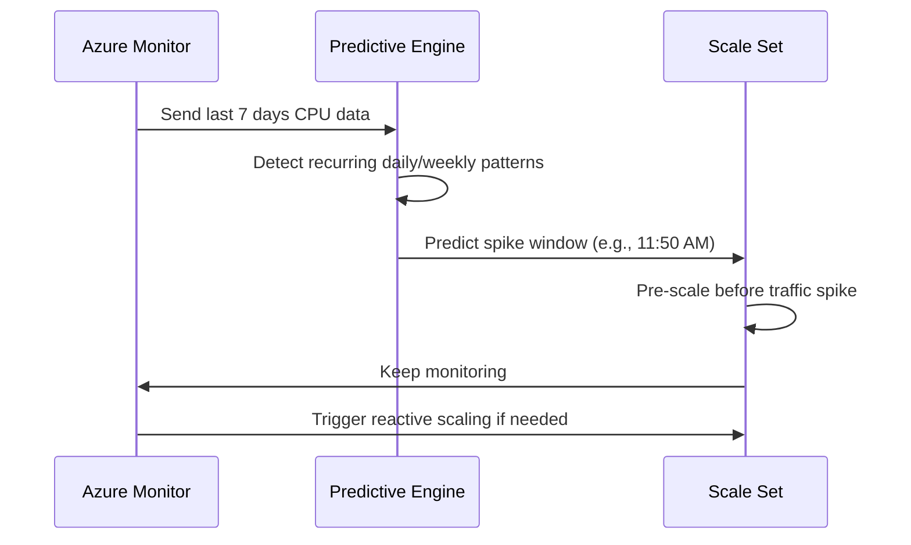

# 🚀 **Custom Rules vs Predictive (Forecast)**

When you run a **Virtual Machine Scale Set (VMSS)** in Azure, scaling your instances is **the game-changer** for handling variable workloads.
Autoscaling keeps your app **performant**, **cost-efficient**, and **SLA-friendly** — without you logging in at 3 AM to “add more servers.”

Azure gives you **two primary scaling brains**:

1. **Custom Autoscale** → You are the boss, set the rules.
2. **Predictive Autoscale (Forecast)** → Azure is the boss, predicts demand using ML.

---

## 🎯 1. What Is VMSS Autoscale and Why Do We Care?

Autoscale in Azure VMSS is **Azure Monitor + VMSS capacity control**.
It automatically **adds or removes VM instances** based on **metrics** or **forecasted load**.

You care because:

- 📈 **Handles Traffic Spikes** → No app crashes when marketing runs that email campaign.
- 💰 **Optimizes Costs** → You only pay for what you use.
- 🛡 **Protects SLA** → Keeps response time under control.

💡 **AWS Mapping**:

- Azure Custom Autoscale = AWS Step Scaling Policies.
- Azure Predictive Autoscale = AWS Predictive Scaling in Auto Scaling Groups.

---

## 🛠 2. Autoscale Modes in Azure VMSS

| Feature / Mode    | Custom Autoscale (Rule-Based)                  | Predictive Autoscale (Forecast)                                 |
| ----------------- | ---------------------------------------------- | --------------------------------------------------------------- |
| **Control**       | You define all rules & thresholds              | Azure ML predicts future load and acts in advance               |
| **Metric Scope**  | Any supported metric (CPU, Memory, Queue, App) | CPU metric only (currently)                                     |
| **Trigger Type**  | Reactive only                                  | Predictive (and optionally reactive)                            |
| **Data Needed**   | No history required                            | Needs 7 days of historical CPU data                             |
| **Scaling Speed** | Scales after threshold breach                  | Scales **before** expected spike                                |
| **Best Use Case** | Unpredictable workloads, complex triggers      | Predictable patterns (e.g., lunch-hour spike, daily batch jobs) |

---

## ⚙️ 3. Mode 1 — **Custom Autoscale (Reactive Rule-Based)**

**Concept**:
You set **IF → THEN** rules. Azure Monitor watches metrics → when condition is met → VMSS changes capacity.

**Flow**:

**Example Rule**:

- **Scale Out**: If Average CPU > 75% for 5 min → Add 2 instances.
- **Scale In**: If Average CPU < 40% for 10 min → Remove 1 instance.

**Supported Metrics**:

- **Platform Metrics**: CPU %, Memory %, Disk IO
- **Application Metrics**: From Application Insights
- **Custom Metrics**: From Azure Monitor APIs

💡 **AWS Parallel**: Same as AWS **Step Scaling** — each rule is independent.

---

## 🔮 4. Mode 2 — **Predictive Autoscale (Forecast Mode)**

**Concept**:
Azure runs an ML algorithm on your last **7 days** of CPU usage → detects patterns → scales **before** the spike.

**How it Works**:

**Key Facts**:

- **Only works for CPU metric**.
- Predicts **24 hours ahead**.
- Updates predictions continuously.
- Can run in **two modes**:

  1. **Predictive Only** — purely forecast-based scaling.
  2. **Predictive + Reactive** — combines prediction with custom rules.

💡 **AWS Parallel**: Similar to AWS **Predictive Scaling** in ASGs.

---

## 🖥 5. Example — Predictive + Custom Rules Hybrid

**Scenario**:
Your web app spikes **every weekday at 12:00 PM** when people take lunch breaks and check the app.
CPU jumps from **20% → 90% in 3 minutes**.

**Setup**:

- Predictive Mode → **Enabled**
- Capacity range: **2–10 VMs**
- Custom Rule: CPU > 75% for 5 min → Add 2 VMs

**Behavior**:

- At **11:50 AM** → Predictive scaling adds 3 VMs **before load**.
- At **12:05 PM** → Reactive rule kicks in if CPU still > 75%.
- At **2:00 PM** → Scale-in rules remove excess capacity.

---

## 🧠 6. Best Practices

✅ Use **Predictive + Reactive** — never rely solely on prediction for unpredictable workloads.
✅ Allow **at least 7 days** of stable load before enabling predictive mode.
✅ Always set a **safe minimum capacity** (prediction can under-forecast in irregular traffic).
✅ Use **Application Insights** for app-specific scaling (e.g., request count).
✅ Test scaling in **non-prod VMSS** before production rollout.

---

## 🛑 7. Common Pitfalls

❌ Enabling predictive mode on workloads with **no clear pattern** — wastes resources.
❌ Setting too aggressive scale-in rules — can cause **flapping** (add/remove cycles).
❌ Forgetting warm-up time — predictive scaling helps but **VM boot time still matters**.
❌ Assuming it works for memory or queue length — **CPU only** supported.
