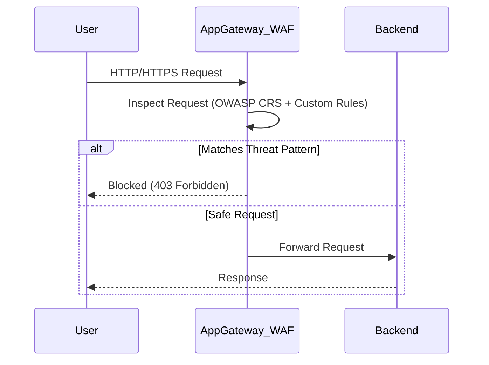
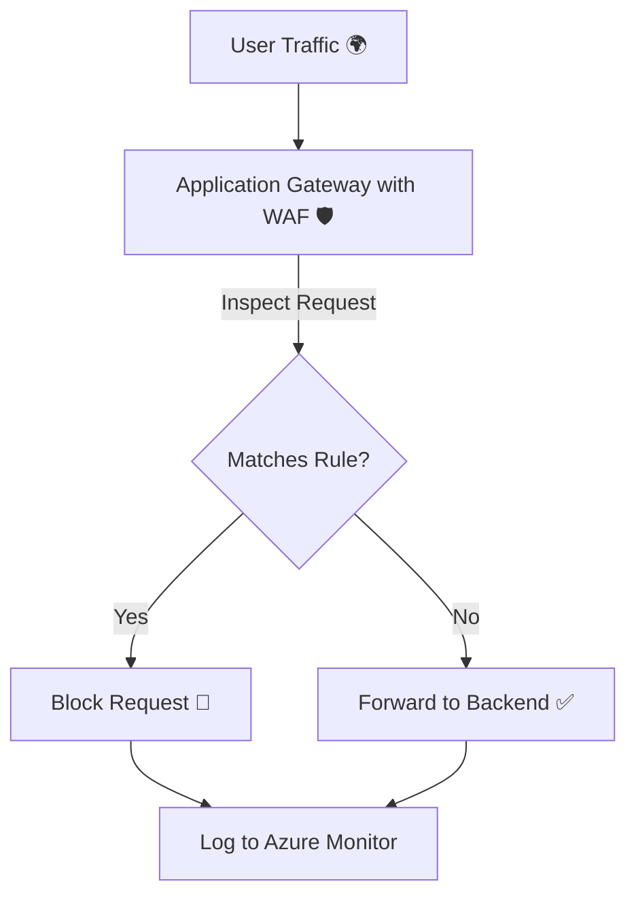

# 🧱 **Web Application Firewall (WAF)**

## 🛑 **Problem** – Why We Need WAF at All

Your web apps are **publicly accessible**.
That means anyone, including attackers, can send requests to them.

Without a **filter at the edge**, you risk:

- **SQL Injection** – inserting malicious SQL into form fields.
- **XSS (Cross-Site Scripting)** – injecting scripts into pages served to users.
- **HTTP Request Smuggling** – bypassing security by manipulating HTTP headers.
- **DDoS Amplification** – making your app slow/unavailable.

These are **application-layer (Layer 7) threats** that a network firewall (NSG) won’t block.

---

## ✅ **Solution** – WAF in Application Gateway

Azure WAF for AGW is a **Layer 7 inspection and filtering engine** that sits **between the internet and your app**.

It **inspects every HTTP/HTTPS request**, compares it to **OWASP Core Rule Sets (CRS)** and custom rules, and **blocks or logs** malicious requests **before** they hit your backend.

---

## ⁉️ **How WAF Works in AGW**

Here’s the request journey when WAF is enabled:

<div align="center">



</div>

**Key Points:**

- Works with **both HTTP and HTTPS** (but HTTPS needs SSL cert in AGW).
- Rulesets are updated automatically by Azure (OWASP CRS).
- Supports **Detection Mode** (log only) and **Prevention Mode** (block bad requests).

---

## 🎭 **Modes of Operation**

| Mode           | What It Does                                   | When to Use                                 |
| -------------- | ---------------------------------------------- | ------------------------------------------- |
| **Detection**  | Logs suspicious traffic but allows it through. | Testing new rules to avoid false positives. |
| **Prevention** | Blocks requests matching rules and logs them.  | Production, after rule tuning.              |

---

## 📜 **WAF Rule Sets**

### 📌 **Managed Rules** – Provided by Microsoft, based on OWASP Core Rule Set (CRS) versions:

- OWASP 3.2 (most secure & latest)
- OWASP 3.1 (older apps compatibility)

### 📌 **Custom Rules** – Your own conditions:

- Block by IP address range.
- Block based on request header or query string.
- Block suspicious User-Agent strings.

**Example – Custom Rule:** Block requests from a specific country:

```json
{
  "name": "BlockCountry",
  "priority": 1,
  "ruleType": "MatchRule",
  "action": "Block",
  "matchConditions": [
    {
      "matchVariables": [{ "variableName": "RemoteAddr" }],
      "operator": "GeoMatch",
      "values": ["CN"]
    }
  ]
}
```

---

## 📰 **Logging & Monitoring**

When WAF is enabled, logs are sent to:

- **Azure Monitor Logs** (KQL queries possible)
- **Storage Account** (archival)
- **Event Hub** (real-time streaming)

**Example KQL – Find Blocked Requests!**

```kql
AzureDiagnostics
| where ResourceType == "APPLICATIONGATEWAYS"
| where action_s == "Blocked"
| summarize count() by ruleSetName_s, requestUri_s
```

---

## 🚀 **Deployment Options**

You can deploy WAF in AGW in two SKUs:

- **WAF_v2 SKU** – Recommended (autoscaling, zone redundancy, faster rule updates).
- **WAF_v1 SKU** – Legacy, limited scaling.

---

## ✍🏻 **Example** Use Cases

| Use Case                                    | WAF Feature Used                             |
| ------------------------------------------- | -------------------------------------------- |
| Block SQL injection                         | OWASP CRS Rule 942100 (SQL Injection Attack) |
| Allow only certain IP ranges                | Custom Rule – Match IP address               |
| Block file uploads over certain size        | Custom Rule – Body inspection + size limit   |
| Restrict API calls to specific HTTP methods | Custom Rule – Match HTTP Method              |

---

## 💡 **Best Practices** & Considerations

- **Test in Detection Mode first** to avoid blocking legit users.
- Use **WAF_v2** unless you have a legacy dependency.
- Keep CRS updated for new vulnerabilities.
- Stream WAF logs to **Log Analytics** for real-time alerting.
- Combine WAF with **Private Link** for internal-only APIs.
- Remember: WAF protects **Layer 7**, for DDoS protection at **Layer 3/4** use **Azure DDoS Protection Standard**.

---

## 🏁 **Summary**

<div align="center">



</div>
