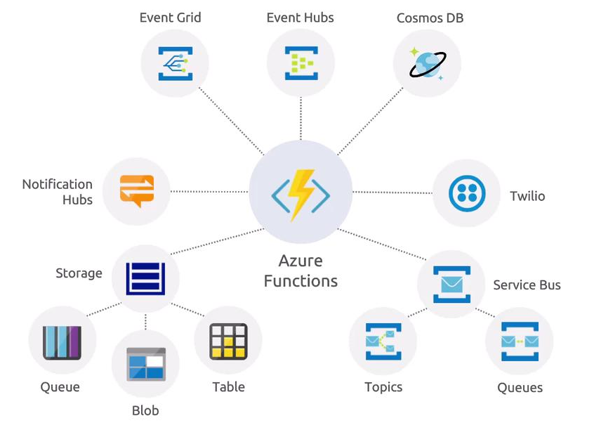
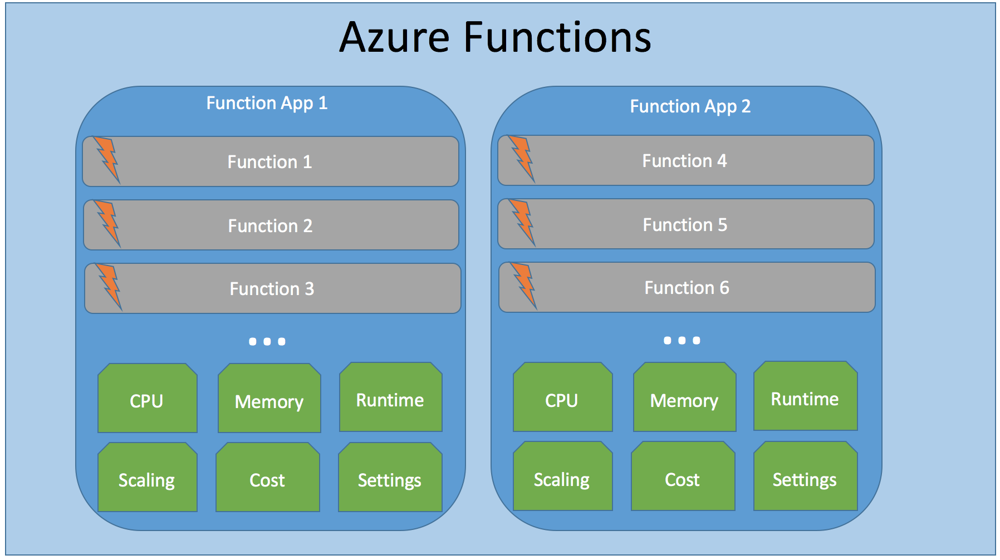
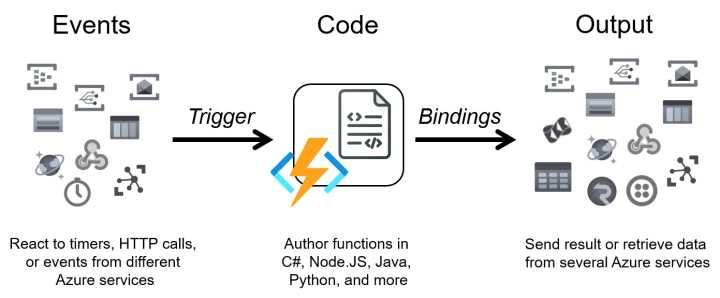
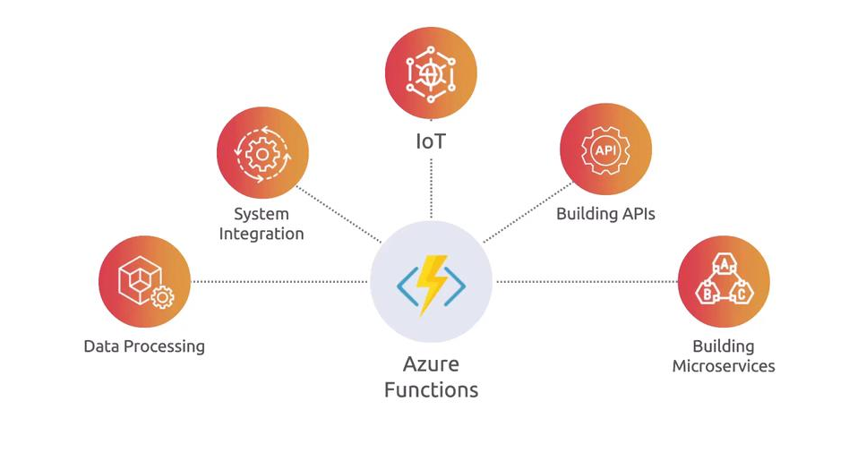

# ⚡ **Azure Functions**

## 📌 **What is Azure Functions?**

Azure Functions is a **serverless compute service** that lets you run small units of code (functions) **without managing servers or infrastructure**.

Think of it as:

- Write your code → Azure runs it when **something happens** (an event).
- No VM, no container setup, no scaling headaches.
- Pay only for the **execution time** and resources used.

---

<div align="center" style="background-color: #ffffffff ;border-radius: 10px;border: 2px solid white">
  
</div>

---

## 🎯 **Why Use It?**

- **Event-driven** – respond to triggers like HTTP requests, queue messages, timers, database changes.
- **Scale automatically** – from 0 to thousands of executions per second.
- **Pay-per-use** – consumption plan charges only when your function runs.
- **Polyglot** – supports C#, Python, Java, JavaScript, PowerShell, Go, etc.
- **Integrations** – deep integration with Azure services (Storage, Service Bus, Event Grid, Cosmos DB).

---

## 🖼 **Azure Functions Architecture**

<div align="center" style="background-color: #ffffffff ;border-radius: 10px;border: 2px solid white;margin: 0 10px">
  
</div>

---

<div align="center" style="background-color: #ffffffff ;border-radius: 10px;border: 2px solid white;margin: 0 10px">
  
</div>

---

## 🏛️ **1. Function App**

- A **Function App** is the **deployment unit**.
- It’s like a **container of functions** sharing:

  - Hosting plan (Consumption, Premium, Dedicated App Service Plan)
  - Runtime version (.NET, Node.js, Python, Java, PowerShell, etc.)
  - Configuration (App Settings, Managed Identity, Networking rules)
  - Scaling behavior (scale controller applies to the entire app)

💡 Analogy: A Function App = a microservice. Functions inside = endpoints in that service.

---

## 🧩 **2. Function(s)**

- A **Function** = the smallest unit of execution.
- Each function has:

  - **Trigger**: defines how execution starts (HTTP, Queue, Event Hub, Timer, etc.)
  - **Input Bindings**: read data from external resources (Blob, Table, Cosmos DB)
  - **Output Bindings**: send data to other services
  - **Code**: your business logic (C#, Java, Python, etc.)

💡 Functions are just methods, but the runtime wires them up with triggers/bindings.

---

## 🛠️ **3. Triggers & Bindings**

- **Trigger** = event that starts the function

  - Example: HTTP request, new Blob, message in Service Bus

- **Bindings** = declarative connections to resources

  - Example: `[BlobTrigger]`, `[CosmosDBOutput]`

- Advantages:

  - No boilerplate connection code
  - Config driven (in `function.json` or attributes)

💡 Azure Functions runtime takes care of plumbing (opening connections, retry, auth).

---

## ⚙️ **4. Hosting & Instances**

- Functions run inside a **host process** called the **Azure Functions Runtime**.
- Deployed in an **App Service Environment**, with different plans:

  - **Consumption Plan**: pay-per-execution, scale-out automatically
  - **Premium Plan**: warm instances, VNET integration, better scaling
  - **Dedicated Plan**: runs on App Service Plan, fixed cost

Scaling:

- **Scale Controller** monitors events/queue length/HTTP load → adds/removes instances.
- Each instance runs **1 Function Host process**, which can execute multiple functions.

💡 You don’t scale individual functions, you scale the whole Function App.

---

## 🔑 **5. Function Host**

- The **runtime process** (`host.json` controls behavior).
- Responsibilities:

  - Load configuration
  - Manage triggers/bindings
  - Handle retries & logging
  - Coordinate with scale controller

- Extensible via **extensions** (e.g., Durable Functions, Dapr extension)

---

## 📂 **6. Configuration & Files**

- `host.json` → global config for Function App (logging, retry, timeout)
- `function.json` → per-function config (bindings, triggers)
- **App Settings** → connection strings, environment vars
- **Managed Identity** → secure auth to Azure resources

---

## 🔒 **7. Security & Networking**

- **Auth options**:

  - Function Keys (per function or per app)
  - Azure AD (OAuth 2.0)
  - Networking (VNET, IP restrictions)

- **Secrets**: stored in App Settings or Key Vault

---

## 🔄 **8. Monitoring & Telemetry**

- Built-in **Application Insights** integration
- Logs request traces, failures, dependencies
- Metrics (execution count, failures, cold starts, duration)

---

## 🛠 **Step-by-Step: Create Azure Function**

### 1️⃣ Using **Azure Portal**

1. Go to **Azure Portal → Create a Resource → Function App**.
2. Configure:

   - Resource Group
   - Function App name (unique)
   - Runtime (C#, Python, Node.js, etc.)
   - Hosting plan (Consumption is default)
   - Storage Account (required for state + logs)

3. Deploy → Go to **Functions → Create → HTTP Trigger**.
4. Test with built-in editor or Postman.

---

### 2️⃣ Using **Azure CLI**

```bash
# Create RG
az group create --name rg-func-demo --location eastus

# Create Storage (required)
az storage account create \
  --name funcdemosa123 \
  --location eastus \
  --resource-group rg-func-demo \
  --sku Standard_LRS

# Create Function App
az functionapp create \
  --resource-group rg-func-demo \
  --consumption-plan-location eastus \
  --runtime dotnet \
  --functions-version 4 \
  --name funcdemo12345 \
  --storage-account funcdemosa123
```

---

### 3️⃣ Function Code Example (C# HTTP Trigger)

```csharp
using System.IO;
using Microsoft.AspNetCore.Mvc;
using Microsoft.Azure.WebJobs;
using Microsoft.Azure.WebJobs.Extensions.Http;
using Microsoft.AspNetCore.Http;
using Microsoft.Extensions.Logging;
using Newtonsoft.Json;

public static class HelloFunction
{
    [FunctionName("HelloFunction")]
    public static async Task<IActionResult> Run(
        [HttpTrigger(AuthorizationLevel.Function, "get", "post")] HttpRequest req,
        ILogger log)
    {
        log.LogInformation("C# HTTP trigger processed a request.");

        string name = req.Query["name"];
        string responseMessage = string.IsNullOrEmpty(name)
            ? "Hello, Azure Functions 🚀!"
            : $"Hello, {name}! 👋";

        return new OkObjectResult(responseMessage);
    }
}
```

👉 Call with:

```bash
curl https://funcdemo12345.azurewebsites.net/api/HelloFunction?name=John
```

Response:

```ini
Hello, John! 👋
```

---

## 🧩 **Real Use Cases**

🔹 **Serverless APIs** → quick REST endpoints without full backend.  
🔹 **Data processing** → process images when uploaded to Blob Storage.  
🔹 **Event-driven workflows** → new order → push to queue → trigger function → notify user.  
🔹 **CRON jobs** → nightly cleanup, scheduled emails.

---

<div align="center" style="background-color: #ffffffff ;border-radius: 10px;border: 2px solid white;margin: 0 10px">
  
</div>

---

## 📚 **Best Practices**

- Keep functions **small and single-purpose**.
- Use **managed identity** for secure access to resources (no secrets).
- Handle **cold starts** → use Premium Plan for latency-sensitive apps.
- Log with **Application Insights**.
- Use **Durable Functions** for workflows/orchestrations.
