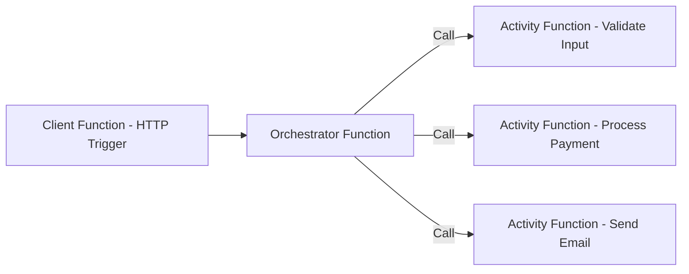
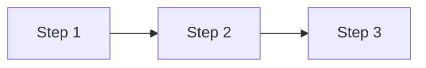
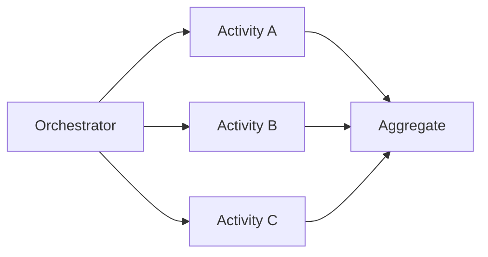

# ⚡ Azure Durable Functions (From Basics to Advanced)

> 📖 **Durable Functions** is an **extension of Azure Functions** that lets you write **stateful serverless workflows** in a **serverless compute environment**.
>
> - 👉 In short: It helps you manage **long-running workflows** and **state** in a **stateless function world**.

## 🌟 1. What is Azure Durable Functions?

Traditional Azure Functions are **stateless**:

- Each function call runs independently.
- State must be stored externally (DB, cache, etc.).

**Durable Functions** solve this by using the **Durable Task Framework** to:

- Store **state**, **checkpoints**, and **messages**.
- Allow **orchestration** of multiple functions.
- Support long-running processes that survive restarts.

---

## 🧩 2. Core Concepts

Durable Functions define workflows using three main function types:

| Function Type             | Role                                                                                        |
| ------------------------- | ------------------------------------------------------------------------------------------- |
| **Client Function**       | Entry point. Starts orchestration (e.g., HTTP trigger, queue message).                      |
| **Orchestrator Function** | Defines workflow logic. Calls activity functions in order, in parallel, or with conditions. |
| **Activity Function**     | Performs the actual work (e.g., call API, process data, send email).                        |

### Example Flow



---

## ⚡ 3. Programming Model

### Example: Orchestration Function

```csharp
[FunctionName("OrderOrchestrator")]
public static async Task Run(
   [OrchestrationTrigger] IDurableOrchestrationContext context)
{
    var order = context.GetInput<Order>();
    await context.CallActivityAsync("ValidateOrder", order);
    await context.CallActivityAsync("ProcessPayment", order);
    await context.CallActivityAsync("SendConfirmation", order.CustomerEmail);
}
```

### Example: Activity Function

```csharp
[FunctionName("ValidateOrder")]
public static string ValidateOrder([ActivityTrigger] Order order)
{
    return order.IsValid ? "Valid" : "Invalid";
}
```

### Example: Client Function

```csharp
[FunctionName("StartOrder")]
public static async Task<HttpResponseMessage> StartOrder(
   [HttpTrigger(AuthorizationLevel.Function, "post")] HttpRequestMessage req,
   [DurableClient] IDurableOrchestrationClient starter)
{
    var order = await req.Content.ReadAsAsync<Order>();
    string instanceId = await starter.StartNewAsync("OrderOrchestrator", order);
    return starter.CreateCheckStatusResponse(req, instanceId);
}
```

---

## 🔄 4. Durable Function Patterns

Durable Functions support **five key orchestration patterns**:

### 1️⃣ Function Chaining

Run tasks in sequence.  
✅ Example: Validate → Process → Send Email.



---

### 2️⃣ Fan-out / Fan-in

Run tasks in parallel and aggregate results.  
✅ Example: Resize images into multiple formats.



---

### 3️⃣ Async HTTP APIs

Allow clients to start an orchestration and then poll for status via a **status endpoint**.  
✅ Example: Long-running report generation.

---

### 4️⃣ Human Interaction

Workflows that pause until external input arrives.  
✅ Example: Wait for manager approval before processing payment.

- Uses `WaitForExternalEvent` API.

```csharp
var approval = await context.WaitForExternalEvent<string>("ApprovalEvent");
if (approval == "Approved") {
    await context.CallActivityAsync("ProcessPayment", order);
}
```

---

### 5️⃣ Monitor

Recurring process that runs at intervals.  
✅ Example: Monitor website health every 5 minutes until condition is met.

```csharp
while (true) {
    await context.CallActivityAsync("CheckWebsite", null);
    var nextCheck = context.CurrentUtcDateTime.AddMinutes(5);
    await context.CreateTimer(nextCheck, CancellationToken.None);
}
```

---

## ⚙️ 5. State Management

Durable Functions maintain state by:

- **Checkpointing** every await.
- Automatically **replaying orchestrator code** to rebuild state.
- Storing state in **Azure Storage (Tables/Queues/Blobs)** or **SQL Backend**.

This ensures reliability:

- If VM crashes, orchestration can resume.
- You don’t manually manage persistence.

---

## 📦 6. Hosting & Scaling

Durable Functions run inside **Azure Functions runtime**.

- Can run on **Consumption Plan** (serverless autoscale).
- Or **Premium/Dedicated Plans** (for VNET, high scale, no cold starts).

Scaling is based on:

- Queue length in control/storage queues.
- Partitioned orchestrations across multiple instances.

---

## 🛠 7. Advanced Features

1. **Durable Entities**

   - Lightweight stateful objects managed by Durable Functions.
   - Replace the need for external DB for small state tracking.

   Example:

   ```csharp
   [FunctionName("Counter")]
   public static void Counter([EntityTrigger] IDurableEntityContext ctx)
   {
       switch (ctx.OperationName)
       {
           case "add": ctx.SetState(ctx.GetState<int>() + ctx.GetInput<int>()); break;
           case "get": ctx.Return(ctx.GetState<int>()); break;
       }
   }
   ```

2. **Sub-orchestrations**

   - Orchestrator can call another orchestrator.
   - Helps modularize workflows.

3. **Error Handling & Retries**

   - Built-in retry policies for transient failures.
   - Example: `CallActivityWithRetryAsync()`.

4. **Durable Timers**

   - Pause workflows until a specific time.
   - Example: `context.CreateTimer(DateTime.UtcNow.AddHours(1), CancellationToken.None);`

5. **Event Sourcing**

   - Durable Functions essentially replay orchestration code to rebuild state → similar to event sourcing.

---

## 📉 Example Use Cases

- 🧾 **Invoice Approval** → Human interaction workflow.
- 📊 **ETL Data Pipelines** → Fan-out / fan-in with retries.
- 🛒 **E-commerce Orders** → Orchestration of payment, inventory, and notifications.
- 🤖 **IoT Processing** → Durable Entities for device state tracking.
- 🔍 **Monitoring Systems** → Monitor pattern for continuous checks.

---

## 🔐 8. Limitations / Best Practices

- Orchestrator functions must be **deterministic** (no random, no DateTime.Now directly).
- Long-running orchestrations are fine (days, months).
- Store **large payloads in Blob Storage**, not directly in state.
- Use **Durable Entities** for small stateful apps.
- Watch out for **orchestration replay cost** → design lean workflows.

---

## ✅ Summary

- **Durable Functions** = Serverless + Stateful workflows.
- **Client → Orchestrator → Activity** model.
- Supports **patterns**: chaining, fan-out/fan-in, async APIs, human interaction, monitor.
- Manages **state & reliability** with automatic checkpointing.
- Advanced features include **durable entities, sub-orchestrations, retries, timers**.
- Perfect for **long-running, stateful, serverless workflows**.

---

👉 Would you like me to create a **full step-by-step demo** (like we did for Logic Apps) where we build a real Durable Function orchestration — e.g., "Order Processing Workflow" — with screenshots + JSON outputs + status monitoring?
