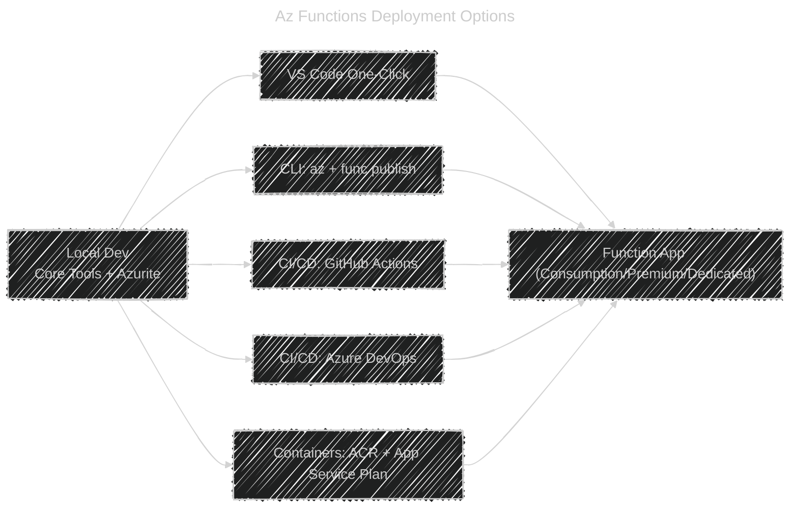

# 🚀 Deploying Azure Functions

> You said “in my preferred style”—so here you go: clean sections, emojis, diagrams, real commands, .NET **and** Python, CI/CD (GitHub Actions + Azure DevOps), and pro tips/FAQs. Copy-paste friendly.

---

## 🧭 What You’ll Deploy

- **Function runtime:** Azure Functions v4
- **Stacks:**

  - **.NET 8 (Isolated worker)**
  - **Python 3.10 (v1 JSON model)**

- **Plans:** Consumption first (notes for Premium/Dedicated)
- **Paths:** VS Code one-click, Azure CLI + Core Tools, CI/CD, and Container images

---

## 🧩 Project Structures (Reference)

### .NET 8 (Isolated)

```ini
HttpToTableDotnet/
├─ host.json
├─ local.settings.json        # local only (not deployed)
├─ HttpToTableDotnet.csproj
├─ Program.cs
└─ Functions/
   └─ WebToTable.cs
```

### Python 3.10 (JSON model)

```ini
HttpToTablePy/
├─ host.json
├─ local.settings.json        # local only (not deployed)
├─ requirements.txt
└─ HttpToTable/
   ├─ __init__.py
   └─ function.json
```

---

## 🧪 Local First (Core Tools)

```bash
# Install Core Tools (if not installed)
# macOS (brew): brew tap azure/functions && brew install azure-functions-core-tools@4
# Windows: choco install azure-functions-core-tools-4
# Linux: use Microsoft repo (docs) or npm i -g azure-functions-core-tools@4 --unsafe-perm true

# Start local runtime
func start --verbose
```

> Use **Azurite** or real Storage. Keep `AzureWebJobsStorage=UseDevelopmentStorage=true` in `local.settings.json` for local.

---

## 🛠️ One-Click Deploy (VS Code)

1. Install **Azure Functions** & **Azure Resources** extensions
2. Sign in to Azure in VS Code
3. **F1 → “Azure Functions: Deploy to Function App”**
4. Choose **Create new Function App** → pick runtime (e.g., **.NET 8 Isolated**/**Python 3.10**), region, plan
5. Confirm Storage + App Insights → Deploy

> Great for fast iterations. For teams, move to CI/CD below.

---

## 🧱 Azure CLI (Repeatable & Scriptable)

### 1) Create infra (RG + Storage + Function App)

```bash
# --- Variables ---
RG=rg-func-demo
LOC=westeurope
STG=stfuncdemo$RANDOM
DOTNET_APP=func-dotnet-demo
PY_APP=func-python-demo

# --- Resource Group & Storage ---
az group create -n $RG -l $LOC
az storage account create -n $STG -g $RG -l $LOC --sku Standard_LRS

# --- Function Apps (Consumption, Linux) ---
# .NET 8 isolated
az functionapp create \
  -g $RG -n $DOTNET_APP \
  --storage-account $STG \
  --consumption-plan-location $LOC \
  --functions-version 4 \
  --runtime dotnet-isolated \
  --os-type Linux

# Python 3.10
az functionapp create \
  -g $RG -n $PY_APP \
  --storage-account $STG \
  --consumption-plan-location $LOC \
  --functions-version 4 \
  --runtime python \
  --runtime-version 3.10 \
  --os-type Linux
```

### 2) Deploy code (Core Tools)

**.NET:**

```bash
cd HttpToTableDotnet
dotnet restore
dotnet publish -c Release -o publish
func azure functionapp publish $DOTNET_APP --dotnet-cli-params "--configuration Release"
```

**Python:**

```bash
cd HttpToTablePy
python -m venv .venv && source .venv/bin/activate
pip install -r requirements.txt
func azure functionapp publish $PY_APP
```

> Core Tools performs **zip deploy** and **syncs triggers**. For manual zips, run: `az functionapp sync-functions -g $RG -n <app>` if needed.

---

## 🧰 CI/CD — GitHub Actions (OIDC, no secrets in repo)

### 🔷 .NET 8 Workflow — `.github/workflows/deploy-dotnet.yml`

```yaml
name: Deploy Functions (.NET)

on:
  push:
    branches: [main]

permissions:
  id-token: write
  contents: read

env:
  AZURE_FUNCTIONAPP_NAME: func-dotnet-demo

jobs:
  build-and-deploy:
    runs-on: ubuntu-latest
    steps:
      - uses: actions/checkout@v4
      - uses: actions/setup-dotnet@v4
        with:
          dotnet-version: "8.0.x"
      - name: Restore & Publish
        run: |
          dotnet restore
          dotnet publish -c Release -o publish
      - name: Azure Login (OIDC)
        uses: azure/login@v2
        with:
          client-id: ${{ secrets.AZURE_CLIENT_ID }}
          tenant-id: ${{ secrets.AZURE_TENANT_ID }}
          subscription-id: ${{ secrets.AZURE_SUBSCRIPTION_ID }}
      - name: Deploy
        uses: azure/functions-action@v1
        with:
          app-name: ${{ env.AZURE_FUNCTIONAPP_NAME }}
          package: publish
```

### 🟣 Python Workflow — `.github/workflows/deploy-python.yml`

```yaml
name: Deploy Functions (Python)

on:
  push:
    branches: [main]

permissions:
  id-token: write
  contents: read

env:
  AZURE_FUNCTIONAPP_NAME: func-python-demo

jobs:
  build-and-deploy:
    runs-on: ubuntu-latest
    steps:
      - uses: actions/checkout@v4
      - uses: actions/setup-python@v5
        with:
          python-version: "3.10"
      - name: Install deps into site-packages
        run: |
          python -m pip install --upgrade pip
          pip install -r requirements.txt --target=".python_packages/lib/site-packages"
      - name: Azure Login (OIDC)
        uses: azure/login@v2
        with:
          client-id: ${{ secrets.AZURE_CLIENT_ID }}
          tenant-id: ${{ secrets.AZURE_TENANT_ID }}
          subscription-id: ${{ secrets.AZURE_SUBSCRIPTION_ID }}
      - name: Deploy
        uses: azure/functions-action@v1
        with:
          app-name: ${{ env.AZURE_FUNCTIONAPP_NAME }}
          package: .
```

> **Setup once**: Create an Entra ID App, add **Federated Credentials (OIDC)** for GitHub, grant **Contributor** on RG or Function App. Save IDs as repo secrets.

---

## 🧰 CI/CD — Azure DevOps (YAML)

**.NET example**:

```yaml
trigger:
  - main

pool:
  vmImage: ubuntu-latest

variables:
  appName: "func-dotnet-demo"
  buildConfiguration: "Release"

steps:
  - task: UseDotNet@2
    inputs:
      version: "8.0.x"

  - script: |
      dotnet restore
      dotnet publish -c $(buildConfiguration) -o $(Build.ArtifactStagingDirectory)/publish
    displayName: "Build"

  - publish: $(Build.ArtifactStagingDirectory)/publish
    artifact: drop

  - task: AzureCLI@2
    displayName: "Zip Deploy to Function App"
    inputs:
      azureSubscription: "Your-Service-Connection"
      scriptType: bash
      scriptLocation: inlineScript
      inlineScript: |
        cd $(Pipeline.Workspace)/drop
        az functionapp deployment source config-zip \
          -g rg-func-demo \
          -n $(appName) \
          --src function.zip
```

(You can zip the publish folder before the deploy step.)

---

## 🐳 Containerized Functions (Premium/Dedicated/Container Apps)

### Dockerfile — .NET 8 Isolated

```dockerfile
# Build
FROM mcr.microsoft.com/dotnet/sdk:8.0 AS build
WORKDIR /src
COPY . .
RUN dotnet publish -c Release -o /app

# Run on Functions base
FROM mcr.microsoft.com/azure-functions/dotnet-isolated:4-dotnet8
WORKDIR /home/site/wwwroot
COPY --from=build /app .
```

**Build, push, create app:**

```bash
az acr create -n myacr$RANDOM -g $RG --sku Basic
az acr login -n myacrXXXX
docker build -t myacrXXXX.azurecr.io/func-dotnet:v1 .
docker push myacrXXXX.azurecr.io/func-dotnet:v1

az functionapp create \
  -g $RG -n func-dotnet-container \
  --storage-account $STG \
  --plan <YOUR_APP_SERVICE_PLAN> \
  --functions-version 4 \
  --deployment-container-image-name myacrXXXX.azurecr.io/func-dotnet:v1
```

> Python base: `mcr.microsoft.com/azure-functions/python:4-python3.10` then `pip install -r requirements.txt` into `/home/site/wwwroot`.

---

## 🔐 Settings, Keys, and Secrets (Prod-Safe)

- `local.settings.json` **never** deploys.
- In Azure Portal → **Function App → Environment variables**:

  - `AzureWebJobsStorage` (required)
  - Your custom settings (e.g., `MyDbConn`, `CosmosConn`)

- Use **Key Vault references** or **Managed Identity**:

  - Prefer Managed Identity + RBAC over static keys.

- HTTP Auth:

  - `authLevel`: `Function` for shared secret, `Anonymous` behind APIM/AAD, `Admin` for host-level ops.
  - Keys can be passed in `?code=` or `x-functions-key` header.

---

## 🔁 Blue/Green & Zero-Downtime (Slots)

- **Slots** are best on **Premium/Dedicated** plans (Consumption slot support is limited; verify your SKU).
- Create **staging** slot → deploy there → smoke test → **swap** to production.
- Keep **App Settings** slot-sticky where needed.

---

## 📈 Monitoring & Troubleshooting

- Enable **Application Insights** (auto with VS Code/CLI).
- Check **Live Metrics**, **traces**, **Requests**, **Dependencies**.
- For cold starts:

  - Move hot paths to **Premium** with **pre-warmed instances**
  - Trim package size, use **Run-From-Package**, avoid heavyweight startup

- Common issues:

  - **“No job functions found”** → build output not in `wwwroot`, or wrong target runtime
  - **Trigger not firing** → missing **Storage**/connection setting or didn’t **sync triggers**
  - **401** on HTTP → missing/invalid `code` for `Function` authLevel

---

## 🧪 Smoke Test (after deploy)

```bash
# .NET or Python HTTP function named WebToTable
curl -X POST "https://<YOUR_APP>.azurewebsites.net/api/WebToTable?code=<FUNCTION_KEY>" \
  -H "Content-Type: application/json" \
  -d '{"partitionKey":"1","rowKey":"1","name":"John","email":"john@example.com"}'
```

---

## 🗺️ Visual: Deployment Options at a Glance

<div align="center">



</div>

---

## ✅ Quick “Which Method Should I Use?”

- **Solo / fast demo** → **VS Code one-click**
- **Team / repeatable** → **CLI** + scripts
- **Production** → **CI/CD** (GitHub Actions or Azure DevOps)
- **Custom runtime / dependencies** → **Container** on Premium/Dedicated/Container Apps
- **Enterprise auth/routing** → Put Functions **behind APIM** + **AAD**

---

## 🧠 Pro Tips (From Real Projects)

- Always enable **WEBSITE_RUN_FROM_PACKAGE=1** (zip deploy; immutable).
- Keep **cold start** in mind; pin .NET ReadyToRun publish if needed.
- Use **Managed Identity** for Storage/Cosmos/Key Vault RBAC; avoid connection strings when possible.
- Keep **host.json** minimal; don’t over-tune unless measured.
- Log **correlation IDs** and request payload sizes for debugging.
