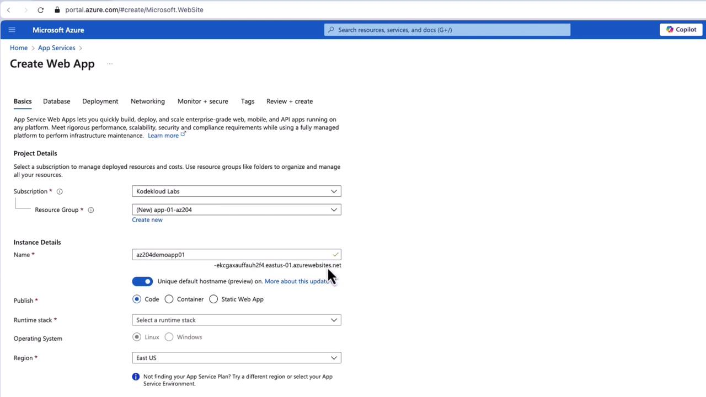
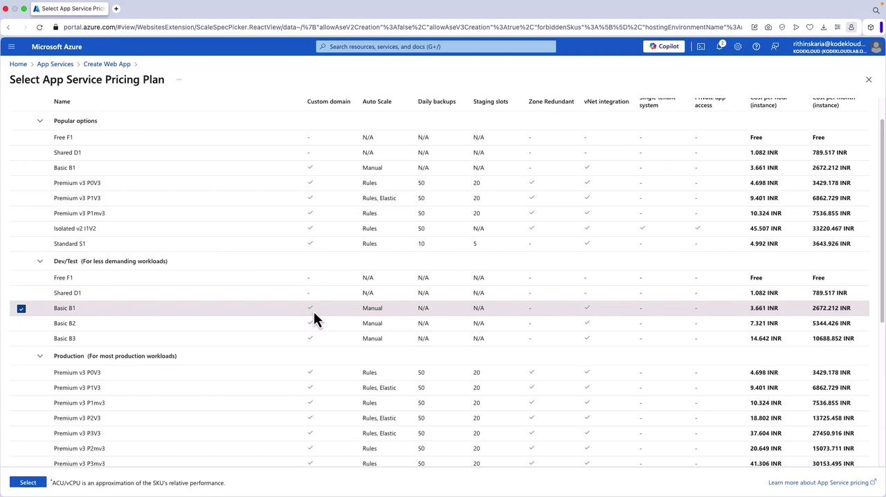
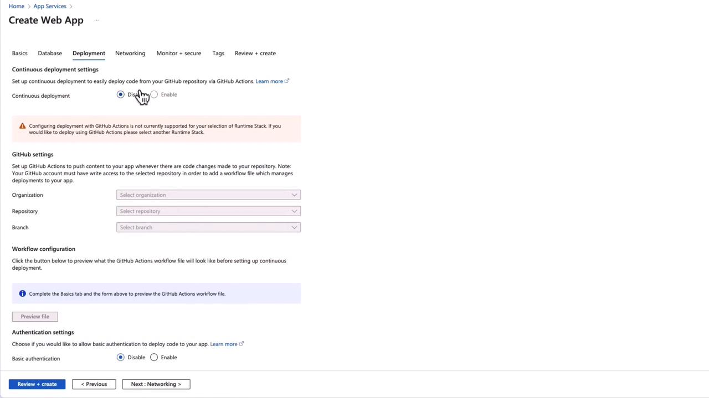
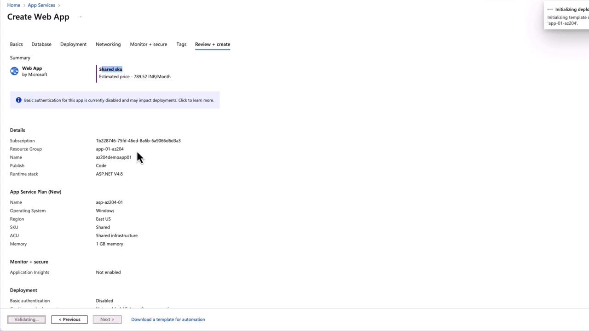
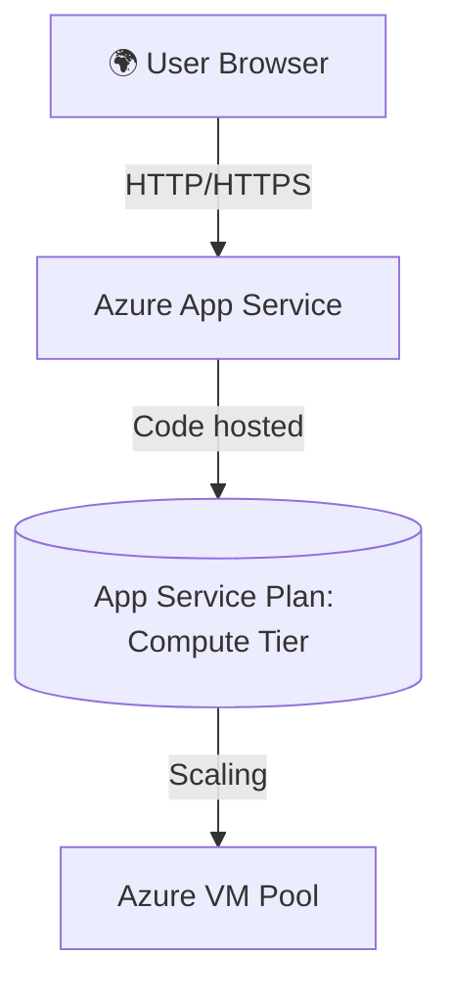

# 🌐 **Project: Deploy an Azure App Service (Portal + CLI)**

## 📌 **Scenario**

You’re tasked with deploying a **web app** to Azure.
Instead of manually managing VMs, scaling, and patching, you’ll use **App Service**, which gives you a **PaaS hosting environment** for .NET, Node.js, Python, Java, or PHP apps.

We’ll deploy in **two ways**:

1. **Portal (click-ops)**
2. **Azure CLI (infra as code-lite)**

---

## 🚀 **Part 1: Deploy via Azure Portal**

### 🔹 Step 1: Create a Resource Group

- In the Portal → Search **Resource groups** → **+ Create**
- Example: `rg-appservice-demo`

---

### 🔹 Step 2: Create App Service (Web App)

1. Search **App Service** → Click **+ Create**
2. Fill in **Basics**:

   - **Subscription**: Select yours
   - **Resource Group**: `rg-appservice-demo`
   - **Name**: `az204demoapp01` → becomes `az204demoapp01.azurewebsites.net`
   - **Publish**: Code (or Docker Container if using containers)
   - **Runtime stack**: Choose (e.g., `.NET 8`, `Node.js 20`, `Python 3.12`)
   - **OS**: Windows (for classic ASP.NET) / Linux (for modern stacks)
   - **Region**: Closest region

<div align="left">
  
</div>

---

### 🔹 Step 3: Create an App Service Plan

- **App Service Plan** = compute (VMs) + pricing
- Click **Create new** → Name: `asp-appdemo01`
- Choose **SKU** (pricing tier):

  - **Free/Shared (F1/D1)** → testing only (no scaling, no staging slots)
  - **Basic (B1–B3)** → small prod apps
  - **Standard (S1–S3)** → staging slots, backups, auto-scaling
  - **Premium/Isolated** → mission-critical workloads

<div align="left">
  
</div>

> ⚠️ Be aware that the shared tier has limitations, such as no auto scaling, staging slots, or zone redundancy.

---

### 🔹 Step 4: Configure Deployment (optional)

- **Continuous Deployment**: GitHub, Azure DevOps, Bitbucket
- **Networking**: VNET integration (only in Standard+)
- **Monitoring**: Enable **Application Insights** for telemetry

<div align="left">
  
</div>

---

### 🔹 Step 5: Review + Create

- Click **Review + Create** → **Create**
- Wait for deployment to finish

<div align="left">
  
</div>

---

### 🔹 Step 6: Verify Deployment

- Go to the resource → Overview → **Default URL** (e.g., `https://az204demoapp01.azurewebsites.net/`)
- Open in browser → You’ll see the default hosting page 🎉

---

## 🧑‍💻 **Part 2: Deploy via Azure CLI**

Now, let’s do the same but in **bash/CLI**.

### 🔹 Step 1: Create Resource Group

```bash
az group create \
  --name rg-appservice-demo \
  --location eastus
```

---

### 🔹 Step 2: Create App Service Plan

```bash
az appservice plan create \
  --name asp-appdemo01 \
  --resource-group rg-appservice-demo \
  --sku B1 \
  --is-linux
```

- `--sku` → pricing tier (`F1`, `B1`, `S1`, etc.)
- `--is-linux` → host on Linux (omit for Windows)

---

### 🔹 Step 3: Create Web App

```bash
az webapp create \
  --name az204demoapp01 \
  --resource-group rg-appservice-demo \
  --plan asp-appdemo01 \
  --runtime "DOTNETCORE:8.0"
```

- `--runtime` supports `.NET`, `NODE:20-lts`, `PYTHON:3.12`, etc.

---

### 🔹 Step 4: Verify

```bash
az webapp show \
  --name az204demoapp01 \
  --resource-group rg-appservice-demo \
  --query defaultHostName \
  -o tsv
```

👉 Output:

```text
az204demoapp01.azurewebsites.net
```

Open that in browser 🎉

---

## 🏗 **App Service Architecture (Simplified)**

<div align="center">



</div>

📌 **App Service** = Web app container  
📌 **App Service Plan** = compute tier (VMs, scaling rules, pricing)  
📌 **Azure Infra** = abstracts VM patching, scaling, load balancing

---

## 🔒 **Best Practices**

- Use **Standard or higher** tiers for prod (scaling, staging slots).
- Enable **Application Insights** for monitoring.
- Store **secrets in Key Vault**, not App Settings.
- Use **Deployment Slots** for zero-downtime deployments.
- Automate with **Azure CLI + Bicep/Terraform** for repeatable infra.

---

## 🏁 **TL;DR**

1. **Portal** → easy wizard → App Service + Plan + Runtime stack → Deploy → Access via URL.
2. **CLI** → `az group create` → `az appservice plan create` → `az webapp create`.
3. Both approaches land you a fully managed PaaS web host.
