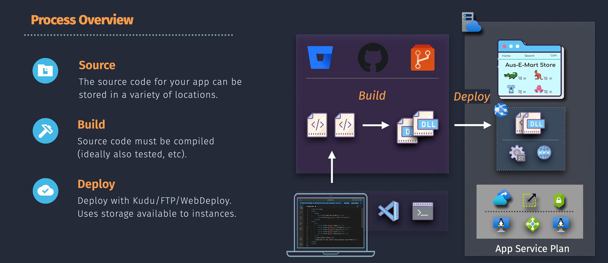
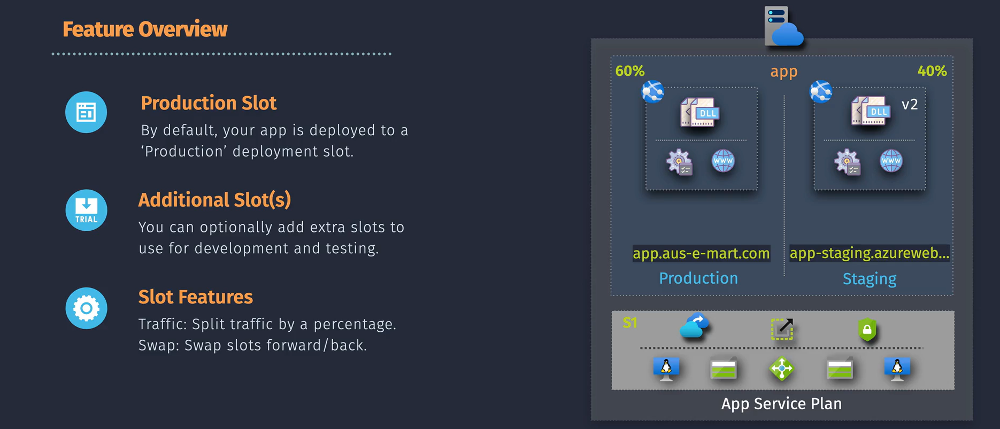

# 🚀 Azure App Service – Deployments & Deployment Slots

## 🛑 **Problem** – Why This Matters

When you deploy directly to production:

- Risk of **downtime** while the app restarts.
- Risk of **users hitting errors** if a deployment breaks something.
- No **safe rollback** if the new version fails.
- No **preview environment** for QA before production release.

In AWS terms, this is like updating an **EC2 ASG without a staging ELB** — users might hit half-updated instances.

---

## ✅ **Solution: Deployment + Deployment Slots**

### **Deployment** (General)

- The act of pushing **new code/config** to your App Service.
- Can be **manual** (ZIP deploy, FTP) or **automated** (GitHub Actions, Azure DevOps).
- **Default behavior** → overwrites production app in place (no staging).

---

<div align="center">
  
</div>

---

### **Deployment Slots** (The Magic)

- **Separate environments** (with their own hostname) **inside the same App Service Plan**.
- Each slot = fully running app instance with its **own config, code, and environment variables**.
- You can **swap** a staging slot with production **instantly** without redeploying.

💡 **Think AWS Blue/Green Deployment**:

- **Blue** = Production slot.
- **Green** = Staging slot (new version).
- When ready → swap traffic from Blue → Green with zero downtime.

---

<div align="center">
  
</div>

---

## 🧩 **Deployment Slot Components**

| Component           | Description                                        | Example                            |
| ------------------- | -------------------------------------------------- | ---------------------------------- |
| **Production Slot** | The default slot serving live traffic.             | `mysite.azurewebsites.net`         |
| **Staging Slot**    | A separate instance for testing.                   | `mysite-staging.azurewebsites.net` |
| **Swap**            | Exchanges code, config, and traffic between slots. | Swap `staging` → `production`      |
| **Slot Settings**   | Config values that **don’t swap** during swap.     | DB connection strings, API keys    |
| **Warm-up**         | Azure can “preload” your app before swap.          | No cold start delay for .NET app   |

---

## 🖼 **How Slots Work**


---

## 📜 **Types of Deployments in Azure App Service**

1. **In-Place Deployment (No Slots)**

   - Directly updates production app.
   - Short downtime if app restarts.
   - Risky without rollback option.

2. **Blue/Green via Deployment Slots**

   - Deploy new version to **staging slot**.
   - Test, then swap with production instantly.
   - Can roll back by swapping back.

---

## 🛠 **Step-by-Step – Zero Downtime Deployment Using Slots**

### 1️⃣ **Create a Deployment Slot**

- In **App Service → Deployment Slots** → Add Slot.
- Choose name: `staging`, `uat`, etc.
- Clone configuration from production.

### 2️⃣ **Deploy to Staging Slot**

- Use CI/CD or manual deploy **targeting the slot**.
- Example with Azure CLI:

  ```bash
  az webapp deployment source config \
      --name myapp \
      --slot staging \
      --repo-url https://github.com/user/repo \
      --branch main \
      --manual-integration
  ```

### 3️⃣ **Test in Staging**

- Access `mysite-staging.azurewebsites.net`.
- Test new features, performance, and integration.

### 4️⃣ **Swap Slots**

- In Portal: **Swap → staging ↔ production**.
- Azure:

  - Prepares target slot (warm-up).
  - Redirects traffic instantly.
  - Preserves “Slot Settings” configs.

### 5️⃣ **Rollback if Needed**

- If something breaks, swap back.

---

## 🔄 **Slot Swap – What Happens Under the Hood**

1. **Configuration Swap**

   - Swappable settings (app settings, connection strings) are exchanged.
   - Slot-specific settings stay put.

2. **Warm-Up Phase**

   - Azure preloads assemblies, caches, dependencies.
   - Ensures users hit a “ready” app.

3. **Traffic Cutover**

   - Load balancer sends all traffic to new slot instantly.

---

## 🎯 **Example: Deploy a .NET App with CI/CD to a Slot**

```yaml
# Azure Pipelines YAML Example
trigger:
  - main

stages:
  - stage: Build
    jobs:
      - job: BuildApp
        steps:
          - task: DotNetCoreCLI@2
            inputs:
              command: publish
              projects: "**/*.csproj"
              arguments: "--configuration Release --output publish_output"

  - stage: Deploy_Staging
    jobs:
      - deployment: DeployToStaging
        environment: staging
        strategy:
          runOnce:
            deploy:
              steps:
                - task: AzureWebApp@1
                  inputs:
                    azureSubscription: "MyServiceConnection"
                    appName: "myapp"
                    slotName: "staging"
                    package: "publish_output/**/*.zip"
```

---

## 📦 **Plan Requirement – Where Deployment Slots Exist**

Deployment Slots are **not** available in all App Service Plans.
They are only available in:

| App Service Plan Tier          | Deployment Slots Available |
| ------------------------------ | -------------------------- |
| **Free (F1)**                  | ❌ None                    |
| **Shared (D1)**                | ❌ None                    |
| **Basic (B1–B3)**              | ❌ None                    |
| **Standard (S1–S3)**           | ✅ Yes – up to 5 slots     |
| **Premium (P1V2, P2V2, etc.)** | ✅ Yes – up to 20 slots    |
| **PremiumV3 & Isolated**       | ✅ Yes – up to 20 slots    |

💡 **Translation:**

- If your App Service Plan is **Free**, **Shared**, or **Basic** → you get **zero slots** (only production).
- **Standard or higher** → you unlock Deployment Slots.
- Higher tiers = more slots.

---

### 🛠 **Why Plan Matters**

- Slots **consume the same compute resources** as your production app (they’re live apps).
- Higher-tier plans can handle extra load from multiple running slots.
- Cost is tied to the **App Service Plan**, not per slot — so adding slots is “free” in terms of Azure billing (but they share your compute).

---

## ⚡ **Benefits of Deployment Slots**

| Feature                  | Benefit                                      |
| ------------------------ | -------------------------------------------- |
| Zero Downtime            | Swap avoids app restart in production.       |
| Safe Rollback            | Swap back instantly.                         |
| Real Environment Testing | Staging slot runs same compute tier as prod. |
| Traffic Warm-Up          | Avoids cold starts in high-traffic apps.     |
| Config Isolation         | Keep secrets and prod-only settings safe.    |

---

## 📌 Best Practices

- Always **test in slot** before swapping.
- Mark DB strings, secrets as **slot settings** to avoid overwriting prod configs.
- Use **Traffic Routing** during swap to do gradual rollouts (e.g., 20% staging, 80% prod).
- Have at least **one staging slot** in production-tier plans (Standard or above).
- Automate swaps in CI/CD pipelines for consistent deployments.
