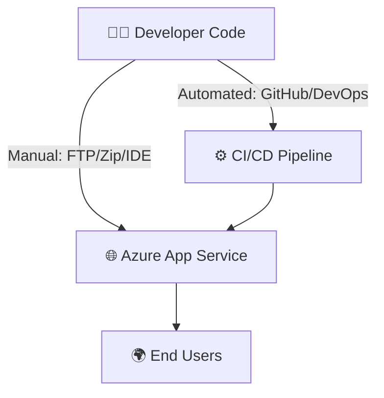

# 🚀 **Deploying to Azure App Service**

## 📌 **Scenario**

You built a web app (HTML/Node.js/.NET/Python/Java). Now you need to **deploy it**.
Azure App Service gives you two ways:

1. **Manual Deployment** → good for testing, one-off uploads.
2. **Automated Deployment (CI/CD)** → production-grade, integrates with GitHub, DevOps, Bitbucket.

---

## 🎯 **Deployment Options**

### 🔹 1. **Manual Deployment**

Use this when you want **full control**, or for **quick tests**.

✅ Methods:

- **Git Push** → Push code directly to the App Service Git repo.
- **Zip Deploy** → Upload a `.zip` package of your app.
- **FTP/FTPS** → Use classic FTP uploads.
- **VS Code / Visual Studio** → Deploy directly from your IDE.

👉 Example: Simple HTML site deployed from VS Code using **App Service Extension**.

---

### 🔹 2. **Automated Deployment (CI/CD)**

Use this when you want **continuous integration + continuous deployment**.

✅ Tools:

- **Azure DevOps Pipelines**
- **GitHub Actions**
- **Bitbucket Pipelines**

Every commit → automatically built + deployed → App Service.

---

## 🖼 **Deployment Architecture**



---

## 🧑‍💻 **Hands-On: Manual Deployment with VS Code**

### 🔹 Step 1: Install VS Code Extensions

- Install **Azure App Service Extension**.
- Log in to your Azure account inside VS Code (`Azure: Sign In`).

---

### 🔹 Step 2: Create Sample Web Project

Use a free HTML5 template or your own app. Example `index.html`:

```html
<!DOCTYPE html>
<html>
  <head>
    <title>My Azure App Service Demo</title>
  </head>
  <body>
    <h1>🚀 Hello from Azure App Service!</h1>
  </body>
</html>
```

---

### 🔹 Step 3: Deploy to Azure

1. Open Command Palette (`Ctrl+Shift+P` / `Cmd+Shift+P`).
2. Search: **“Deploy to Web App”**.
3. Select your project folder.
4. Choose your **App Service instance** (create if not exists).
5. Confirm → VS Code will **Zip Deploy** your project.

👉 After success → Visit `https://<appname>.azurewebsites.net/`

---

## 🧑‍💻 **Hands-On: Manual Deployment via CLI (Zip Deploy)**

```bash
# Package app into zip
zip -r myapp.zip .

# Deploy
az webapp deploy \
  --resource-group rg-appservice-demo \
  --name mydemoapp01 \
  --src-path ./myapp.zip
```

---

## 🔄 **Hands-On: Automated Deployment (Azure DevOps)**

### 🔹 Step 1: Push Code to Azure Repos

```bash
git init
git remote add origin https://dev.azure.com/<org>/<project>/_git/<repo>
git add .
git commit -m "init"
git push origin main
```

---

### 🔹 Step 2: Configure Deployment Center

- In Azure Portal → Go to your **App Service** → **Deployment Center**.
- Source: **Azure Repos / GitHub / Bitbucket**.
- Select **Project → Repo → Branch (main)**.

---

### 🔹 Step 3: CI/CD Pipeline Runs

- Every **commit** → triggers **build + deploy**.
- Monitor logs in **Deployment Center**.

👉 Update your HTML → push commit → refresh App Service site. 🚀

---

## 📦 **Other Deployment Methods**

- **FTP/FTPS** → From Deployment Center → get credentials → upload files with FileZilla.
- **Kudu Portal** → Advanced management (`https://<appname>.scm.azurewebsites.net`).

  - Browse files
  - Edit live code
  - Run PowerShell/Console

---

## ✅ **Best Practices**

- Use **Manual Deployment** for: quick tests, POCs, prototypes.
- Use **Automated Deployment** for: production apps, teamwork, fast rollouts.
- Always use **CI/CD** with GitHub or DevOps for reliability.
- Clean up project folders before deployment (avoid bloated zips).
- Enable **staging slots** for zero-downtime swaps in production.

---

## 🏁 **TL;DR Flow**

1. **Manual** → Zip Deploy / FTP / Git push (good for tests).
2. **Automated** → CI/CD pipeline (good for real apps).
3. **Deployment Center** in Azure Portal makes switching easy.
