# 🔐 Implementing Authentication & Authorization in Azure App Service

## 🧠 What is “Easy Auth”?

**App Service Authentication** sits **in front of** your app:

- intercepts every request,
- handles the **sign-in** with your chosen provider,
- injects **user identity & tokens** into headers/environment for your app,
- optionally **blocks anonymous** traffic.

Think: a **reverse-proxy identity layer** for your web app/API.

```mermaid
sequenceDiagram
    participant User
    participant EasyAuth as App Service Auth (Easy Auth)
    participant IdP as Identity Provider (Entra ID / B2C / Google / etc.)
    participant App as Your App

    User->>EasyAuth: GET / (no cookie)
    EasyAuth->>IdP: Redirect to sign-in
    IdP-->>EasyAuth: Auth code → tokens
    EasyAuth-->>User: Auth cookie set
    User->>EasyAuth: GET / (cookie present)
    EasyAuth->>App: Forward request + identity headers
    App-->>User: 200 OK
```



---

## 🧩 Supported Identity Providers

- **Microsoft Entra ID** (Azure AD) — best for workforce/internal apps.
- **Entra External ID / Azure AD B2C** — for customer/external users.
- **Social** — Google, Facebook, Apple, X (Twitter).
- **Any OpenID Connect** provider.

> Exam tip: internal enterprise → **Entra ID**; customer sign-in → **B2C/External ID**.

---

## ⚙️ Key Easy Auth Settings (what they mean)

| Setting                              | What it does                                         | Typical choice                                |
| ------------------------------------ | ---------------------------------------------------- | --------------------------------------------- |
| **App Service Authentication**       | Turn Easy Auth on/off                                | **On**                                        |
| **Unauthenticated requests**         | Block or allow anonymous                             | **HTTP 401** (block) for secure apps          |
| **Identity provider**                | Where users sign in                                  | **Microsoft** (Entra ID)                      |
| **Issuer / Allowed token audiences** | Validates tokens if you send JWTs to Easy Auth       | Defaults set when using built-in provider     |
| **Token store**                      | Stores tokens in provider-managed store for your app | Usually **On** (to get refresh/access tokens) |
| **Login/logout route**               | Built-in endpoints                                   | `/.auth/login/<provider>`, `/.auth/logout`    |

---

## 🖱️ Portal: Step-by-Step (Entra ID)

1. **Open your App Service** → **Authentication** → **+ Add identity provider**
2. **Provider**: **Microsoft**
3. **App registration**: choose **Create new app registration**
4. **Supported account types**: usually **Single tenant** (internal)
5. **App Service authentication**: **Enable**
6. **Unauthenticated requests**: **HTTP 401**
7. **Permissions**: default **User.Read** (profile) → keep minimal
8. **Add** → Save

<div align="left">
  
</div>

<div align="left">
  
</div>

<div align="left">
  
</div>

### Test it

- Open your site URL in an incognito window → you’ll be redirected to sign in.
- After consent (for **User.Read**), you land back on your site **as an authenticated user**.

<div align="left">
  
</div>

> No custom auth code required. Easy Auth sets cookies and forwards identity to your app.

---

## 🧑‍💻 Azure CLI: Configure Auth (same result)

```bash
# Enable built-in auth and require login
az webapp auth set \
  --resource-group rg-app \
  --name mywebapp123 \
  --enabled true \
  --action LoginWithAzureActiveDirectory

# Wire Microsoft (Entra ID) provider using current tenant
# This creates/links an app registration automatically in many cases
az webapp auth microsoft update \
  --resource-group rg-app \
  --name mywebapp123 \
  --client-id <APP_ID> \
  --client-secret-setting-name MICROSOFT_PROVIDER_AUTH_SECRET \
  --issuer "https://login.microsoftonline.com/<TENANT_ID>/v2.0"

# Store the client secret as an app setting before the command above (if needed)
az webapp config appsettings set \
  --resource-group rg-app \
  --name mywebapp123 \
  --settings MICROSOFT_PROVIDER_AUTH_SECRET=<client_secret_value>
```

> For **B2C/External ID** or **custom OIDC**, use `az webapp auth oidc add` and set issuer/metadata endpoints accordingly.

---

## 🧾 What your app receives (no SDK necessary)

Easy Auth injects identity into:

- **Headers**: `X-MS-CLIENT-PRINCIPAL`, `X-MS-TOKEN-AAD-ACCESS-TOKEN`, etc.
- **Env vars** (for some stacks)
- **/.auth/me** endpoint returns the identity JSON

### Minimal example: read identity in .NET

```csharp
app.MapGet("/whoami", (HttpRequest req) =>
{
    // Compact: decode X-MS-CLIENT-PRINCIPAL (Base64 JSON)
    var b64 = req.Headers["X-MS-CLIENT-PRINCIPAL"].FirstOrDefault();
    if (string.IsNullOrEmpty(b64)) return Results.Unauthorized();

    var json = System.Text.Encoding.UTF8.GetString(Convert.FromBase64String(b64));
    return Results.Text(json, "application/json");
});
```

### Call Microsoft Graph (on-behalf-of via Easy Auth token)

If you enabled **Token Store**, you can forward the access token Easy Auth obtained:

```csharp
app.MapGet("/me", async (HttpRequest req) =>
{
    var token = req.Headers["X-MS-TOKEN-AAD-ACCESS-TOKEN"].FirstOrDefault();
    if (string.IsNullOrEmpty(token)) return Results.Unauthorized();

    using var http = new HttpClient();
    var msg = new HttpRequestMessage(HttpMethod.Get, "https://graph.microsoft.com/v1.0/me");
    msg.Headers.Authorization = new System.Net.Http.Headers.AuthenticationHeaderValue("Bearer", token);
    var res = await http.SendAsync(msg);
    return Results.Content(await res.Content.ReadAsStringAsync(), "application/json");
});
```

> If Graph needs broader scopes (e.g., `Mail.Read`), add them to the **app registration** and **Authentication** provider config, then re-consent.

---

## 🔒 Authorization (who can access what)

You’ve authenticated the user; now decide **authorization**:

### Option A — Block all anonymous at the edge

Set **Unauthenticated requests = HTTP 401**.
Then in your app, authorize by role/claim/tenant:

- **App Roles / Groups** in Entra ID → emitted as claims (e.g., `roles`, `groups`).
- In .NET:

  ```csharp
  app.MapGet("/admin", (ClaimsPrincipal user) =>
      user.IsInRole("App.Admin") ? Results.Ok("ok") : Results.Forbid());
  ```

### Option B — Allow anonymous but gate specific routes

Set **Unauthenticated requests = Allow (No action)**.
Use app-level authorization attributes/middleware to protect endpoints.

> For multi-tenant/external scenarios, prefer **B2C/External ID** and implement per-tenant checks in code.

---

## 🔁 Useful built-in endpoints

- `/.auth/login/<provider>` → start login (e.g., `/.auth/login/aad`)
- `/.auth/logout` → sign out
- `/.auth/me` → current identity & tokens
- `/.auth/refresh` → refresh tokens (if token store enabled)

---

## 🧯 Troubleshooting quick hits

| Symptom                     | Likely cause                                                | Fix                                                                            |
| --------------------------- | ----------------------------------------------------------- | ------------------------------------------------------------------------------ |
| Redirect loop               | Wrong redirect URL / cookie conflict                        | Clear cookies, verify app registration reply URL                               |
| 401 after login             | “Unauthenticated requests = Allow” but app expects identity | Switch to **LoginWith…** or enforce `[Authorize]` in app                       |
| 403 calling Graph           | Missing scopes/consent                                      | Add scopes to provider; re-consent; check `X-MS-TOKEN-AAD-ACCESS-TOKEN` exists |
| 404 on `/.auth/*`           | Easy Auth disabled                                          | Enable **App Service Authentication**                                          |
| Works locally, not in Azure | Using local auth code instead of Easy Auth                  | Remove local OIDC middleware, rely on Easy Auth in Azure                       |

---

## ✅ Best practices

- **Use Entra ID** for internal apps; **B2C/External ID** for consumer-facing.
- **Block anonymous** at the edge for sensitive apps.
- Keep **permissions minimal** (principle of least privilege).
- Turn on **Token Store** if your app needs to call downstream APIs (Graph).
- Prefer **Managed Identity** to call Azure resources (Key Vault, Storage) — no secrets.
- Log identity info sparingly; never log tokens.

---

## 🏁 TL;DR

1. Turn on **App Service Authentication** (Easy Auth).
2. Add an **identity provider** (Microsoft Entra ID is default for internal).
3. Choose what to do with **unauthenticated requests** (usually 401).
4. (Optional) Enable **Token Store** to call downstream APIs with the user’s token.
5. In your app, use identity headers/claims to **authorize** access.
