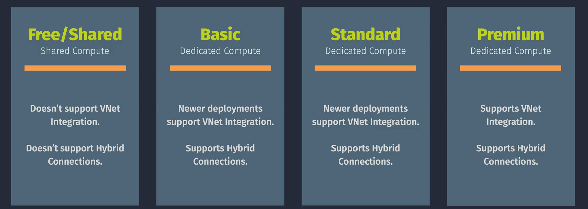

# 🌐 Azure App Service Networking

## 🛑 **Problem** – Why App Service Networking Matters

Your Azure App Service runs your **web apps, APIs, and backends** in a managed environment.
But not all traffic should be public. You may want:

- **Private connectivity** to backend resources (databases, APIs, storage).
- **Secure inbound traffic** from only specific networks or services.
- **Hybrid connectivity** between on-premises and Azure.
- **Service-to-service** secure calls without exposing public endpoints.

If you do nothing, your app:

- Gets a **public IP** accessible to the world 🌍.
- Cannot directly access private resources without **network integration**.

---

## ✅ **Solution:** App Service Networking Features

Azure App Service provides multiple networking options to control **inbound** and **outbound** traffic.

---

## 🖼 **Networking Components & Scenarios**

| Feature                 | Direction | Purpose                        | Example                                       |
| ----------------------- | --------- | ------------------------------ | --------------------------------------------- |
| **Access Restrictions** | Inbound   | Restrict who can call your app | Allow only corporate IP ranges                |
| **Private Endpoint**    | Inbound   | Private IP in your VNet        | Expose app internally without public internet |
| **Front Door**          | Inbound   | Global routing + CDN           | Low latency and failover for global users     |
| **App Gateway + WAF**   | Inbound   | Advanced routing + security    | Put WAF in front of app                       |

---

---

| Feature                | Direction | Purpose                                 | Example                                        |
| ---------------------- | --------- | --------------------------------------- | ---------------------------------------------- |
| **VNet Integration**   | Outbound  | Reach private resources in VNet/on-prem | Call a private API in same VNet                |
| **Service Endpoint**   | Outbound  | Connect to Azure PaaS services securely | Access Azure SQL over Azure backbone           |
| **Hybrid Connections** | Outbound  | Access on-premises without VPN          | Connect to on-prem SQL without public exposure |

---

## 📥 Inbound Networking Options

  

---

### 1️⃣ **Access Restrictions**

- Define **allow/deny rules** based on:

  - IP address
  - Azure Service Tags (e.g., allow `AzureFrontDoor.Backend`)

- Works at **app level**, no VNet needed.
- Example: Only allow IPs `20.30.40.0/24`.

---

### 2️⃣ **Private Endpoints**

- App gets **private IP** from your VNet.
- Public internet access disabled (unless explicitly kept).
- Users/apps inside VNet (or peered VNets) can reach the app privately.
- Requires **Premium v2/v3** App Service Plan.

---

### 3️⃣ **Application Gateway / Azure Front Door**

- **App Gateway**:

  - Regional load balancing, WAF protection, SSL offload.

- **Front Door**:

  - Global routing, edge caching, failover.

---

## 📤 Outbound Networking Options

### 4️⃣ **VNet Integration**

  

- Allows outbound calls from your app into your VNet.
- Two modes:

  - **Regional VNet Integration** (subnet in same region).
  - **Gateway-required VNet Integration** (different region via VPN/ExpressRoute).

- Use case: Access private database in VNet.

---

### 5️⃣ **Service Endpoints**

- Secure access to Azure PaaS services (SQL, Storage) over Azure backbone.
- **App Service’s outbound IP** is allowed in the PaaS resource firewall.

---

### 6️⃣ **Hybrid Connections**

  

---

- Access on-premises TCP endpoints without VPN/ExpressRoute.
- Uses Azure Relay.
- Doesn’t require full VNet integration.

---

## 🖥 Diagram – Inbound & Outbound in One View

```mermaid
flowchart TB
    subgraph VNet
        A[Private Endpoint 🔒]
        B[Backend DB 🗄]
    end

    Internet -->|Allowed IPs| AppService["(Azure App Service)"]
    AppService -->|VNet Integration| B
    AppService -->|Service Endpoint| AzureSQL["(Azure SQL)"]
    AppService -->|Hybrid Connection| OnPrem[On-Prem Server 🏢]
```

---

## 🪜 **Step-by-Step Example: Private Endpoint + VNet Integration**

**Goal:** App is internal-only, accesses SQL DB privately.

1. **Create VNet** with subnets for App Service and DB.
2. **Deploy App Service Plan** (Premium v3 required for Private Endpoint).
3. **Enable Private Endpoint** for the app in VNet.
4. **Disable Public Access** in App Service Networking blade.
5. **Deploy Azure SQL** with Private Endpoint in same VNet.
6. **Enable VNet Integration** so App can call SQL over private IP.
7. Test connectivity from an internal VM in the VNet.

---

## 🏷️ **Networking SKUs**

> Define the range of networking capabilities based on pricing tiers and app requirements.

---

  

