# 🌐 Azure App Service Networking

## 🛑 **Problem — Why Networking Matters**

Your Azure App Service hosts **web apps, APIs, and backends** in a managed environment.
But networking needs vary:

- Restrict **who can reach your app** 🌍
- Secure **outbound calls** to databases, APIs, or storage
- Connect **on-premises + Azure**
- Expose apps **privately** (no public internet)

By default, your app:

- Runs in a **multi-tenant shared environment**
- Gets a **public IP** (open to the world)
- Has no private network integration until you configure it

---

## ✅ **Two Networking Models**

Azure App Service supports two networking models:

1. **Multi-tenant Public Service** → shared infra, cost-effective, public by default
2. **Single-tenant App Service Environment (ASE)** → isolated infra, advanced networking, higher cost

  

---

## 🏢 Multi-tenant Public Service

This is the **default** App Service model:

- Multiple tenants share underlying infra
- Apps run on `*.azurewebsites.net` domain
- Perfect for **blogs, small web apps, APIs** that need quick hosting

Even in this model, you can control networking (inbound + outbound).

---

### 📥 Inbound Features (Multi-tenant)

  

#### 🔹 App Assigned Address

- Each app gets its own **unique FQDN and IP**
- Supports **custom domains + SSL**

#### 🔹 Access Restrictions

- Restrict by:

  - IP ranges (e.g., only `20.30.40.0/24`)
  - Service Tags (e.g., allow `AzureFrontDoor.Backend` only)

- Deny all except corporate traffic = ✅ security

#### 🔹 Private Endpoint

- Map app to a **private IP in a VNet**
- Disable public internet → app is only reachable inside VNet/peered VNets
- Requires **Premium v2/v3 plan**

---

### 📤 Outbound Features (Multi-tenant)

  

#### 🔹 VNet Integration

- Lets app call private resources inside VNet
- Two modes:

  - Regional subnet integration
  - Gateway-required (cross-region via VPN/ExpressRoute)

#### 🔹 Service Endpoints

- App talks to Azure PaaS (SQL, Storage) over **Azure backbone**
- Resource firewall trusts **App Service outbound IP**

#### 🔹 Hybrid Connections

- Access on-prem TCP endpoints without VPN
- Uses Azure Relay
- Easy way to connect to on-prem SQL

---

### 🖥 Example — Private Endpoint + SQL with VNet Integration

**Goal:** Internal-only web app that calls SQL DB privately.

1. Create **VNet** with subnets for App + SQL
2. Deploy App Service Plan (**Premium v3**)
3. Enable **Private Endpoint** for App Service
4. Disable **Public Access**
5. Deploy **Azure SQL** with Private Endpoint
6. Enable **VNet Integration** for outbound calls
7. Test: only works inside VNet ✅

```mermaid
flowchart TB
    subgraph VNet
        A[App Service 🔒 Private Endpoint]
        B[Azure SQL 🗄]
    end
    A -->|VNet Integration| B
```

---

## 🏰 Single-tenant App Service Environment (ASE)

For apps needing **isolation, compliance, and private-only hosting**.

- Dedicated infra in **your VNet**
- Domain: `*.appserviceenvironment.net` (instead of `azurewebsites.net`)
- Expensive but powerful → suited for **finance, healthcare, regulated workloads**

---

### 🚪 Inbound Options (ASE)

- **External ASE** → apps get a public IP, exposed to internet
- **Internal ASE (ILB ASE)** → apps only reachable inside VNet (via Internal Load Balancer)

  - Perfect for internal LOB apps

---

### 🌉 Outbound Options (ASE)

- Since app lives **inside your VNet**, it can directly:

  - Talk to subnets/resources privately
  - Use **NSGs**, **UDRs**, and **firewalls**

- No need for Private Endpoint → connectivity is native

---

### 🛠 Config Steps — Create ASE v3

1. In Portal → **App Service Environments → Add**
2. Choose:

   - VNet + Subnet
   - External (public) or Internal (ILB)

3. Deploy **Isolated App Service Plan**
4. Deploy apps inside ASE (`*.appserviceenvironment.net`)
5. Configure NSGs, firewalls, routes as needed

---

## 📊 Multi-tenant vs Single-tenant — Quick Compare

| Feature           | Multi-tenant App Service | ASE (Single-tenant)             |
| ----------------- | ------------------------ | ------------------------------- |
| Infra             | Shared                   | Dedicated                       |
| Default Domain    | `*.azurewebsites.net`    | `*.appserviceenvironment.net`   |
| Isolation         | Logical                  | Full VNet-based isolation       |
| Private-only Apps | Needs Private Endpoint   | Native (ILB ASE)                |
| Outbound to VNet  | Needs VNet Integration   | Native                          |
| Cost              | Low to moderate          | High (Isolated plan)            |
| Best For          | Blogs, public apps, APIs | Finance, healthcare, compliance |

---

## 🖥 Diagram – Inbound & Outbound in One View

```mermaid
flowchart TB
    subgraph VNet
        A[Private Endpoint 🔒]
        B[Backend DB 🗄]
    end

    Internet -->|Allowed IPs| AppService["(Azure App Service)"]
    AppService -->|VNet Integration| B
    AppService -->|Service Endpoint| AzureSQL["(Azure SQL)"]
    AppService -->|Hybrid Connection| OnPrem[On-Prem Server 🏢]
```

---

## 🏷️ **Networking SKUs**

> Define the range of networking capabilities based on pricing tiers and app requirements.

---

  

---

## 🏁 Summary

- **Multi-tenant**: Cost-effective, public by default, but can be secured with **Private Endpoints**, **Access Restrictions**, **VNet Integration**.
- **Single-tenant ASE**: Fully private, isolated, runs inside your **VNet**. Best for highly regulated or mission-critical apps.
- Networking is about **choosing the right model** → cheap and flexible (multi-tenant) vs isolated and compliant (ASE).

---

📚 **Further Reading**:

- [Microsoft Docs: App Service Networking](https://learn.microsoft.com/azure/app-service/networking-features)
