# 🔐 **Project: Azure App Service Networking (Multi-tenant + ASE)**

## 📌 **Scenario**

You’re hosting a **web app** that talks to an **Azure SQL Database**.
You need two deployment flavors:

- **Multi-tenant App Service** (cheaper, public by default, but locked down with Private Endpoint + VNet Integration).
- **Single-tenant App Service Environment (ASE)** (isolated, private-only, full compliance).

---

## 🏢 Part 1 – Multi-tenant App Service (Public → Secured)

### 🔹 Step 1: Create Resource Group + VNet

```bash
az group create --name rg-appnet-demo --location eastus

az network vnet create \
  --resource-group rg-appnet-demo \
  --name vnet-app-demo \
  --address-prefix 10.10.0.0/16 \
  --subnet-name appsubnet \
  --subnet-prefix 10.10.1.0/24
```

---

### 🔹 Step 2: Create App Service Plan + Web App

```bash
az appservice plan create \
  --name asp-demo-net \
  --resource-group rg-appnet-demo \
  --sku P1v3 \
  --is-linux

az webapp create \
  --resource-group rg-appnet-demo \
  --plan asp-demo-net \
  --name demoappnet123 \
  --runtime "DOTNET:6"
```

👉 `demoappnet123.azurewebsites.net` is public by default.

---

### 🔹 Step 3: Secure Inbound with **Private Endpoint**

```bash
az network private-endpoint create \
  --name pe-app-demo \
  --resource-group rg-appnet-demo \
  --vnet-name vnet-app-demo \
  --subnet appsubnet \
  --private-connection-resource-id $(az webapp show -g rg-appnet-demo -n demoappnet123 --query id -o tsv) \
  --group-id sites \
  --connection-name app-priv-conn
```

👉 App now has a **private IP** inside `vnet-app-demo`.  
👉 Disable public access in **Networking → Access Restrictions** in portal.

---

### 🔹 Step 4: Enable **VNet Integration** for Outbound Calls

```bash
az webapp vnet-integration add \
  --name demoappnet123 \
  --resource-group rg-appnet-demo \
  --vnet vnet-app-demo \
  --subnet appsubnet
```

👉 Now your app can **call Azure SQL privately**.

---

### 🔹 Step 5: Test Access

- Deploy an **Azure SQL DB** with private endpoint in same VNet.
- From app, connect using private FQDN → works ✅.
- From internet → blocked 🚫.

---

## 🏰 Part 2 – Single-tenant ASE (App Service Environment)

### 🔹 Step 1: Create ASE v3

```bash
az appservice ase create \
  --name ase-demo-v3 \
  --resource-group rg-appnet-demo \
  --vnet-name vnet-app-demo \
  --subnet appsubnet \
  --kind asev3 \
  --front-end-sku I1v2
```

👉 ASE lives **inside your VNet**.  
👉 Apps run on `*.appserviceenvironment.net`.

---

### 🔹 Step 2: Create App Service Plan in ASE

```bash
az appservice plan create \
  --name asp-ase-demo \
  --resource-group rg-appnet-demo \
  --app-service-environment ase-demo-v3 \
  --sku I1v2
```

---

### 🔹 Step 3: Create Web App in ASE

```bash
az webapp create \
  --resource-group rg-appnet-demo \
  --plan asp-ase-demo \
  --name internalappdemo \
  --runtime "DOTNET:6"
```

👉 App is reachable **only inside VNet** (if using ILB ASE).  
👉 For public exposure, choose External ASE.

---

### 🔹 Step 4: Configure Outbound

Since ASE runs in your VNet:

- Directly access **SQL private endpoint**
- Apply **NSGs**, **firewalls**, **UDRs**
- No need for Private Endpoint for inbound/outbound

---

## 🖥 Networking Diagram

```mermaid
flowchart TB
    subgraph Internet
        User[User Browser]
    end

    subgraph MultiTenant["Multi-tenant App Service"]
        AppPublic["App Service (Public IP)"]
        AppPrivate["App Service (Private Endpoint 🔒)"]
    end

    subgraph ASE["App Service Environment (ASE)"]
        ASEApp["Internal App Service (ILB)"]
    end

    subgraph AzureSQL["Azure SQL with Private Endpoint 🗄"]
    end

    User --> AppPublic
    User --> AppPrivate
    AppPrivate -->|VNet Integration| AzureSQL
    ASEApp --> AzureSQL
```



---

## 📊 Multi-tenant vs ASE Hands-on Outcome

| Feature                 | Multi-tenant App Service | ASE (Single-tenant)           |
| ----------------------- | ------------------------ | ----------------------------- |
| Infra                   | Shared                   | Dedicated (VNet isolated)     |
| Domain                  | `*.azurewebsites.net`    | `*.appserviceenvironment.net` |
| Inbound Private Access  | Needs Private Endpoint   | Native (ILB ASE)              |
| Outbound Private Access | Needs VNet Integration   | Native                        |
| Cost                    | 💲 Low → Medium          | 💲💲💲 High                   |

---

## 🏁 **TL;DR Lab Flow**

1. Create App Service (multi-tenant).
2. Add **Private Endpoint** + **VNet Integration** → secure inbound + outbound.
3. Create ASE v3 → apps run **inside your VNet** with full isolation.

---

👉 Do you want me to also add a **bonus section** showing how to test connectivity with a **bastion VM inside the VNet** (so you can curl the private-only app URL)?
