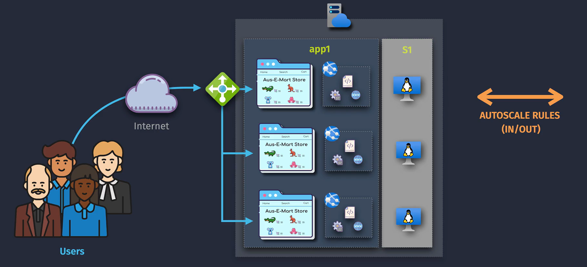
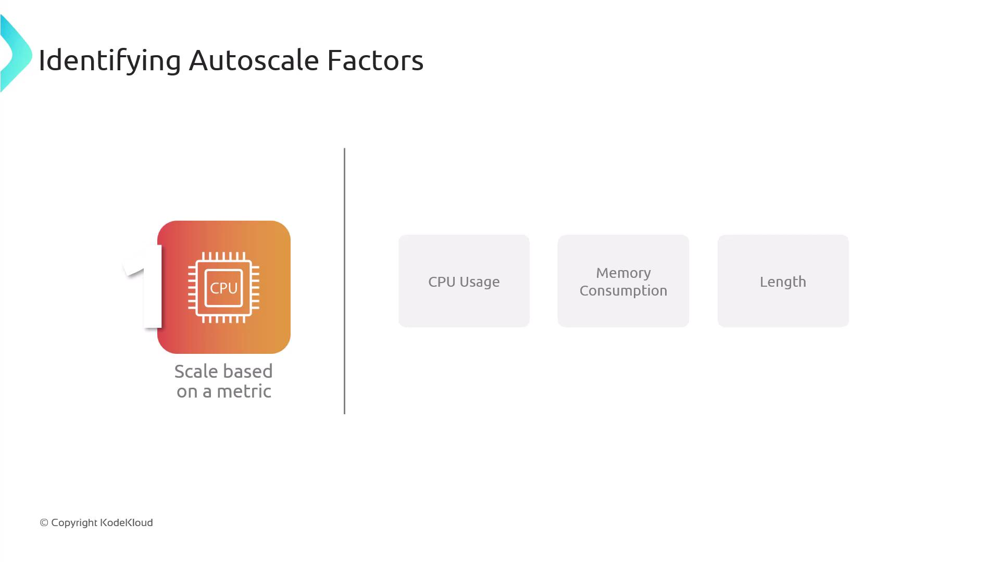
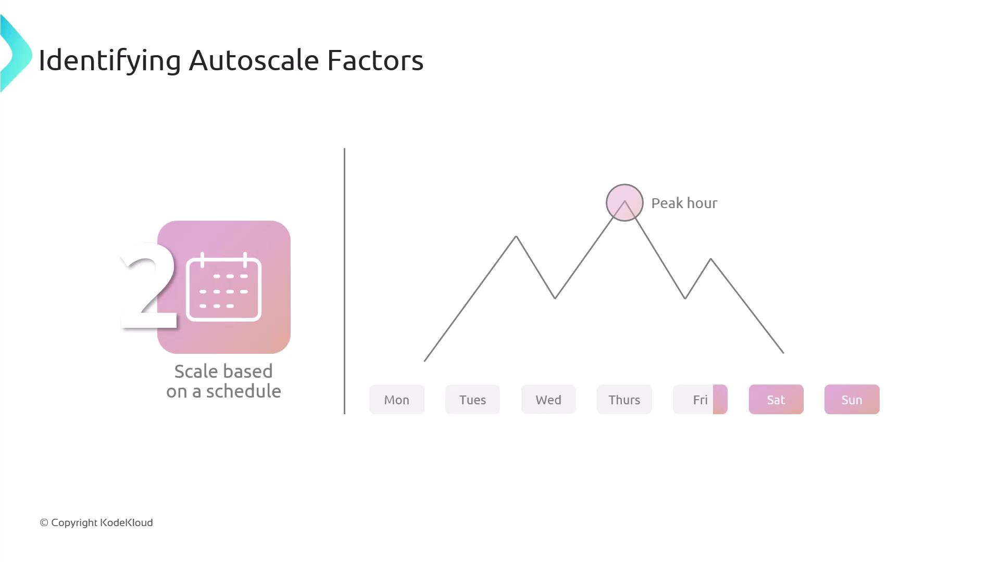
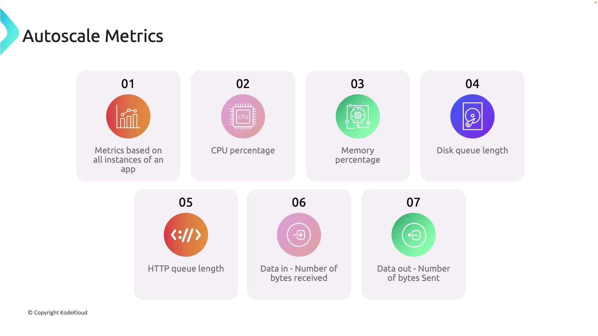

# ⚡ Azure App Service – Autoscaling Deep Dive

## 🛑 **The Problem Without Autoscale**

Imagine you host an **e-commerce app** on Azure App Service with:

- 2 instances
- Fixed size (Standard S2 Plan)

On **Black Friday**, your users spike from 1,000 to 50,000 concurrent requests.

- Fixed size means **same number of instances** even under pressure.
- Result → **High CPU**, slow responses, potential 502/503 errors.

---

## ✅ **The Solution – Autoscale**

**Azure Autoscale** dynamically adjusts the **number of instances** in your **App Service Plan** based on **real-time metrics** or a **predefined schedule**.

- **Scale Out** → Add instances when demand increases.
- **Scale In** → Remove instances when demand drops.

---

<div align="center">
  
</div>

---

## 🧠 **How It Works**

1. **Scope**
   Autoscale applies at the **App Service Plan** level, not individual apps.
   → If multiple apps share the same plan, **they share the same scaling decision**.

2. **Trigger Types**

   - **Metric-based**: CPU, Memory, HTTP Queue Length, Custom Metrics from Application Insights.
   - **Time-based (Scheduled)**: Scale up at 9 AM, scale down at 8 PM.
   - **Predictive Scaling** (Premium v3 only): Uses **machine learning** to forecast load before it happens.

3. **Scaling Actions**

   - Changes the **instance count** (vertical scale = different feature, that’s scaling up).
   - Instances are distributed **across fault domains** for high availability.

4. **Cool-down Period**

   - After scaling, Azure waits a configurable **cool-down** period (default 5 min) before re-evaluating.
   - Prevents “flapping” (scale in/out every minute).

---

## ⚙ **Configuration Options**

<div align="center">
  
</div>

---

### 1. **Metric-based Autoscale**



Example:

- Rule: If **CPU > 70% for 5 minutes**, add 1 instance.
- Rule: If **CPU < 30% for 10 minutes**, remove 1 instance.
- Instance Range: **Min 2, Max 10**.

**Example Portal Setup:**

```ini
Metric: CPU Percentage
Operator: Greater than
Threshold: 70
Duration: 5 minutes
Action: Increase count by 1
```

---

### 2. **Scheduled Autoscale**



Example:

- **Weekdays**: Min 5, Max 15 (office hours load)
- **Weekends**: Min 2, Max 5 (lower traffic)

---

### 3. **Predictive Autoscale** _(Premium v3 / Elastic Premium)_

- Uses historical traffic to **forecast demand**.
- Starts scaling **before** the spike.
- Example: If data shows a spike every day at 8:55 AM, Azure starts adding instances at 8:50 AM.

---

## 📈 **Auto-Scaling Metrics**

Azure App Service provides an extensive range of metrics that support effective auto-scaling across all application instances. Key metrics include:

| Metric Type       | Description                          |
| ----------------- | ------------------------------------ |
| CPU Percentage    | Monitors processor utilization       |
| MemoryPercentage  | Tracks memory consumption            |
| Disk Queue Length | Measures disk I/O performance        |
| HTTP Queue Length | Evaluates the HTTP request queue     |
| Data In/Out       | Monitors the volume of data transfer |

These metrics enable you to fine-tune your auto-scaling configuration, ensuring that your service adjusts dynamically to real-world usage patterns.



---

## 🔍 **Under the Hood – Scaling Logic**

1. Azure Monitor collects metrics every **minute**.
2. Metrics are compared against autoscale rules.
3. If a threshold is breached → Scale Action Triggered.
4. App Service adds/removes instances within **your min/max limits**.
5. Instance warm-up time usually \~1-2 min for App Service.

---

## 💡 **Real Example**

You have:

- Plan: Premium v3
- Rules:

  - CPU > 80% for 5 min → Add 2 instances.
  - HTTP Queue Length > 100 → Add 1 instance.
  - CPU < 30% for 10 min → Remove 1 instance.

- Min: 2 instances
- Max: 8 instances

**Scenario:**

- Traffic spike → CPU hits 85% → App Service adds 2 instances → now 4 total.
- Traffic keeps increasing → HTTP Queue hits 150 → adds 1 more instance → now 5.
- At night → CPU drops to 20% → scales in gradually to min 2.

---

## 📌 **Key Considerations**

- Scaling is **per region** — if your app is deployed in multiple regions, autoscale rules apply to each separately.
- Warm-up time matters — for bursty traffic, **Predictive Scaling** is more effective.
- Scaling out ≠ Scaling up:

  - **Scale Out** = more instances.
  - **Scale Up** = bigger instance SKU (vCPU/RAM).

---

## 🎯 **Pro Tip**

For **mission-critical apps**, combine:

- **Predictive Autoscale** (to handle known spikes)
- **Metric-based Autoscale** (to handle unexpected load)
- **Minimum instance buffer** (so you don’t start from zero during spikes)
