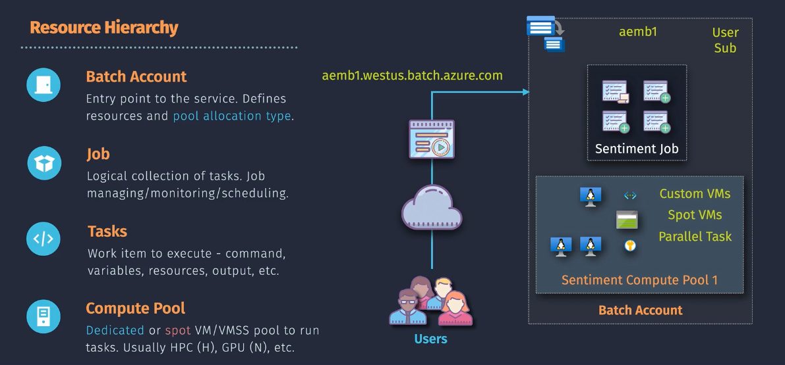
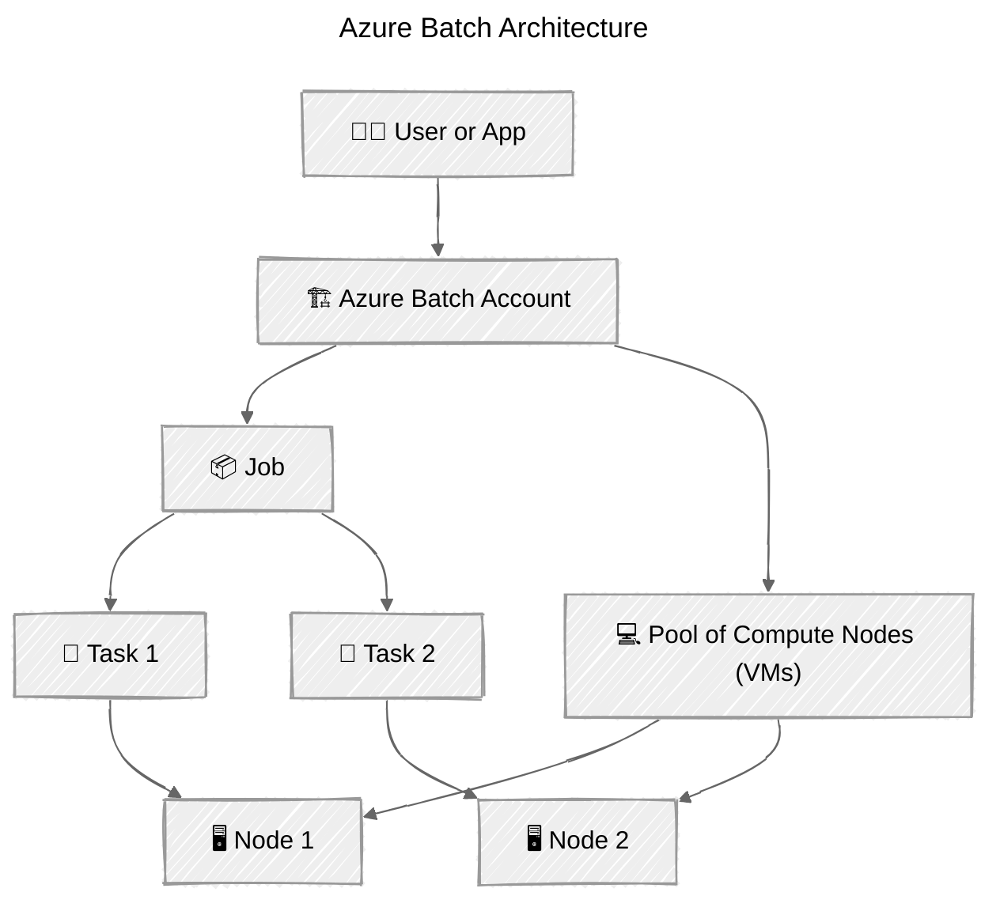

# ⚙️ **Azure Batch Service – “Massive Compute, No Manual Scaling”**

> 💡 Think of **Azure Batch** as **“a managed supercomputer in the cloud”** —
> you give it **a bunch of jobs**, it automatically provisions **VMs**, runs them in **parallel**, and **cleans up** afterward.

---

## 🧠 What Is Azure Batch?

**Azure Batch** is a **fully managed compute orchestration service** for running **large-scale parallel and high-performance computing (HPC)** workloads.

You:

- Define your jobs (tasks to run)
- Define the compute environment (pool of VMs)
- Submit tasks
- Azure Batch does everything else — **provisioning, scaling, distributing, retrying, and cleaning up.**

---

<div align="center" style="background-color: #242A3A; border-radius: 20px;border: 4px solid white;">
  
</div>

---

## 🧩 When to Use Azure Batch

<div align="center" style="background-color: #1b3f47ff; border-radius: 10px;">

| Scenario                      | Example                                                 |
| ----------------------------- | ------------------------------------------------------- |
| 🎞️ **Rendering**              | Video frames, 3D animation rendering (like Pixar-style) |
| 🧮 **Scientific Computation** | Monte Carlo simulations, fluid dynamics                 |
| 🧾 **Data Processing**        | Log analysis, ETL tasks, ML data prep                   |
| 🧬 **Financial Modeling**     | Risk simulation, stock prediction jobs                  |
| 🧠 **AI/ML Workloads**        | Preprocessing or model evaluation at scale              |

</div>

💡 **It’s not a web app service** — it’s for **background compute jobs** (batch workloads).

---

## 🧱 Core Components of Azure Batch

Here’s the **3 main building blocks** that power Azure Batch 👇

<div align="center" style="background-color: #1b3f47ff; border-radius: 10px;">

| Component            | Description                                    | Analogy              |
| -------------------- | ---------------------------------------------- | -------------------- |
| 🏗️ **Batch Account** | The top-level resource that manages everything | Your “control tower” |
| 💻 **Compute Pool**  | A set of VMs (nodes) created to run your jobs  | Your “workers”       |
| 📦 **Job & Tasks**   | The actual workloads you submit                | Your “to-do list”    |

</div>

Let’s visualize 👇

<div align="center" style="background-color: #1b3f47ff; border-radius: 10px;">



</div>

---

## ⚙️ Step-by-Step Workflow

<div align="center" style="background-color: #1b3f47ff; border-radius: 10px;">

| Step                        | What Happens                                         |
| --------------------------- | ---------------------------------------------------- |
| **1️⃣ Create Batch Account** | A control plane for your jobs                        |
| **2️⃣ Create a Pool**        | Define VM size, OS image, and scaling rules          |
| **3️⃣ Create a Job**         | Group of related tasks to execute                    |
| **4️⃣ Add Tasks to Job**     | Each task runs a command/script                      |
| **5️⃣ Azure Batch Executes** | Tasks are automatically distributed and retried      |
| **6️⃣ Results Stored**       | Output stored in Azure Storage or your custom target |

</div>

---

## 💡 Example Use Case – Rendering 1000 Frames

Let’s say you have to render 1000 animation frames 🎞️

Instead of one big machine rendering sequentially:

- You split it into **1000 tasks**
- Azure Batch spins up **100 VMs**
- Each VM renders **10 frames**
- When done → results stored → VMs deallocated

⚡ Result: **Massive parallelism** + **zero manual scaling**

---

## 🔩 Types of Compute Pools

Azure Batch can use **different kinds of compute** environments:

<div align="center" style="background-color: #1b3f47ff; border-radius: 10px;">

| Pool Type                       | Description                                               |
| ------------------------------- | --------------------------------------------------------- |
| 🧱 **Dedicated Pool**           | Uses dedicated VMs that you pay for while allocated       |
| ☁️ **Low-Priority / Spot Pool** | Uses surplus Azure capacity (cheaper, but can be evicted) |
| 🧬 **Custom Image Pool**        | Use your own VM image (preinstalled libraries/tools)      |

## </div>

## 🔁 Auto-Scaling Logic

Azure Batch can automatically scale your pool using **formulas** like:

```text
$TargetDedicatedNodes = min($PendingTasks, 20)
```

This means:

> If you have pending tasks, scale up to a max of 20 nodes.

When jobs finish → nodes scale back down (saving cost).

---

## 💾 Storage Integration

Azure Batch integrates with:

- **Azure Storage Blobs** (for input/output files)
- **Azure Files** (for shared file mounts)
- **Azure Container Registry** (for containerized tasks)

💡 You can **containerize tasks** using Docker — Azure Batch will pull your image and execute the command in a container.

---

## 🔐 Security and Access

<div align="center" style="background-color: #1b3f47ff; border-radius: 10px;">

| Security Feature                   | Description                                       |
| ---------------------------------- | ------------------------------------------------- |
| 🔑 **Managed Identity**            | Access Storage or other services securely         |
| 🧩 **Virtual Network Integration** | Run batch pools inside VNets                      |
| 🔒 **Private Endpoints**           | Restrict Batch account access to private networks |

</div>

---

## 🧰 Batch vs. Alternatives

<div align="center" style="background-color: #1b3f47ff; border-radius: 10px;">

| Service                            | Purpose                    | When to Use                               |
| ---------------------------------- | -------------------------- | ----------------------------------------- |
| **Azure Batch**                    | Orchestrated parallel jobs | Large-scale compute workloads             |
| **Logic Apps / Functions**         | Event-driven or small jobs | Lightweight, reactive tasks               |
| **Azure Kubernetes Service (AKS)** | Container orchestration    | Microservices or custom job orchestration |
| **Databricks / Synapse**           | Data analytics & ML        | Spark-based big data processing           |

</div>

💡 **If it’s CPU-heavy or embarrassingly parallel → Azure Batch wins.**

---

## 🧮 Cost Model

You pay for:

- **VM compute** (same as normal Azure VM pricing)
- **Storage** for logs/results
- Batch orchestration is **free** (no surcharge for using the service)

✅ Batch supports **Spot VMs** to cut costs up to 80%.

---

## 🧩 Monitoring & Logging

You can monitor:

- Pool status
- Task execution results
- Node-level metrics

Integration with:

- **Azure Monitor**
- **Log Analytics**
- **Application Insights (for custom telemetry)**

---

## 🧭 Memory Hook Summary

<div align="center" style="background-color: #1b3f47ff; border-radius: 10px;">

| Concept           | Mnemonic                   |
| ----------------- | -------------------------- |
| **Batch Account** | “Control tower”            |
| **Pool**          | “Workers”                  |
| **Job**           | “Project”                  |
| **Task**          | “Each individual job step” |
| **Auto-Scaling**  | “Brains”                   |
| **Azure Storage** | “File cabinet”             |

</div>

---

## ✅ Quick Recap

<div align="center" style="background-color: #1b3f47ff; border-radius: 10px;">

| Layer         | Role              | Example                            |
| ------------- | ----------------- | ---------------------------------- |
| Batch Account | Control plane     | “Run my simulation!”               |
| Pool          | Compute VMs       | 50 Standard_D4s_v3 nodes           |
| Job           | Logical container | “Risk Analysis Batch”              |
| Task          | Unit of work      | `python risk_model.py --region=us` |

</div>

---

## 🧠 TL;DR Summary

- Azure Batch = **HPC orchestration service**
- **Not for real-time apps**, but **for large compute workloads**
- Handles **provisioning, scaling, retries, cleanup** automatically
- Works with **VMs or containers**
- Great for **data, AI, video, or scientific workloads**
- Billing is **per VM compute usage**, not per job
