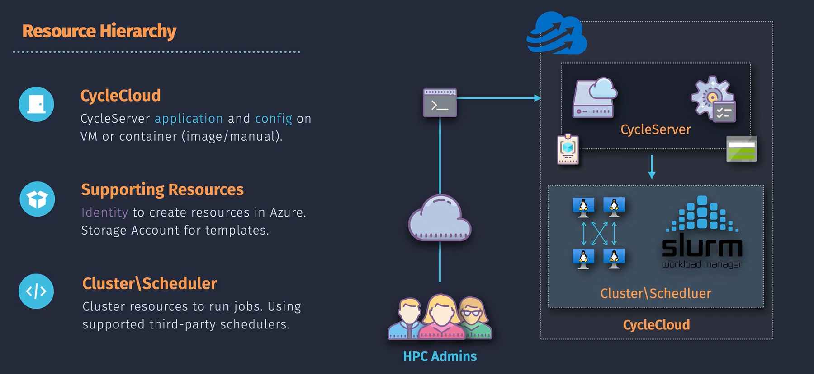
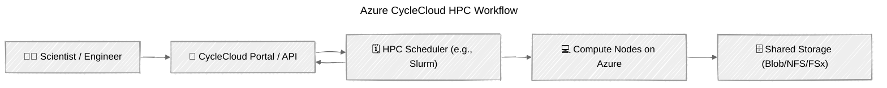

# ☁️ **Azure CycleCloud – “HPC Cluster Manager in the Cloud”**

> 💡 **In one line:**
> Azure CycleCloud helps you **create, manage, and scale High-Performance Computing (HPC) clusters** on Azure — **automatically** and **on-demand**.

Think of it as the **“cluster orchestrator”** for scientific computing, data analysis, or engineering workloads that need hundreds (or thousands) of VMs working together.

---

## 🧠 Why CycleCloud Exists

Normally, running HPC workloads means you must:

- Manually create a bunch of VMs 🧱
- Configure networking between them 🔗
- Install schedulers like **Slurm, PBS, or Grid Engine** 🧩
- Scale nodes up/down based on workload 📈
- Manage shared storage 🗄️

That’s **painful** 😩

➡️ **Azure CycleCloud automates all that.**

It gives you a **portal + API** to:

- Define clusters (node types, VM sizes, scheduler type)
- Deploy them automatically
- Scale based on job queue
- Tear down when done

---

  

---

## ⚙️ How It Works (Simple Flow)

---

## 🧩 Key Components

| Component                | Description                                                                  |
| ------------------------ | ---------------------------------------------------------------------------- |
| 🧭 **CycleCloud Portal** | Web UI or REST API to create/manage clusters                                 |
| ⚙️ **Cluster Template**  | Defines what your cluster looks like (VM sizes, schedulers, etc.)            |
| 🧮 **Scheduler**         | Handles job queuing and scheduling (Slurm, PBS, Grid Engine, HTCondor, etc.) |
| 💻 **Compute Nodes**     | Azure VMs automatically provisioned as worker nodes                          |
| 🗄️ **Shared Storage**    | Files accessible across nodes (Azure Files, Blob, or Lustre)                 |

---

## 🚀 Step-by-Step Workflow

| Step                           | What Happens                                     |
| ------------------------------ | ------------------------------------------------ |
| **1️⃣ Define Cluster Template** | Choose VM type, OS image, scheduler, storage     |
| **2️⃣ Deploy via Portal/API**   | CycleCloud provisions head + worker nodes        |
| **3️⃣ Submit Jobs**             | Scheduler distributes compute tasks              |
| **4️⃣ Auto Scale**              | Nodes automatically added/removed based on queue |
| **5️⃣ Collect Results**         | Outputs stored in shared storage                 |
| **6️⃣ Tear Down Cluster**       | Automatically deallocated when done              |

---

## ⚡ Example Use Case

🎬 **Rendering 10,000 animation frames**  
🧬 **Genome sequencing analysis**  
📈 **Financial Monte Carlo simulations**  
🌦️ **Weather or climate modeling**

All these need **hundreds of VMs working together**.
With CycleCloud:

- You define the cluster once
- Submit your workloads
- Azure handles VM provisioning, scaling, and networking

---

## 🔩 Scheduler Support

CycleCloud supports all major HPC schedulers:

| Scheduler          | Use Case                                     |
| ------------------ | -------------------------------------------- |
| 🧮 **Slurm**       | Most common for Linux HPC clusters           |
| 🗓️ **PBS Pro**     | Research & engineering workloads             |
| ⚙️ **Grid Engine** | Data processing and rendering                |
| ☁️ **HTCondor**    | Distributed computing across mixed resources |
| 🧠 **LSF**         | Enterprise-grade research clusters           |

💡 You can even use **custom schedulers** if your organization has its own.

---

## 🧰 Storage Integration

You can connect:

- **Azure NetApp Files** (for high-performance shared file systems)
- **Azure Blob Storage**
- **Azure Files / NFS**
- **Azure Lustre** (for extreme performance)

This means your cluster can share and access data easily.

---

## 🧠 CycleCloud vs. Azure Batch

| Feature          | **Azure CycleCloud**                    | **Azure Batch**                  |
| ---------------- | --------------------------------------- | -------------------------------- |
| 🎯 **Focus**     | HPC clusters, tightly coupled workloads | Independent parallel tasks       |
| ⚙️ **Scheduler** | You choose (e.g., Slurm, PBS)           | Azure-managed                    |
| 🧩 **Control**   | Full control over cluster configuration | Abstracted, simpler              |
| 🧮 **Use Case**  | Scientific computing, simulations       | Rendering, ETL, batch processing |
| 💸 **Scaling**   | Manual or autoscaling per job queue     | Automatic scaling per task       |

💬 **In short:**

- Use **Batch** when jobs are **independent**
- Use **CycleCloud** when jobs are **interdependent and need HPC scheduling**

---

## 🧾 Pricing Model

You pay for:

- The **Azure resources** you use (VMs, storage, etc.)
- CycleCloud software itself is **free**
- You can mix **spot** and **dedicated VMs** for cost optimization

---

## 🔒 Security & Integration

| Feature                     | Description                                   |
| --------------------------- | --------------------------------------------- |
| 🔑 **Azure AD Integration** | Control access with Entra ID                  |
| 🧩 **VNet Integration**     | Place clusters in private subnets             |
| 🔐 **Managed Identity**     | Secure access to storage and data             |
| 🛡️ **RBAC Support**         | Fine-grained access to clusters and templates |

---

## 🧭 TL;DR Summary

| Concept                          | Meaning                                                         |
| -------------------------------- | --------------------------------------------------------------- |
| **CycleCloud = Cluster Manager** | It automates creation and scaling of HPC clusters               |
| **Use When**                     | You need a scheduler (like Slurm) and many VMs working together |
| **Difference from Batch**        | CycleCloud gives full control; Batch is simpler and abstracted  |
| **Cost**                         | Pay only for VMs and storage used                               |
| **Bonus**                        | Supports hybrid HPC (on-prem + cloud) environments              |

---

## 🧩 Quick Analogy

> 🧑‍🔬 You = Scientist  
> 🧠 CycleCloud = IT Admin that automatically builds your lab  
> 💻 Azure VMs = Lab machines  
> 🗓️ Scheduler = Task planner for experiments  
> 📦 Azure Storage = Cabinet for results

---

## ✅ Summary Table

| Layer             | Role                     | Example                                   |
| ----------------- | ------------------------ | ----------------------------------------- |
| CycleCloud Portal | Define & deploy clusters | "Create Slurm cluster with 100 D4s VMs"   |
| Scheduler         | Manage job queue         | Slurm schedules 100 jobs across 100 nodes |
| Compute Nodes     | Execute jobs             | Each VM runs a simulation                 |
| Storage           | Persist results          | Azure Blob or Lustre                      |
| Networking        | Cluster communication    | VNet with HPC bandwidth                   |

---

## 🧠 TL;DR (Memorize This)

> 🔹 **Azure Batch = Parallel jobs, no scheduler**
> 🔹 **Azure CycleCloud = Full HPC cluster with scheduler**
> 🔹 **CycleCloud = “Cluster-as-Code” for HPC**
> 🔹 **You control everything: nodes, scaling, schedulers, storage**

---

Would you like me to add a **CycleCloud architecture diagram** showing the control plane + head node + worker nodes interaction next (in your preferred Mermaid visual style)?
It makes remembering the flow **10× easier** for interviews and AZ-305 exam.
