# 🐳 Azure Container Registry (ACR)

## 📖 What is ACR?

**Azure Container Registry (ACR)** is Microsoft’s **fully managed, private Docker registry service**.
Think of it as **“Azure’s version of Docker Hub”**, but **private, secure, and integrated** into the Azure ecosystem.

It stores and manages:

- **Container images** → e.g., your microservices packaged as Docker images
- **OCI artifacts** → like Helm charts, SBOMs, WASM modules
- **Build artifacts** → via Tasks (ACR Tasks can build images for you)

---

<div align="center">
  
</div>

---

## 🏗 Core Components

> Here’s how ACR fits into your workflow:
>
> - **Repositories** → collections of images (`acrname.azurecr.io/myimage:tag`)
> - **Images** → versioned Docker images (tags like `:v1`, `:latest`)
> - **Tasks** → automated builds (like GitHub Actions but inside ACR)
> - **Webhooks** → trigger events when images are pushed

```mermaid
flowchart LR
  Dev[👨‍💻 Developer] -->|Push/Pull| ACR[(🐳 Azure Container Registry)]
  ACR --> AKS[⚡ AKS Cluster]
  ACR --> AppSvc[🌐 App Service / Web Apps]
  ACR --> Fnc[⚙️ Azure Functions]
  ACR --> Arc[☁️ Hybrid/Edge via Arc]

  subgraph ACR
    direction TB
    Repo1[Repo: microservice-api]
    Repo2[Repo: frontend-ui]
  end
```



---

## ⚙️ Features

- **💻 Windows/Linux Support**

  - Can include both Windows and Linux images

- **📃 OCI Artifact Support**

  - Helm charts for Kubernetes
  - SBOMs for supply chain security

- **🌍 Geo-Redundant Storage**

  - Azure uses a geo-redundant storage schema.

- **🌐 Geo-Replication**

  - Replicate images to multiple Azure regions
  - Reduce latency & avoid cross-region pulls

- **👷🏻‍♂️ Automated Builds**

  - Build images from source repo using **ACR Tasks**
  - Supports **base image updates** (rebuilds when base changes)

- **🧬 Integration with Azure Services**

  - **AKS**: pull images for Kubernetes pods
  - **App Service & Functions**: deploy containerized apps
  - **Azure Arc**: hybrid & edge deployments

---

## 💰 Pricing Tiers

ACR has **three SKUs**:

| Tier         | Use Case       | Features                                     |
| ------------ | -------------- | -------------------------------------------- |
| **Basic**    | Small dev/test | Single region, cost-effective                |
| **Standard** | Most workloads | Better performance, larger storage           |
| **Premium**  | Enterprise     | Geo-replication, content trust, private link |

---

## 🔑 Common Commands (CLI)

```bash
# 1. Create registry
az acr create -n myRegistry -g myRG --sku Standard --admin-enabled true

# 2. Log in
az acr login -n myRegistry

# 3. Tag image
docker tag myapp:latest myregistry.azurecr.io/myapp:v1

# 4. Push image
docker push myregistry.azurecr.io/myapp:v1

# 5. Pull image (e.g., from AKS/App Service)
docker pull myregistry.azurecr.io/myapp:v1
```

---

## 🔒 Security & Access

- **Azure RBAC** roles:

  - `AcrPull` → pull only
  - `AcrPush` → push + pull
  - `AcrDelete` → delete
  - `Owner/Admin` → full control

- **Managed Identity**:
  AKS/App Services authenticate to ACR without passwords by assigning an **ACR Pull role** to their identity.

---

## 📍 When to Use ACR?

✅ Use ACR when:

- You need **private, secure storage** for images
- You’re deploying to **AKS, App Services, Functions**
- You want **geo-replication** for global deployments
- You want to automate builds with **ACR Tasks**

❌ Don’t use ACR if:

- You’re fine with **public images only** (just use Docker Hub/GHCR)
- You don’t need **tight Azure integration**

---

## 🧪 Example: AKS with ACR

```bash
# Attach AKS to ACR
az aks update -n myAks -g myRG --attach-acr myRegistry
```

Now, Kubernetes pods can pull images like:

```yaml
containers:
  - name: myapp
    image: myregistry.azurecr.io/myapp:v1
```

---

## ✍🏻 Building and Pushing Images Without ACR Tasks

1. Install Docker.
2. Log in to ACR using Azure CLI.
3. Build the Docker image locally.
4. Push the image to ACR.

### Step 1: Install Docker

Ensure Docker is installed on your local machine. You can download it from the [Docker website](images/https://www.docker.com/get-started).

### Step 2: Log in to ACR

Use the Azure CLI to log in to your Azure Container Registry.

```bash
az login
az acr login --name <YourACRName>
```

### Step 3: Build the Docker Image

Navigate to your project directory and build the Docker image.

```bash
docker build -t <YourACRName>.azurecr.io/<RepositoryName>:<Tag> .

docker build -t myacr.azurecr.io/myapp:v1 .
```

### Step 4: Push the Image to ACR

Push the built image to your Azure Container Registry.

```bash
docker push <YourACRName>.azurecr.io/<RepositoryName>:<Tag>

docker push myacr.azurecr.io/myapp:v1
```

---

## 🔑 Summary

- **ACR = Private Docker Hub for Azure**
- Supports **container images + OCI artifacts**
- Integrated with **AKS, App Service, Functions**
- Provides **security, RBAC, geo-replication, tasks**
- Scales from **dev/test (Basic)** → **enterprise (Premium)**
