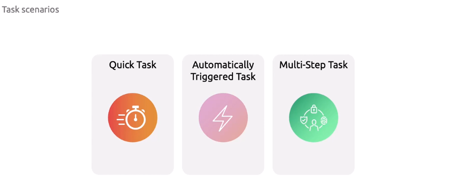

# 🐳 Azure Container Registry (ACR) Tasks

## 📖 What is ACR Task?

**ACR Tasks** is a feature inside **Azure Container Registry** that lets you **build, test, and patch container images automatically in Azure**.
Think of it as **“ACR + CI/CD-lite”**, tightly coupled with your registry.

Instead of building your Docker images on your local machine or GitHub Actions runner, you can **delegate builds to ACR itself**.

---

## 🚀 Why use ACR Tasks?

- ✅ **Offload builds** → no need for your own build agents.
- ✅ **Cloud-native build** → happens inside Azure, close to the registry.
- ✅ **Automated triggers** → rebuild on:

  - Git commit (from GitHub/Azure Repos).
  - Base image updates (e.g., when `mcr.microsoft.com/dotnet:6.0` updates).
  - Manual (`az acr build`).

- ✅ **Multi-step workflows** → not just `docker build`, but test + sign + push.
- ✅ **Consistent environments** → builds run inside ACR’s trusted infrastructure.
- ✅ **Secure** → no Docker Desktop needed; integrates with Azure RBAC & Managed Identities.

---

## 🏗️ Types of ACR Tasks

| Task Type           | Description                                                                    | Example                                                              |
| ------------------- | ------------------------------------------------------------------------------ | -------------------------------------------------------------------- |
| **Quick Task**      | One-off build directly from source (Git repo, local dir, or tarball).          | `az acr build --registry myACR --image myapp:v1 .`                   |
| **Automated Task**  | Builds automatically on Git commit, base image change, or schedule.            | Trigger build when you `git push` to `main`.                         |
| **Multi-step Task** | Defines a YAML workflow with multiple steps (build, test, sign, push, notify). | `task.yaml` → build image → run tests → push to ACR → webhook Slack. |

---

<div align="center">
  
</div>

---

## 🔨 Hands-On: Quick Build in ACR

Let’s build an image in ACR without installing Docker locally.

```bash
# Variables
ACR_NAME=mydemoacr
IMAGE_NAME=demoapp:v1

# Build and push directly to ACR
az acr build \
  --registry $ACR_NAME \
  --image $IMAGE_NAME \
  .
```

📌 This command:

- Packs your current folder (`.`),
- Sends it to ACR,
- Builds using ACR’s cloud builder,
- Pushes the image back to ACR.

---

## 🔁 Automated Task Example

Create a task that rebuilds your image whenever you push to GitHub **or** when the base image updates.

```bash
az acr task create \
  --registry mydemoacr \
  --name demoTask \
  --image demoapp:{{.Run.ID}} \
  --context https://github.com/your-org/demoapp.git \
  --branch main \
  --file Dockerfile \
  --git-access-token $GITHUB_TOKEN \
  --base-image-trigger-enabled true
```

### 🔍 What’s happening?

- **`--context`** → source code repo (GitHub in this case).
- **`--branch`** → watch `main`.
- **`--file`** → Dockerfile path.
- **`--image`** → image name + tag. `{{.Run.ID}}` = dynamic build ID.
- **`--base-image-trigger-enabled`** → automatically rebuild if base image (FROM line) updates.

So if .NET 9 drops tomorrow, your app image gets rebuilt automatically. 🎉

---

## 🧩 Multi-Step Task with YAML

Create a `task.yaml`:

```yaml
version: v1.1.0
steps:
  - build:
      context: .
      dockerfile: Dockerfile
      image: demoapp:{{.Run.ID}}

  - cmd: "docker run demoapp:{{.Run.ID}} dotnet test"

  - push:
      image: demoapp:{{.Run.ID}}
```

Run it with:

```bash
az acr task create \
  --registry mydemoacr \
  --name pipelineTask \
  --file task.yaml \
  --context .
```

This builds → tests → pushes image in one go.
No GitHub Actions, no DevOps pipeline — fully ACR-native.

---

## 📊 Monitor Task Runs

```bash
az acr task list-runs --registry mydemoacr --name demoTask -o table
```

Check logs for a specific run:

```bash
az acr task logs --registry mydemoacr --run-id <runId>
```

---

## 🔒 Security & Best Practices

- Use **Managed Identities** for GitHub → ACR access.
- Don’t store PATs (personal access tokens) in plain text; use **Key Vault** or secret scopes.
- Combine with **ACR Content Trust** to sign your images.
- Keep **base image trigger enabled** for critical CVE patches.
- Use ACR Tasks for **CI/CD bootstrap** and then integrate with GitHub Actions/Azure DevOps for richer workflows.

---

✅ **Summary**

- **ACR Tasks** = “serverless Docker builds in Azure”.
- Three flavors: quick build, automated, multi-step.
- Perfect for keeping your images fresh when **source code or base images change**.
- Great for lightweight CI/CD or as a **complement to GitHub/DevOps pipelines**.

---

👉 Do you want me to build you a **full CI/CD flow using only ACR Tasks** (without GitHub Actions/Azure DevOps), like “push to GitHub → ACR builds → deploy to AKS/App Service”? That would give you a **pipeline fully managed by ACR itself**.
